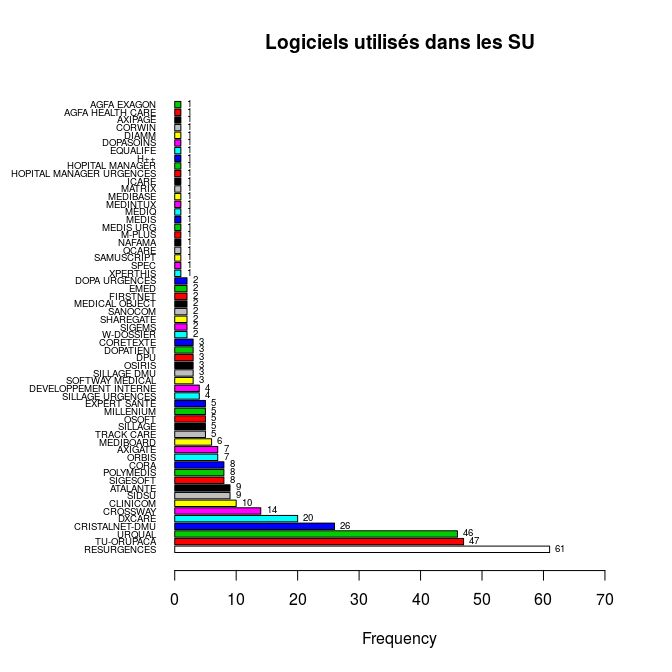

Enquête FEDORU
========================================================

La FEDORU a décidé de faire sa propre enquête concernant les logiciels utilisés dans les servives d'urgence. RESURAL a été chargé de cette enquête.

Méthodologie
------------

La liste des SU a été récupérée à partir du fichier [FINESS](adresse ?) en sélectionnant toutes les régions de France + médecine d'urgence. L'export se fait en utilisabt le format étendu. Le fichier résultant est enregistré sous __DATA/SU_France_2014.csv__. A partir de ce fichier, les colonnes ... ont été isolées. Le fichier obtenu a été mis en ligne via __google drive__ et mis à la disposition des membres du CA.

Google ayant modifié les conditions d'accès au _drive_, il faut procéder en trois temps pour récupérer les données:

1. ouvrir le fichier dans drive et importer le fichier au format .csv.
2. l'ouvrir dans calc et le réenregisterer au format .csv en précisant que les champs doivent être entourés de guillemets (sinon ça plante)
2. transférer le ficher dans le répertoire de travail et le renommer __su_France_ + AAAAMMJJ + .csv__.


```
##  [1] "X"                       "Région"                 
##  [3] "Dpt"                     "FINNES"                 
##  [5] "Raison.sociale"          "Complement.distribution"
##  [7] "Adresse"                 "Lieudit.BP"             
##  [9] "Code.postal"             "Libelle.routage"        
## [11] "Tel"                     "nom.correspondant"      
## [13] "mail"                    "logiciel"               
## [15] "editeur"                 "RPU..OUI.NON."          
## [17] "Remarque"
```

```
## 'data.frame':	676 obs. of  17 variables:
##  $ X                      : int  437 438 439 440 441 442 443 444 445 446 ...
##  $ Région                 : Factor w/ 23 levels "ALSACE","AQUITAINE",..: 1 1 1 1 1 1 1 1 1 1 ...
##  $ Dpt                    : Factor w/ 100 levels "Ain","Aine","Allier",..: 12 12 12 12 12 12 12 12 12 42 ...
##  $ FINNES                 : Factor w/ 674 levels "","100000090",..: 406 407 408 409 410 411 412 413 414 415 ...
##  $ Raison.sociale         : Factor w/ 669 levels "AMERICAN MEMORIAL HOSPITAL CHU REIMS",..: 525 58 380 313 101 472 437 470 528 439 ...
##  $ Complement.distribution: Factor w/ 53 levels "","25-29","2-avr.",..: 1 1 1 1 1 1 1 1 1 1 ...
##  $ Adresse                : Factor w/ 658 levels "","100 BOULEVARD DU GENERAL LECLERC",..: 135 435 115 197 194 450 275 99 124 166 ...
##  $ Lieudit.BP             : Factor w/ 296 levels "","2 AV DU 11 NOVEMBRE 1918",..: 158 147 75 73 120 1 243 1 1 31 ...
##  $ Code.postal            : Factor w/ 655 levels "1000","10003",..: 391 396 398 394 397 393 390 390 392 403 ...
##  $ Libelle.routage        : Factor w/ 610 levels "ABBEVILLE CEDEX",..: 546 245 486 609 489 545 546 546 547 382 ...
##  $ Tel                    : Factor w/ 657 levels "","01 30 69 45 00 OU 15",..: 351 350 357 355 356 353 352 354 351 361 ...
##  $ nom.correspondant      : Factor w/ 219 levels ""," ","A Blanchard informaticien",..: 1 1 1 1 1 1 1 1 1 1 ...
##  $ mail                   : Factor w/ 356 levels "","abdelattif.diani@ch-ghsa.fr",..: 1 1 1 1 1 1 1 1 1 1 ...
##  $ logiciel               : Factor w/ 83 levels "","AGFA EXAGON",..: 24 57 24 4 8 24 4 49 24 4 ...
##  $ editeur                : Factor w/ 47 levels "","\n","AGFA",..: 1 1 1 1 1 1 1 1 1 1 ...
##  $ RPU..OUI.NON.          : Factor w/ 10 levels "","?","\n","NON",..: 8 8 8 8 8 8 8 8 8 8 ...
##  $ Remarque               : Factor w/ 28 levels "","\n","à partir de janvier 2015 : Logiciel DxCare V7.4",..: 1 1 1 1 1 1 3 1 1 1 ...
```
#### Normalisation du fichier

- Suppression des blancs
- suppression des caractères accentués
- correction du nom des logiciels (+++)


#### Nombre (théorique) de SU par région:


```
              ALSACE            AQUITAINE             AUVERGNE 
                  19                   35                   20 
     BASSE NORMANDIE            BOURGOGNE             BRETAGNE 
                  25                   23                   32 
              CENTRE   CHAMPAGNE ARDENNES                CORSE 
                  28                   16                    8 
                 DOM        FRANCHE CONTE      HAUTE NORMANDIE 
                  14                   13                   21 
       ILE DE France LANGUEDOC ROUSSILLON             LIMOUSIN 
                  97                   29                   10 
            LORRAINE        MIDI PYRENEES   NORD PAS DE CALAIS 
                  23                   37                   37 
                PACA     PAYS DE LA LOIRE             PICARDIE 
                  52                   21                   21 
   POITOU CHANRENTES          RHONE ALPES 
                  24                   71 
```

```
   Min. 1st Qu.  Median    Mean 3rd Qu.    Max. 
    8.0    19.5    23.0    29.4    33.5    97.0 
```

 

#### Table des logiciels répertoriés

On exclu les colonnes:

 - "MAIL ENVOYÉ SUR LE SITE RUBRIQUE NOUS CONTACTER" (28)
 - "MAIL ATTENTE REPONSE" (27)
 - "NON INFORMATISÉ" (39)

```
Loading required package: foreign
Loading required package: survival
Loading required package: splines
Loading required package: MASS
Loading required package: nnet
```

```
             AGFA EXAGON         AGFA HEALTH CARE                 ATALANTE 
                       1                        1                        9 
                 AXIGATE                  AXIPAGE                 CLINICOM 
                       7                        1                       10 
                    CORA                CORETEXTE                   CORWIN 
                       8                        3                        1 
          CRISTALNET-DMU                 CROSSWAY    DEVELOPPEMENT INTERNE 
                      26                       14                        4 
                   DIAMM                DOPASOINS                DOPATIENT 
                       1                        1                        3 
           DOPA URGENCES                      DPU                   DXCARE 
                       2                        3                       20 
                    EMED                 EQUALIFE             EXPERT SANTE 
                       2                        1                        5 
                FIRSTNET                      H++          HOPITAL MANAGER 
                       2                        1                        1 
HOPITAL MANAGER URGENCES                    ICARE                   MATRIX 
                       1                        1                        1 
                MEDIBASE                MEDIBOARD           MEDICAL OBJECT 
                       1                        6                        2 
                MEDINTUX                    MEDIQ                    MEDIS 
                       1                        1                        1 
               MEDIS URG                MILLENIUM                   M-PLUS 
                       1                        5                        1 
                  NAFAMA          NON INFORMATISE                    ORBIS 
                       1                        4                        7 
                  OSIRIS                    OSOFT                POLIMEDIS 
                       3                        5                        1 
               POLYMEDIS                    QCARE              RESURGENCES 
                       7                        1                       61 
              SAMUSCRIPT                  SANOCOM                SHAREGATE 
                       1                        2                        2 
                   SIDSU                   SIGEMS                 SIGESOFT 
                       9                        2                        8 
                 SILLAGE              SILLAGE DMU         SILLAGE URGENCES 
                       5                        3                        4 
         SOFTWAY MEDICAL                     SPEC               TRACK CARE 
                       3                        1                        5 
              TU-ORUPACA                   URQUAL                W-DOSSIER 
                      47                       46                        2 
                XPERTHIS 
                       1 
```

```
Warning: attempt to set 'col.names' ignored
```

 

```
l : 
                         Frequency   %(NA+)   %(NA-)
AGFA EXAGON                      1      0.2      0.3
AGFA HEALTH CARE                 1      0.2      0.3
AXIPAGE                          1      0.2      0.3
CORWIN                           1      0.2      0.3
DIAMM                            1      0.2      0.3
DOPASOINS                        1      0.2      0.3
EQUALIFE                         1      0.2      0.3
H++                              1      0.2      0.3
HOPITAL MANAGER                  1      0.2      0.3
HOPITAL MANAGER URGENCES         1      0.2      0.3
ICARE                            1      0.2      0.3
MATRIX                           1      0.2      0.3
MEDIBASE                         1      0.2      0.3
MEDINTUX                         1      0.2      0.3
MEDIQ                            1      0.2      0.3
MEDIS                            1      0.2      0.3
MEDIS URG                        1      0.2      0.3
M-PLUS                           1      0.2      0.3
NAFAMA                           1      0.2      0.3
POLIMEDIS                        1      0.2      0.3
QCARE                            1      0.2      0.3
SAMUSCRIPT                       1      0.2      0.3
SPEC                             1      0.2      0.3
XPERTHIS                         1      0.2      0.3
DOPA URGENCES                    2      0.4      0.5
EMED                             2      0.4      0.5
FIRSTNET                         2      0.4      0.5
MEDICAL OBJECT                   2      0.4      0.5
SANOCOM                          2      0.4      0.5
SHAREGATE                        2      0.4      0.5
SIGEMS                           2      0.4      0.5
W-DOSSIER                        2      0.4      0.5
CORETEXTE                        3      0.6      0.8
DOPATIENT                        3      0.6      0.8
DPU                              3      0.6      0.8
OSIRIS                           3      0.6      0.8
SILLAGE DMU                      3      0.6      0.8
SOFTWAY MEDICAL                  3      0.6      0.8
DEVELOPPEMENT INTERNE            4      0.7      1.1
NON INFORMATISE                  4      0.7      1.1
SILLAGE URGENCES                 4      0.7      1.1
EXPERT SANTE                     5      0.9      1.3
MILLENIUM                        5      0.9      1.3
OSOFT                            5      0.9      1.3
SILLAGE                          5      0.9      1.3
TRACK CARE                       5      0.9      1.3
MEDIBOARD                        6      1.1      1.6
AXIGATE                          7      1.3      1.8
ORBIS                            7      1.3      1.8
POLYMEDIS                        7      1.3      1.8
CORA                             8      1.5      2.1
SIGESOFT                         8      1.5      2.1
ATALANTE                         9      1.7      2.4
SIDSU                            9      1.7      2.4
CLINICOM                        10      1.9      2.6
CROSSWAY                        14      2.6      3.7
DXCARE                          20      3.7      5.3
CRISTALNET-DMU                  26      4.9      6.8
URQUAL                          46      8.6     12.1
TU-ORUPACA                      47      8.8     12.4
RESURGENCES                     61     11.4     16.1
<NA>                           154     28.8      0.0
  Total                        534    100.0    100.0
```

Nombre total de SU identifiés: 676

Nombre total de logiciels identifiés: 380

Taux d'exhaustivité: 56.21 %

Nombre de fournisseurs identifiés: 61

SU non informatisés: 4

SU contactés en attente de réponse: 142

#### Table logiciels par région:


```
                         ALSACE AQUITAINE AUVERGNE BASSE NORMANDIE
AGFA EXAGON                   0         0        0               0
AGFA HEALTH CARE              0         0        0               0
ATALANTE                      7         0        0               1
AXIGATE                       0         1        0               2
AXIPAGE                       0         0        0               0
CLINICOM                      1         1        0               0
CORA                          0         0        0               1
CORETEXTE                     0         0        0               0
CORWIN                        0         0        0               0
CRISTALNET-DMU                3         0        0               1
CROSSWAY                      0         3        0               0
DEVELOPPEMENT INTERNE         0         0        0               0
DIAMM                         0         0        0               0
DOPASOINS                     0         1        0               0
DOPATIENT                     0         0        0               0
DOPA URGENCES                 0         0        0               0
DPU                           0         0        0               0
DXCARE                        4         5        0               0
EMED                          0         0        0               0
EQUALIFE                      0         0        0               0
EXPERT SANTE                  0         0        0               0
FIRSTNET                      0         0        0               0
H++                           0         0        0               0
HOPITAL MANAGER               0         0        0               0
HOPITAL MANAGER URGENCES      0         0        0               0
ICARE                         0         0        0               0
MATRIX                        0         0        1               0
MEDIBASE                      0         1        0               0
MEDIBOARD                     0         0        0               0
MEDICAL OBJECT                0         0        0               0
MEDINTUX                      0         0        0               0
MEDIQ                         0         0        0               0
MEDIS                         0         0        0               0
MEDIS URG                     0         0        0               0
MILLENIUM                     0         0        0               0
M-PLUS                        0         1        0               0
NAFAMA                        0         0        0               0
ORBIS                         1         0        3               0
OSIRIS                        0         0        0               1
OSOFT                         0         0        0               0
POLIMEDIS                     0         0        0               0
POLYMEDIS                     0         0        0               0
QCARE                         0         0        0               0
RESURGENCES                   1         1        0               3
SAMUSCRIPT                    0         0        0               0
SANOCOM                       0         2        0               0
SHAREGATE                     0         2        0               0
SIDSU                         0         9        0               0
SIGEMS                        0         2        0               0
SIGESOFT                      0         0        0               0
SILLAGE                       0         2        0               1
SILLAGE DMU                   0         0        0               0
SILLAGE URGENCES              0         0        0               0
SOFTWAY MEDICAL               0         0        0               0
SPEC                          0         0        0               0
TRACK CARE                    0         1        0               0
TU-ORUPACA                    0         0        0               0
URQUAL                        1         3        1               0
W-DOSSIER                     0         0        0               0
XPERTHIS                      0         0        0               0
                         BOURGOGNE BRETAGNE CENTRE CHAMPAGNE ARDENNES
AGFA EXAGON                      1        0      0                  0
AGFA HEALTH CARE                 0        0      0                  0
ATALANTE                         1        0      0                  0
AXIGATE                          0        0      1                  0
AXIPAGE                          0        0      0                  0
CLINICOM                         0        0      1                  0
CORA                             0        0      1                  0
CORETEXTE                        0        0      0                  0
CORWIN                           0        0      0                  0
CRISTALNET-DMU                   6        0      0                  3
CROSSWAY                         3        0      0                  0
DEVELOPPEMENT INTERNE            0        0      0                  0
DIAMM                            0        0      0                  0
DOPASOINS                        0        0      0                  0
DOPATIENT                        0        0      0                  0
DOPA URGENCES                    0        0      0                  2
DPU                              0        0      0                  0
DXCARE                           0        0      2                  1
EMED                             0        0      0                  0
EQUALIFE                         0        0      0                  0
EXPERT SANTE                     0        0      0                  0
FIRSTNET                         0        0      1                  0
H++                              0        0      0                  0
HOPITAL MANAGER                  0        0      0                  0
HOPITAL MANAGER URGENCES         0        0      0                  0
ICARE                            0        0      0                  0
MATRIX                           0        0      0                  0
MEDIBASE                         0        0      0                  0
MEDIBOARD                        0        1      0                  0
MEDICAL OBJECT                   0        0      0                  0
MEDINTUX                         0        0      0                  0
MEDIQ                            0        0      0                  0
MEDIS                            0        1      0                  0
MEDIS URG                        0        1      0                  0
MILLENIUM                        0        0      0                  0
M-PLUS                           0        0      0                  0
NAFAMA                           0        0      0                  1
ORBIS                            0        2      0                  0
OSIRIS                           0        0      0                  0
OSOFT                            0        1      0                  0
POLIMEDIS                        0        0      0                  0
POLYMEDIS                        0        0      0                  5
QCARE                            0        0      0                  0
RESURGENCES                      3        7      0                  1
SAMUSCRIPT                       0        0      0                  0
SANOCOM                          0        0      0                  0
SHAREGATE                        0        0      0                  0
SIDSU                            0        0      0                  0
SIGEMS                           0        0      0                  0
SIGESOFT                         0        0      0                  0
SILLAGE                          0        1      0                  0
SILLAGE DMU                      0        3      0                  0
SILLAGE URGENCES                 0        4      0                  0
SOFTWAY MEDICAL                  3        0      0                  0
SPEC                             0        0      0                  0
TRACK CARE                       0        0      0                  0
TU-ORUPACA                       1        0      0                  0
URQUAL                           3       10      1                  3
W-DOSSIER                        0        0      0                  0
XPERTHIS                         0        0      0                  0
                         CORSE DOM FRANCHE CONTE HAUTE NORMANDIE
AGFA EXAGON                  0   0             0               0
AGFA HEALTH CARE             0   1             0               0
ATALANTE                     0   0             0               0
AXIGATE                      0   0             0               3
AXIPAGE                      0   0             0               0
CLINICOM                     0   0             0               1
CORA                         0   0             0               0
CORETEXTE                    0   0             0               0
CORWIN                       0   0             0               0
CRISTALNET-DMU               0   0             0               0
CROSSWAY                     0   0             1               0
DEVELOPPEMENT INTERNE        0   0             0               0
DIAMM                        0   0             0               0
DOPASOINS                    0   0             0               0
DOPATIENT                    0   0             0               0
DOPA URGENCES                0   0             0               0
DPU                          0   0             0               0
DXCARE                       0   1             0               1
EMED                         0   0             0               0
EQUALIFE                     0   0             1               0
EXPERT SANTE                 0   0             0               0
FIRSTNET                     0   0             1               0
H++                          0   0             0               0
HOPITAL MANAGER              0   0             0               0
HOPITAL MANAGER URGENCES     0   0             0               0
ICARE                        0   0             0               1
MATRIX                       0   0             0               0
MEDIBASE                     0   0             0               0
MEDIBOARD                    0   0             0               0
MEDICAL OBJECT               0   0             0               0
MEDINTUX                     0   0             0               0
MEDIQ                        0   0             0               0
MEDIS                        0   0             0               0
MEDIS URG                    0   0             0               0
MILLENIUM                    0   0             4               0
M-PLUS                       0   0             0               0
NAFAMA                       0   0             0               0
ORBIS                        0   0             0               0
OSIRIS                       0   0             0               0
OSOFT                        0   0             0               0
POLIMEDIS                    0   0             1               0
POLYMEDIS                    0   0             0               0
QCARE                        0   0             0               0
RESURGENCES                  0   0             5               1
SAMUSCRIPT                   0   0             0               0
SANOCOM                      0   0             0               0
SHAREGATE                    0   0             0               0
SIDSU                        0   0             0               0
SIGEMS                       0   0             0               0
SIGESOFT                     0   0             0               0
SILLAGE                      0   0             0               0
SILLAGE DMU                  0   0             0               0
SILLAGE URGENCES             0   0             0               0
SOFTWAY MEDICAL              0   0             0               0
SPEC                         0   0             0               0
TRACK CARE                   0   0             0               0
TU-ORUPACA                   4   0             0               0
URQUAL                       0   0             0               1
W-DOSSIER                    0   0             0               0
XPERTHIS                     0   0             0               0
                         ILE DE France LANGUEDOC ROUSSILLON LIMOUSIN
AGFA EXAGON                          0                    0        0
AGFA HEALTH CARE                     0                    0        0
ATALANTE                             0                    0        0
AXIGATE                              0                    0        0
AXIPAGE                              1                    0        0
CLINICOM                             0                    1        0
CORA                                 0                    1        0
CORETEXTE                            0                    0        0
CORWIN                               0                    0        0
CRISTALNET-DMU                       0                    0        0
CROSSWAY                             0                    0        0
DEVELOPPEMENT INTERNE                0                    2        0
DIAMM                                0                    0        0
DOPASOINS                            0                    0        0
DOPATIENT                            0                    0        0
DOPA URGENCES                        0                    0        0
DPU                                  0                    0        0
DXCARE                               0                    1        0
EMED                                 0                    1        0
EQUALIFE                             0                    0        0
EXPERT SANTE                         0                    3        0
FIRSTNET                             0                    0        0
H++                                  1                    0        0
HOPITAL MANAGER                      0                    0        0
HOPITAL MANAGER URGENCES             0                    1        0
ICARE                                0                    0        0
MATRIX                               0                    0        0
MEDIBASE                             0                    0        0
MEDIBOARD                            0                    0        0
MEDICAL OBJECT                       0                    0        0
MEDINTUX                             0                    0        0
MEDIQ                                1                    0        0
MEDIS                                0                    0        0
MEDIS URG                            0                    0        0
MILLENIUM                            0                    0        0
M-PLUS                               0                    0        0
NAFAMA                               0                    0        0
ORBIS                                0                    0        0
OSIRIS                               0                    1        0
OSOFT                                0                    2        0
POLIMEDIS                            0                    0        0
POLYMEDIS                            0                    0        0
QCARE                                0                    0        0
RESURGENCES                          0                    3        7
SAMUSCRIPT                           1                    0        0
SANOCOM                              0                    0        0
SHAREGATE                            0                    0        0
SIDSU                                0                    0        0
SIGEMS                               0                    0        0
SIGESOFT                             0                    8        0
SILLAGE                              0                    0        0
SILLAGE DMU                          0                    0        0
SILLAGE URGENCES                     0                    0        0
SOFTWAY MEDICAL                      0                    0        0
SPEC                                 0                    0        1
TRACK CARE                           0                    0        0
TU-ORUPACA                           0                    0        0
URQUAL                               5                    2        2
W-DOSSIER                            0                    2        0
XPERTHIS                             0                    0        0
                         LORRAINE MIDI PYRENEES NORD PAS DE CALAIS PACA
AGFA EXAGON                     0             0                  0    0
AGFA HEALTH CARE                0             0                  0    0
ATALANTE                        0             0                  0    0
AXIGATE                         0             0                  0    0
AXIPAGE                         0             0                  0    0
CLINICOM                        0             0                  3    0
CORA                            0             0                  2    0
CORETEXTE                       1             2                  0    0
CORWIN                          0             1                  0    0
CRISTALNET-DMU                  0             0                  2    2
CROSSWAY                        1             6                  0    0
DEVELOPPEMENT INTERNE           1             1                  0    0
DIAMM                           0             1                  0    0
DOPASOINS                       0             0                  0    0
DOPATIENT                       0             3                  0    0
DOPA URGENCES                   0             0                  0    0
DPU                             0             1                  0    0
DXCARE                          1             2                  2    0
EMED                            0             1                  0    0
EQUALIFE                        0             0                  0    0
EXPERT SANTE                    0             1                  0    0
FIRSTNET                        0             0                  0    0
H++                             0             0                  0    0
HOPITAL MANAGER                 0             0                  1    0
HOPITAL MANAGER URGENCES        0             0                  0    0
ICARE                           0             0                  0    0
MATRIX                          0             0                  0    0
MEDIBASE                        0             0                  0    0
MEDIBOARD                       0             2                  0    0
MEDICAL OBJECT                  0             2                  0    0
MEDINTUX                        0             0                  0    1
MEDIQ                           0             0                  0    0
MEDIS                           0             0                  0    0
MEDIS URG                       0             0                  0    0
MILLENIUM                       0             0                  1    0
M-PLUS                          0             0                  0    0
NAFAMA                          0             0                  0    0
ORBIS                           0             0                  0    0
OSIRIS                          0             0                  1    0
OSOFT                           0             0                  1    0
POLIMEDIS                       0             0                  0    0
POLYMEDIS                       1             0                  1    0
QCARE                           0             0                  0    1
RESURGENCES                    17             0                  4    2
SAMUSCRIPT                      0             0                  0    0
SANOCOM                         0             0                  0    0
SHAREGATE                       0             0                  0    0
SIDSU                           0             0                  0    0
SIGEMS                          0             0                  0    0
SIGESOFT                        0             0                  0    0
SILLAGE                         0             0                  1    0
SILLAGE DMU                     0             0                  0    0
SILLAGE URGENCES                0             0                  0    0
SOFTWAY MEDICAL                 0             0                  0    0
SPEC                            0             0                  0    0
TRACK CARE                      0             0                  4    0
TU-ORUPACA                      0             2                  0   40
URQUAL                          0             5                  4    2
W-DOSSIER                       0             0                  0    0
XPERTHIS                        1             0                  0    0
                         PAYS DE LA LOIRE PICARDIE POITOU CHANRENTES
AGFA EXAGON                             0        0                 0
AGFA HEALTH CARE                        0        0                 0
ATALANTE                                0        0                 0
AXIGATE                                 0        0                 0
AXIPAGE                                 0        0                 0
CLINICOM                                1        0                 0
CORA                                    2        0                 0
CORETEXTE                               0        0                 0
CORWIN                                  0        0                 0
CRISTALNET-DMU                          0        1                 0
CROSSWAY                                0        0                 0
DEVELOPPEMENT INTERNE                   0        0                 0
DIAMM                                   0        0                 0
DOPASOINS                               0        0                 0
DOPATIENT                               0        0                 0
DOPA URGENCES                           0        0                 0
DPU                                     0        0                 0
DXCARE                                  0        0                 0
EMED                                    0        0                 0
EQUALIFE                                0        0                 0
EXPERT SANTE                            0        0                 0
FIRSTNET                                0        0                 0
H++                                     0        0                 0
HOPITAL MANAGER                         0        0                 0
HOPITAL MANAGER URGENCES                0        0                 0
ICARE                                   0        0                 0
MATRIX                                  0        0                 0
MEDIBASE                                0        0                 0
MEDIBOARD                               0        0                 0
MEDICAL OBJECT                          0        0                 0
MEDINTUX                                0        0                 0
MEDIQ                                   0        0                 0
MEDIS                                   0        0                 0
MEDIS URG                               0        0                 0
MILLENIUM                               0        0                 0
M-PLUS                                  0        0                 0
NAFAMA                                  0        0                 0
ORBIS                                   0        0                 0
OSIRIS                                  0        0                 0
OSOFT                                   0        0                 0
POLIMEDIS                               0        0                 0
POLYMEDIS                               0        0                 0
QCARE                                   0        0                 0
RESURGENCES                             3        0                 2
SAMUSCRIPT                              0        0                 0
SANOCOM                                 0        0                 0
SHAREGATE                               0        0                 0
SIDSU                                   0        0                 0
SIGEMS                                  0        0                 0
SIGESOFT                                0        0                 0
SILLAGE                                 0        0                 0
SILLAGE DMU                             0        0                 0
SILLAGE URGENCES                        0        0                 0
SOFTWAY MEDICAL                         0        0                 0
SPEC                                    0        0                 0
TRACK CARE                              0        0                 0
TU-ORUPACA                              0        0                 0
URQUAL                                  2        0                 0
W-DOSSIER                               0        0                 0
XPERTHIS                                0        0                 0
                         RHONE ALPES
AGFA EXAGON                        0
AGFA HEALTH CARE                   0
ATALANTE                           0
AXIGATE                            0
AXIPAGE                            0
CLINICOM                           1
CORA                               1
CORETEXTE                          0
CORWIN                             0
CRISTALNET-DMU                     8
CROSSWAY                           0
DEVELOPPEMENT INTERNE              0
DIAMM                              0
DOPASOINS                          0
DOPATIENT                          0
DOPA URGENCES                      0
DPU                                2
DXCARE                             0
EMED                               0
EQUALIFE                           0
EXPERT SANTE                       1
FIRSTNET                           0
H++                                0
HOPITAL MANAGER                    0
HOPITAL MANAGER URGENCES           0
ICARE                              0
MATRIX                             0
MEDIBASE                           0
MEDIBOARD                          3
MEDICAL OBJECT                     0
MEDINTUX                           0
MEDIQ                              0
MEDIS                              0
MEDIS URG                          0
MILLENIUM                          0
M-PLUS                             0
NAFAMA                             0
ORBIS                              1
OSIRIS                             0
OSOFT                              1
POLIMEDIS                          0
POLYMEDIS                          0
QCARE                              0
RESURGENCES                        1
SAMUSCRIPT                         0
SANOCOM                            0
SHAREGATE                          0
SIDSU                              0
SIGEMS                             0
SIGESOFT                           0
SILLAGE                            0
SILLAGE DMU                        0
SILLAGE URGENCES                   0
SOFTWAY MEDICAL                    0
SPEC                               0
TRACK CARE                         0
TU-ORUPACA                         0
URQUAL                             1
W-DOSSIER                          0
XPERTHIS                           0
```

 


#### Comparaison nb SU/Logiciels par région

- SU: nombre de services d'urgence
- Logiciels: nombre de logiciels répertorié (au 1/9/2014)
- Rapport: % d'équipement


```
                     Logiciels SU rapport reg.id
ALSACE                      18 19   94.74     42
AQUITAINE                   35 35  100.00     72
AUVERGNE                     5 20   25.00     83
BASSE NORMANDIE             10 25   40.00     25
BOURGOGNE                   21 23   91.30     26
BRETAGNE                    31 32   96.88     53
CENTRE                       7 28   25.00     24
CHAMPAGNE ARDENNES          16 16  100.00     21
CORSE                        4  8   50.00     94
DOM                          2 14   14.29    100
FRANCHE CONTE               13 13  100.00     43
HAUTE NORMANDIE              8 21   38.10     23
ILE DE France                9 97    9.28     11
LANGUEDOC ROUSSILLON        28 29   96.55     91
LIMOUSIN                    10 10  100.00     74
LORRAINE                    23 23  100.00     41
MIDI PYRENEES               30 37   81.08     73
NORD PAS DE CALAIS          27 37   72.97     31
PACA                        48 52   92.31     93
PAYS DE LA LOIRE             8 21   38.10     52
PICARDIE                     1 21    4.76     22
POITOU CHANRENTES            2 24    8.33     54
RHONE ALPES                 20 71   28.17     82
```

```
                     Logiciels SU rapport reg.id
PICARDIE                     1 21    4.76     22
POITOU CHANRENTES            2 24    8.33     54
ILE DE France                9 97    9.28     11
DOM                          2 14   14.29    100
AUVERGNE                     5 20   25.00     83
CENTRE                       7 28   25.00     24
RHONE ALPES                 20 71   28.17     82
HAUTE NORMANDIE              8 21   38.10     23
PAYS DE LA LOIRE             8 21   38.10     52
BASSE NORMANDIE             10 25   40.00     25
CORSE                        4  8   50.00     94
NORD PAS DE CALAIS          27 37   72.97     31
MIDI PYRENEES               30 37   81.08     73
BOURGOGNE                   21 23   91.30     26
PACA                        48 52   92.31     93
ALSACE                      18 19   94.74     42
LANGUEDOC ROUSSILLON        28 29   96.55     91
BRETAGNE                    31 32   96.88     53
AQUITAINE                   35 35  100.00     72
CHAMPAGNE ARDENNES          16 16  100.00     21
FRANCHE CONTE               13 13  100.00     43
LIMOUSIN                    10 10  100.00     74
LORRAINE                    23 23  100.00     41
```
- nombre de logiciels répertoriés: 376
- nombre de services répertoriés: 676 . Le nombre de SU est surestimé par le répertoire FINESS (par ex. des établissements sans SU mais avec une antenne SMUR saisonnière y figurent).
 
Comparer public, privé et PSPH

Cartographie
============


```
[1] "reg.id"    "reg.nom"   "x"         "y"         "Logiciels" "SU"       
[7] "rapport"  
```

   

Transmission des RPU
-------------------


```
  ?  NA NON OUI 
  1 275  35 365 
```

```
                                                NON OUI     V5
ATALANTE                                          0   8   0.00
CORA                                              0   8   0.00
CORWIN                                            0   1   0.00
DIAMM                                             0   1   0.00
DOPASOINS                                         0   1   0.00
DOPATIENT                                         0   3   0.00
DOPA URGENCES                                     0   2   0.00
DPU                                               0   3   0.00
EMED                                              0   2   0.00
EQUALIFE                                          0   1   0.00
EXPERT SANTE                                      0   5   0.00
H++                                               0   1   0.00
MAIL ATTENTE REPONSE                              0  20   0.00
MATRIX                                            0   1   0.00
MEDIBASE                                          0   1   0.00
MEDIBOARD                                         0   6   0.00
MEDICAL OBJECT                                    0   2   0.00
MEDINTUX                                          0   1   0.00
MEDIS                                             0   1   0.00
MEDIS URG                                         0   1   0.00
MILLENIUM                                         0   5   0.00
M-PLUS                                            0   1   0.00
NAFAMA                                            0   1   0.00
OSIRIS                                            0   3   0.00
OSOFT                                             0   5   0.00
POLIMEDIS                                         0   1   0.00
POLYMEDIS                                         0   7   0.00
QCARE                                             0   1   0.00
SANOCOM                                           0   2   0.00
SHAREGATE                                         0   2   0.00
SIDSU                                             0   9   0.00
SIGESOFT                                          0   8   0.00
SPEC                                              0   1   0.00
TRACK CARE                                        0   5   0.00
W-DOSSIER                                         0   2   0.00
XPERTHIS                                          0   1   0.00
RESURGENCES                                       2  56   3.57
CRISTALNET-DMU                                    1  21   4.76
TU-ORUPACA                                        3  43   6.98
URQUAL                                            3  39   7.69
CROSSWAY                                          1  11   9.09
CLINICOM                                          1   9  11.11
DXCARE                                            2  18  11.11
ORBIS                                             1   6  16.67
DEVELOPPEMENT INTERNE                             1   3  33.33
NON INFORMATISE                                   1   3  33.33
SILLAGE URGENCES                                  1   3  33.33
AXIGATE                                           2   5  40.00
CORETEXTE                                         1   2  50.00
SILLAGE DMU                                       1   2  50.00
SILLAGE                                           2   3  66.67
FIRSTNET                                          1   1 100.00
AGFA HEALTH CARE                                  1   0    Inf
AXIPAGE                                           1   0    Inf
HOPITAL MANAGER                                   1   0    Inf
HOPITAL MANAGER URGENCES                          1   0    Inf
ICARE                                             1   0    Inf
SAMUSCRIPT                                        1   0    Inf
SIGEMS                                            2   0    Inf
AGFA EXAGON                                       0   0    NaN
MAIL ENVOYE SUR LE SITE RUBRIQUE NOUS CONTACTER   0   0    NaN
MEDIQ                                             0   0    NaN
SOFTWAY MEDICAL                                   0   0    NaN
```

Table logiciels - Finess
=========================


```r
a <- d[, c("FINNES", "logiciel")]
a <- a[!is.na(a$logiciel),]
a <- a[a$logiciel != "MAIL ATTENTE REPONSE",]
a <- a[a$logiciel != "NON INFORMATISE",]
a <- a[a$logiciel != "MAIL ENVOYE SUR LE SITE RUBRIQUE NOUS CONTACTER",]
names(a) <- c("FINESS_GEO", "LOGICIEL")
write.csv2(a, file="logiciels_Finess_20140927.csv", row.names = FALSE)

# le top ten
x <- tab1(a$LOGICIEL, missing=FALSE, sort.group = "increasing", cex = 0.6, cex.names = 0.6, main="Logiciels utilisés dans les SU")
```

 

```r
x1 <- x$output.table
x2 <- tail(x1, 11)
x2 <- x2[-11,]
x2[order(x2[,1], decreasing = TRUE),]
```

```
##                Frequency Percent Cum. percent
## RESURGENCES           61    16.2        100.0
## TU-ORUPACA            47    12.5         83.8
## URQUAL                46    12.2         71.3
## CRISTALNET-DMU        26     6.9         59.0
## DXCARE                20     5.3         52.1
## CROSSWAY              14     3.7         46.8
## CLINICOM              10     2.7         43.1
## ATALANTE               9     2.4         38.0
## SIDSU                  9     2.4         40.4
## SIGESOFT               8     2.1         35.6
```

```r
top10 <- sum(x2[,2]) # % représenté par les 10 premiers
```

Table Régionales
================

lr <- d[d$Région == "LANGUEDOC ROUSSILLON",]
br <- d[d$Région == "BRETAGNE",]
npc <- d[d$Région == "NORD PAS DE CALAIS",]


write.csv2(lr, file="LanguedocR.csv")  
write.csv2(br, file="Bretagne.csv")   
write.csv2(npc, file="NordPC.csv")   


