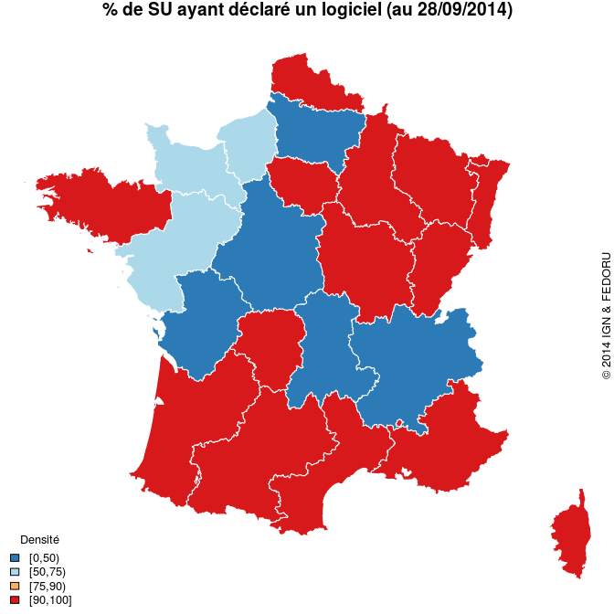
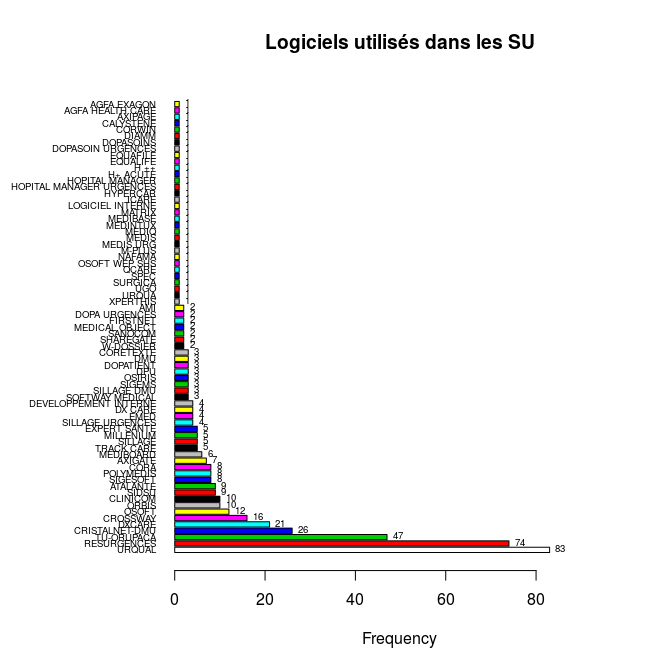

Enquête FEDORU
========================================================

La FEDORU a décidé de faire sa propre enquête concernant les logiciels utilisés dans les servives d'urgence. RESURAL a été chargé de cette enquête.

Méthodologie
------------

La liste des SU a été récupérée à partir du fichier [FINESS](adresse ?) en sélectionnant toutes les régions de France + médecine d'urgence. L'export se fait en utilisabt le format étendu. Le fichier résultant est enregistré sous __DATA/SU_France_2014.csv__. A partir de ce fichier, les colonnes ... ont été isolées. Le fichier obtenu a été mis en ligne via __google drive__ et mis à la disposition des membres du CA.

Une liste des logiciels se trouve sur le site officiel du [DMP](http://www.dmp.gouv.fr/dmp-compatibilite). __Agnès__ se charge de faire un tri dans les logiciels.

Google ayant modifié les conditions d'accès au _drive_, il faut procéder en trois temps pour récupérer les données:

1. ouvrir le fichier dans drive et importer le fichier au format .csv.
2. l'ouvrir dans calc et le réenregisterer au format .csv en précisant que les champs doivent être entourés de guillemets (sinon ça plante)
2. transférer le ficher dans le répertoire de travail et le renommer __su_France_ + AAAAMMJJ + .csv__.


```
##  [1] "X"                       "Région"                 
##  [3] "Dpt"                     "FINNES"                 
##  [5] "Raison.sociale"          "Complement.distribution"
##  [7] "Adresse"                 "Lieudit.BP"             
##  [9] "Code.postal"             "Libelle.routage"        
## [11] "Tel"                     "nom.correspondant"      
## [13] "mail"                    "logiciel"               
## [15] "editeur"                 "RPU..OUI.NON."          
## [17] "Remarque"
```

```
## 'data.frame':	671 obs. of  17 variables:
##  $ X                      : int  437 438 439 440 441 442 443 444 445 446 ...
##  $ Région                 : Factor w/ 23 levels "ALSACE","AQUITAINE",..: 1 1 1 1 1 1 1 1 1 1 ...
##  $ Dpt                    : Factor w/ 99 levels "Ain","Aine","Allier",..: 12 12 12 12 12 12 12 12 12 42 ...
##  $ FINNES                 : Factor w/ 664 levels "","100000090",..: 399 400 401 402 403 404 405 406 407 408 ...
##  $ Raison.sociale         : Factor w/ 661 levels "AMERICAN MEMORIAL HOSPITAL CHU REIMS",..: 519 56 376 310 98 468 432 466 522 434 ...
##  $ Complement.distribution: Factor w/ 50 levels "","2-avr.","30 AVENUE DU 14 JUILLET",..: 1 1 1 1 1 1 1 1 1 1 ...
##  $ Adresse                : Factor w/ 650 levels "","100 BOULEVARD DU GENERAL LECLERC",..: 133 429 114 195 192 444 270 98 123 164 ...
##  $ Lieudit.BP             : Factor w/ 296 levels "","2 AV DU 11 NOVEMBRE 1918",..: 157 147 75 73 120 1 242 1 1 31 ...
##  $ Code.postal            : Factor w/ 647 levels "1000","10003",..: 384 389 391 387 390 386 383 383 385 396 ...
##  $ Libelle.routage        : Factor w/ 602 levels "ABBEVILLE CEDEX",..: 538 240 479 601 482 537 538 538 539 377 ...
##  $ Tel                    : Factor w/ 647 levels "","01 30 63 85 90",..: 345 344 351 349 350 347 346 348 345 355 ...
##  $ nom.correspondant      : Factor w/ 281 levels ""," ","A Blanchard informaticien",..: 1 1 1 1 1 1 1 1 1 1 ...
##  $ mail                   : Factor w/ 397 levels "","abdelattif.diani@ch-ghsa.fr",..: 1 1 1 1 1 1 1 1 1 1 ...
##  $ logiciel               : Factor w/ 94 levels "","AGFA EXAGON",..: 28 66 28 5 10 28 5 58 28 5 ...
##  $ editeur                : Factor w/ 47 levels "","\n","AGFA",..: 1 1 1 1 1 1 1 1 1 1 ...
##  $ RPU..OUI.NON.          : Factor w/ 12 levels "","\n","non",..: 8 8 8 8 8 8 8 8 8 8 ...
##  $ Remarque               : Factor w/ 37 levels "","\n","(adulte)",..: 1 1 1 1 1 1 6 1 1 1 ...
```
#### Normalisation du fichier

- Suppression des blancs
- suppression des caractères accentués
- correction du nom des logiciels (+++)
- CENTRE HOSPITALIER DE GONESSE volontairement dupliqué car 2 SU avec 2 logiciels différents
- CENTRE HOSPITALIER M JACQUET MELUN idem
- ORSAY idem


#### Nombre (théorique) de SU par région:


```
              ALSACE            AQUITAINE             AUVERGNE 
                  19                   35                   15 
     BASSE NORMANDIE            BOURGOGNE             BRETAGNE 
                  23                   23                   32 
              CENTRE   CHAMPAGNE ARDENNES                CORSE 
                  28                   16                    8 
                 DOM        FRANCHE CONTE      HAUTE NORMANDIE 
                  14                   13                   21 
       ILE DE France LANGUEDOC ROUSSILLON             LIMOUSIN 
                  99                   29                   10 
            LORRAINE        MIDI PYRENEES   NORD PAS DE CALAIS 
                  23                   37                   37 
                PACA     PAYS DE LA LOIRE             PICARDIE 
                  52                   21                   21 
   POITOU CHANRENTES          RHONE ALPES 
                  24                   71 
```

```
   Min. 1st Qu.  Median    Mean 3rd Qu.    Max. 
   8.00   17.50   23.00   29.17   33.50   99.00 
```

 

#### Table des logiciels répertoriés

On exclu les colonnes:

 - "MAIL ENVOYÉ SUR LE SITE RUBRIQUE NOUS CONTACTER" (28)
 - "MAIL ATTENTE REPONSE" (27)
 - "NON INFORMATISÉ" (39)

```
Loading required package: foreign
Loading required package: survival
Loading required package: splines
Loading required package: MASS
Loading required package: nnet
```

```
             AGFA EXAGON         AGFA HEALTH CARE                      AMI 
                       1                        1                        2 
                ATALANTE                  AXIGATE                  AXIPAGE 
                       9                        7                        1 
               CALYSTENE                 CLINICOM                     CORA 
                       1                       10                        8 
               CORETEXTE                   CORWIN           CRISTALNET-DMU 
                       3                        1                       26 
                CROSSWAY    DEVELOPPEMENT INTERNE                    DIAMM 
                      15                        4                        1 
                     DMU                DOPASOINS        DOPASOIN URGENCES 
                       3                        1                        1 
               DOPATIENT            DOPA URGENCES                      DPU 
                       3                        2                        3 
                  DXCARE                  DX CARE                     EMED 
                      20                        4                        4 
                EQUAFILE                 EQUALIFE             EXPERT SANTE 
                       1                        1                        5 
                FIRSTNET                     H ++                 H+ ACUTE 
                       2                        1                        1 
         HOPITAL MANAGER HOPITAL MANAGER URGENCES                 HYPERCAR 
                       1                        1                        1 
                   ICARE         LOGICIEL INTERNE                   MATRIX 
                       1                        1                        1 
                MEDIBASE                MEDIBOARD           MEDICAL OBJECT 
                       1                        6                        2 
                MEDINTUX                    MEDIQ                    MEDIS 
                       1                        1                        1 
               MEDIS URG                MILLENIUM                   M-PLUS 
                       1                        5                        1 
                  NAFAMA          NON INFORMATISE                    ORBIS 
                       1                        4                       10 
                  OSIRIS                    OSOFT            OSOFT WEP SHS 
                       3                       12                        1 
               POLYMEDIS                    QCARE              RESURGENCES 
                       8                        1                       74 
                 SANOCOM                SHAREGATE                    SIDSU 
                       2                        2                        9 
                  SIGEMS                 SIGESOFT                  SILLAGE 
                       3                        8                        5 
             SILLAGE DMU         SILLAGE URGENCES          SOFTWAY MEDICAL 
                       3                        4                        3 
                    SPEC                  SURGICA               TRACK CARE 
                       1                        1                        5 
              TU-ORUPACA                      UGO                    URQUA 
                      47                        1                        1 
                  URQUAL                W-DOSSIER                 XPERTHIS 
                      82                        2                        1 
```

```
Warning in write.csv2(logs, file = "Logiciels_RPU.csv", row.names = FALSE,
: attempt to set 'col.names' ignored
```

 

```
l : 
                         Frequency   %(NA+)   %(NA-)
AGFA EXAGON                      1      0.2      0.2
AGFA HEALTH CARE                 1      0.2      0.2
AXIPAGE                          1      0.2      0.2
CALYSTENE                        1      0.2      0.2
CORWIN                           1      0.2      0.2
DIAMM                            1      0.2      0.2
DOPASOINS                        1      0.2      0.2
DOPASOIN URGENCES                1      0.2      0.2
EQUAFILE                         1      0.2      0.2
EQUALIFE                         1      0.2      0.2
H ++                             1      0.2      0.2
H+ ACUTE                         1      0.2      0.2
HOPITAL MANAGER                  1      0.2      0.2
HOPITAL MANAGER URGENCES         1      0.2      0.2
HYPERCAR                         1      0.2      0.2
ICARE                            1      0.2      0.2
LOGICIEL INTERNE                 1      0.2      0.2
MATRIX                           1      0.2      0.2
MEDIBASE                         1      0.2      0.2
MEDINTUX                         1      0.2      0.2
MEDIQ                            1      0.2      0.2
MEDIS                            1      0.2      0.2
MEDIS URG                        1      0.2      0.2
M-PLUS                           1      0.2      0.2
NAFAMA                           1      0.2      0.2
OSOFT WEP SHS                    1      0.2      0.2
QCARE                            1      0.2      0.2
SPEC                             1      0.2      0.2
SURGICA                          1      0.2      0.2
UGO                              1      0.2      0.2
URQUA                            1      0.2      0.2
XPERTHIS                         1      0.2      0.2
AMI                              2      0.4      0.4
DOPA URGENCES                    2      0.4      0.4
FIRSTNET                         2      0.4      0.4
MEDICAL OBJECT                   2      0.4      0.4
SANOCOM                          2      0.4      0.4
SHAREGATE                        2      0.4      0.4
W-DOSSIER                        2      0.4      0.4
CORETEXTE                        3      0.5      0.7
DMU                              3      0.5      0.7
DOPATIENT                        3      0.5      0.7
DPU                              3      0.5      0.7
OSIRIS                           3      0.5      0.7
SIGEMS                           3      0.5      0.7
SILLAGE DMU                      3      0.5      0.7
SOFTWAY MEDICAL                  3      0.5      0.7
DEVELOPPEMENT INTERNE            4      0.7      0.9
DX CARE                          4      0.7      0.9
EMED                             4      0.7      0.9
NON INFORMATISE                  4      0.7      0.9
SILLAGE URGENCES                 4      0.7      0.9
EXPERT SANTE                     5      0.9      1.1
MILLENIUM                        5      0.9      1.1
SILLAGE                          5      0.9      1.1
TRACK CARE                       5      0.9      1.1
MEDIBOARD                        6      1.1      1.3
AXIGATE                          7      1.3      1.5
CORA                             8      1.5      1.7
POLYMEDIS                        8      1.5      1.7
SIGESOFT                         8      1.5      1.7
ATALANTE                         9      1.6      2.0
SIDSU                            9      1.6      2.0
CLINICOM                        10      1.8      2.2
ORBIS                           10      1.8      2.2
OSOFT                           12      2.2      2.6
CROSSWAY                        15      2.7      3.3
DXCARE                          20      3.6      4.3
CRISTALNET-DMU                  26      4.7      5.6
TU-ORUPACA                      47      8.6     10.2
RESURGENCES                     74     13.5     16.1
URQUAL                          82     15.0     17.8
<NA>                            87     15.9      0.0
  Total                        548    100.0    100.0
```

Nombre total de SU identifiés: 671

Nombre total de logiciels identifiés: 461

Taux d'exhaustivité: 68.7 %

Nombre de fournisseurs identifiés: 72

SU non informatisés: 4

SU contactés en attente de réponse: 123

#### Table logiciels par région:


```
                         ALSACE AQUITAINE AUVERGNE BASSE NORMANDIE
AGFA EXAGON                   0         0        0               0
AGFA HEALTH CARE              0         0        0               0
AMI                           0         0        0               0
ATALANTE                      7         0        0               1
AXIGATE                       0         1        0               2
AXIPAGE                       0         0        0               0
CALYSTENE                     0         0        0               0
CLINICOM                      1         1        0               0
CORA                          0         0        0               1
CORETEXTE                     0         0        0               0
CORWIN                        0         0        0               0
CRISTALNET-DMU                3         0        0               1
CROSSWAY                      0         3        0               0
DEVELOPPEMENT INTERNE         0         0        0               0
DIAMM                         0         0        0               0
DMU                           0         0        0               0
DOPASOINS                     0         1        0               0
DOPASOIN URGENCES             0         0        0               0
DOPATIENT                     0         0        0               0
DOPA URGENCES                 0         0        0               0
DPU                           0         0        0               0
DXCARE                        4         5        0               0
DX CARE                       0         0        0               0
EMED                          0         0        0               0
EQUAFILE                      0         0        0               0
EQUALIFE                      0         0        0               0
EXPERT SANTE                  0         0        0               0
FIRSTNET                      0         0        0               0
H ++                          0         0        0               0
H+ ACUTE                      0         0        0               0
HOPITAL MANAGER               0         0        0               0
HOPITAL MANAGER URGENCES      0         0        0               0
HYPERCAR                      0         0        0               0
ICARE                         0         0        0               0
LOGICIEL INTERNE              0         0        0               0
MATRIX                        0         0        1               0
MEDIBASE                      0         1        0               0
MEDIBOARD                     0         0        0               0
MEDICAL OBJECT                0         0        0               0
MEDINTUX                      0         0        0               0
MEDIQ                         0         0        0               0
MEDIS                         0         0        0               0
MEDIS URG                     0         0        0               0
MILLENIUM                     0         0        0               0
M-PLUS                        0         1        0               0
NAFAMA                        0         0        0               0
ORBIS                         1         0        3               0
OSIRIS                        0         0        0               1
OSOFT                         0         0        0               0
OSOFT WEP SHS                 0         0        0               0
POLYMEDIS                     0         0        0               0
QCARE                         0         0        0               0
RESURGENCES                   1         1        0               4
SANOCOM                       0         2        0               0
SHAREGATE                     0         2        0               0
SIDSU                         0         9        0               0
SIGEMS                        0         2        0               0
SIGESOFT                      0         0        0               0
SILLAGE                       0         2        0               1
SILLAGE DMU                   0         0        0               0
SILLAGE URGENCES              0         0        0               0
SOFTWAY MEDICAL               0         0        0               0
SPEC                          0         0        0               0
SURGICA                       0         0        0               0
TRACK CARE                    0         1        0               0
TU-ORUPACA                    0         0        0               0
UGO                           0         0        0               0
URQUA                         0         0        0               0
URQUAL                        1         3        0               1
W-DOSSIER                     0         0        0               0
XPERTHIS                      0         0        0               0
                         BOURGOGNE BRETAGNE CENTRE CHAMPAGNE ARDENNES
AGFA EXAGON                      1        0      0                  0
AGFA HEALTH CARE                 0        0      0                  0
AMI                              0        0      0                  0
ATALANTE                         1        0      0                  0
AXIGATE                          0        0      1                  0
AXIPAGE                          0        0      0                  0
CALYSTENE                        0        0      0                  0
CLINICOM                         0        0      1                  0
CORA                             0        0      1                  0
CORETEXTE                        0        0      0                  0
CORWIN                           0        0      0                  0
CRISTALNET-DMU                   6        0      0                  3
CROSSWAY                         3        0      0                  0
DEVELOPPEMENT INTERNE            0        0      0                  0
DIAMM                            0        0      0                  0
DMU                              0        0      0                  0
DOPASOINS                        0        0      0                  0
DOPASOIN URGENCES                0        0      0                  0
DOPATIENT                        0        0      0                  0
DOPA URGENCES                    0        0      0                  2
DPU                              0        0      0                  0
DXCARE                           0        0      2                  1
DX CARE                          0        0      0                  0
EMED                             0        0      0                  0
EQUAFILE                         0        0      0                  0
EQUALIFE                         0        0      0                  0
EXPERT SANTE                     0        0      0                  0
FIRSTNET                         0        0      1                  0
H ++                             0        0      0                  0
H+ ACUTE                         0        0      0                  0
HOPITAL MANAGER                  0        0      0                  0
HOPITAL MANAGER URGENCES         0        0      0                  0
HYPERCAR                         0        0      0                  0
ICARE                            0        0      0                  0
LOGICIEL INTERNE                 0        0      0                  0
MATRIX                           0        0      0                  0
MEDIBASE                         0        0      0                  0
MEDIBOARD                        0        1      0                  0
MEDICAL OBJECT                   0        0      0                  0
MEDINTUX                         0        0      0                  0
MEDIQ                            0        0      0                  0
MEDIS                            0        1      0                  0
MEDIS URG                        0        1      0                  0
MILLENIUM                        0        0      0                  0
M-PLUS                           0        0      0                  0
NAFAMA                           0        0      0                  1
ORBIS                            0        2      0                  0
OSIRIS                           0        0      0                  0
OSOFT                            0        1      0                  0
OSOFT WEP SHS                    0        0      0                  0
POLYMEDIS                        0        0      0                  5
QCARE                            0        0      0                  0
RESURGENCES                      3        7      0                  1
SANOCOM                          0        0      0                  0
SHAREGATE                        0        0      0                  0
SIDSU                            0        0      0                  0
SIGEMS                           0        0      0                  0
SIGESOFT                         0        0      0                  0
SILLAGE                          0        1      0                  0
SILLAGE DMU                      0        3      0                  0
SILLAGE URGENCES                 0        4      0                  0
SOFTWAY MEDICAL                  3        0      0                  0
SPEC                             0        0      0                  0
SURGICA                          0        0      0                  0
TRACK CARE                       0        0      0                  0
TU-ORUPACA                       1        0      0                  0
UGO                              0        0      0                  0
URQUA                            0        0      0                  0
URQUAL                           3       10      1                  3
W-DOSSIER                        0        0      0                  0
XPERTHIS                         0        0      0                  0
                         CORSE DOM FRANCHE CONTE HAUTE NORMANDIE
AGFA EXAGON                  0   0             0               0
AGFA HEALTH CARE             0   1             0               0
AMI                          0   0             0               0
ATALANTE                     0   0             0               0
AXIGATE                      0   0             0               3
AXIPAGE                      0   0             0               0
CALYSTENE                    0   0             0               0
CLINICOM                     0   0             0               1
CORA                         0   0             0               0
CORETEXTE                    0   0             0               0
CORWIN                       0   0             0               0
CRISTALNET-DMU               0   0             0               0
CROSSWAY                     0   0             1               0
DEVELOPPEMENT INTERNE        0   0             0               0
DIAMM                        0   0             0               0
DMU                          0   0             0               0
DOPASOINS                    0   0             0               0
DOPASOIN URGENCES            0   0             0               0
DOPATIENT                    0   0             0               0
DOPA URGENCES                0   0             0               0
DPU                          0   0             0               0
DXCARE                       0   1             0               1
DX CARE                      0   0             0               0
EMED                         0   0             0               0
EQUAFILE                     0   0             0               0
EQUALIFE                     0   0             1               0
EXPERT SANTE                 0   0             0               0
FIRSTNET                     0   0             1               0
H ++                         0   0             0               0
H+ ACUTE                     0   0             0               0
HOPITAL MANAGER              0   0             0               0
HOPITAL MANAGER URGENCES     0   0             0               0
HYPERCAR                     0   0             0               0
ICARE                        0   0             0               1
LOGICIEL INTERNE             0   0             0               0
MATRIX                       0   0             0               0
MEDIBASE                     0   0             0               0
MEDIBOARD                    0   0             0               0
MEDICAL OBJECT               0   0             0               0
MEDINTUX                     0   0             0               0
MEDIQ                        0   0             0               0
MEDIS                        0   0             0               0
MEDIS URG                    0   0             0               0
MILLENIUM                    0   0             4               0
M-PLUS                       0   0             0               0
NAFAMA                       0   0             0               0
ORBIS                        0   0             0               0
OSIRIS                       0   0             0               0
OSOFT                        0   0             0               0
OSOFT WEP SHS                0   0             0               0
POLYMEDIS                    0   0             1               0
QCARE                        0   0             0               0
RESURGENCES                  0   0             5               1
SANOCOM                      0   0             0               0
SHAREGATE                    0   0             0               0
SIDSU                        0   0             0               0
SIGEMS                       0   0             0               0
SIGESOFT                     0   0             0               0
SILLAGE                      0   0             0               0
SILLAGE DMU                  0   0             0               0
SILLAGE URGENCES             0   0             0               0
SOFTWAY MEDICAL              0   0             0               0
SPEC                         0   0             0               0
SURGICA                      0   0             0               0
TRACK CARE                   0   0             0               0
TU-ORUPACA                   4   0             0               0
UGO                          0   0             0               0
URQUA                        0   0             0               0
URQUAL                       0   0             0               1
W-DOSSIER                    0   0             0               0
XPERTHIS                     0   0             0               0
                         ILE DE France LANGUEDOC ROUSSILLON LIMOUSIN
AGFA EXAGON                          0                    0        0
AGFA HEALTH CARE                     0                    0        0
AMI                                  2                    0        0
ATALANTE                             0                    0        0
AXIGATE                              0                    0        0
AXIPAGE                              1                    0        0
CALYSTENE                            1                    0        0
CLINICOM                             0                    1        0
CORA                                 0                    1        0
CORETEXTE                            0                    0        0
CORWIN                               0                    0        0
CRISTALNET-DMU                       0                    0        0
CROSSWAY                             1                    0        0
DEVELOPPEMENT INTERNE                0                    2        0
DIAMM                                0                    0        0
DMU                                  3                    0        0
DOPASOINS                            0                    0        0
DOPASOIN URGENCES                    1                    0        0
DOPATIENT                            0                    0        0
DOPA URGENCES                        0                    0        0
DPU                                  0                    0        0
DXCARE                               0                    1        0
DX CARE                              4                    0        0
EMED                                 2                    1        0
EQUAFILE                             1                    0        0
EQUALIFE                             0                    0        0
EXPERT SANTE                         0                    3        0
FIRSTNET                             0                    0        0
H ++                                 1                    0        0
H+ ACUTE                             1                    0        0
HOPITAL MANAGER                      0                    0        0
HOPITAL MANAGER URGENCES             0                    1        0
HYPERCAR                             1                    0        0
ICARE                                0                    0        0
LOGICIEL INTERNE                     1                    0        0
MATRIX                               0                    0        0
MEDIBASE                             0                    0        0
MEDIBOARD                            0                    0        0
MEDICAL OBJECT                       0                    0        0
MEDINTUX                             0                    0        0
MEDIQ                                1                    0        0
MEDIS                                0                    0        0
MEDIS URG                            0                    0        0
MILLENIUM                            0                    0        0
M-PLUS                               0                    0        0
NAFAMA                               0                    0        0
ORBIS                                3                    0        0
OSIRIS                               0                    1        0
OSOFT                                7                    2        0
OSOFT WEP SHS                        1                    0        0
POLYMEDIS                            0                    0        0
QCARE                                0                    0        0
RESURGENCES                         12                    3        7
SANOCOM                              0                    0        0
SHAREGATE                            0                    0        0
SIDSU                                0                    0        0
SIGEMS                               1                    0        0
SIGESOFT                             0                    8        0
SILLAGE                              0                    0        0
SILLAGE DMU                          0                    0        0
SILLAGE URGENCES                     0                    0        0
SOFTWAY MEDICAL                      0                    0        0
SPEC                                 0                    0        1
SURGICA                              1                    0        0
TRACK CARE                           0                    0        0
TU-ORUPACA                           0                    0        0
UGO                                  1                    0        0
URQUA                                1                    0        0
URQUAL                              41                    2        2
W-DOSSIER                            0                    2        0
XPERTHIS                             0                    0        0
                         LORRAINE MIDI PYRENEES NORD PAS DE CALAIS PACA
AGFA EXAGON                     0             0                  0    0
AGFA HEALTH CARE                0             0                  0    0
AMI                             0             0                  0    0
ATALANTE                        0             0                  0    0
AXIGATE                         0             0                  0    0
AXIPAGE                         0             0                  0    0
CALYSTENE                       0             0                  0    0
CLINICOM                        0             0                  3    0
CORA                            0             0                  2    0
CORETEXTE                       1             2                  0    0
CORWIN                          0             1                  0    0
CRISTALNET-DMU                  0             0                  2    2
CROSSWAY                        1             6                  0    0
DEVELOPPEMENT INTERNE           1             1                  0    0
DIAMM                           0             1                  0    0
DMU                             0             0                  0    0
DOPASOINS                       0             0                  0    0
DOPASOIN URGENCES               0             0                  0    0
DOPATIENT                       0             3                  0    0
DOPA URGENCES                   0             0                  0    0
DPU                             0             1                  0    0
DXCARE                          1             2                  2    0
DX CARE                         0             0                  0    0
EMED                            0             1                  0    0
EQUAFILE                        0             0                  0    0
EQUALIFE                        0             0                  0    0
EXPERT SANTE                    0             1                  0    0
FIRSTNET                        0             0                  0    0
H ++                            0             0                  0    0
H+ ACUTE                        0             0                  0    0
HOPITAL MANAGER                 0             0                  1    0
HOPITAL MANAGER URGENCES        0             0                  0    0
HYPERCAR                        0             0                  0    0
ICARE                           0             0                  0    0
LOGICIEL INTERNE                0             0                  0    0
MATRIX                          0             0                  0    0
MEDIBASE                        0             0                  0    0
MEDIBOARD                       0             2                  0    0
MEDICAL OBJECT                  0             2                  0    0
MEDINTUX                        0             0                  0    1
MEDIQ                           0             0                  0    0
MEDIS                           0             0                  0    0
MEDIS URG                       0             0                  0    0
MILLENIUM                       0             0                  1    0
M-PLUS                          0             0                  0    0
NAFAMA                          0             0                  0    0
ORBIS                           0             0                  0    0
OSIRIS                          0             0                  1    0
OSOFT                           0             0                  1    0
OSOFT WEP SHS                   0             0                  0    0
POLYMEDIS                       1             0                  1    0
QCARE                           0             0                  0    1
RESURGENCES                    17             0                  4    2
SANOCOM                         0             0                  0    0
SHAREGATE                       0             0                  0    0
SIDSU                           0             0                  0    0
SIGEMS                          0             0                  0    0
SIGESOFT                        0             0                  0    0
SILLAGE                         0             0                  1    0
SILLAGE DMU                     0             0                  0    0
SILLAGE URGENCES                0             0                  0    0
SOFTWAY MEDICAL                 0             0                  0    0
SPEC                            0             0                  0    0
SURGICA                         0             0                  0    0
TRACK CARE                      0             0                  4    0
TU-ORUPACA                      0             2                  0   40
UGO                             0             0                  0    0
URQUA                           0             0                  0    0
URQUAL                          0             5                  4    2
W-DOSSIER                       0             0                  0    0
XPERTHIS                        1             0                  0    0
                         PAYS DE LA LOIRE PICARDIE POITOU CHANRENTES
AGFA EXAGON                             0        0                 0
AGFA HEALTH CARE                        0        0                 0
AMI                                     0        0                 0
ATALANTE                                0        0                 0
AXIGATE                                 0        0                 0
AXIPAGE                                 0        0                 0
CALYSTENE                               0        0                 0
CLINICOM                                1        0                 0
CORA                                    2        0                 0
CORETEXTE                               0        0                 0
CORWIN                                  0        0                 0
CRISTALNET-DMU                          0        1                 0
CROSSWAY                                0        0                 0
DEVELOPPEMENT INTERNE                   0        0                 0
DIAMM                                   0        0                 0
DMU                                     0        0                 0
DOPASOINS                               0        0                 0
DOPASOIN URGENCES                       0        0                 0
DOPATIENT                               0        0                 0
DOPA URGENCES                           0        0                 0
DPU                                     0        0                 0
DXCARE                                  0        0                 0
DX CARE                                 0        0                 0
EMED                                    0        0                 0
EQUAFILE                                0        0                 0
EQUALIFE                                0        0                 0
EXPERT SANTE                            0        0                 0
FIRSTNET                                0        0                 0
H ++                                    0        0                 0
H+ ACUTE                                0        0                 0
HOPITAL MANAGER                         0        0                 0
HOPITAL MANAGER URGENCES                0        0                 0
HYPERCAR                                0        0                 0
ICARE                                   0        0                 0
LOGICIEL INTERNE                        0        0                 0
MATRIX                                  0        0                 0
MEDIBASE                                0        0                 0
MEDIBOARD                               0        0                 0
MEDICAL OBJECT                          0        0                 0
MEDINTUX                                0        0                 0
MEDIQ                                   0        0                 0
MEDIS                                   0        0                 0
MEDIS URG                               0        0                 0
MILLENIUM                               0        0                 0
M-PLUS                                  0        0                 0
NAFAMA                                  0        0                 0
ORBIS                                   0        0                 0
OSIRIS                                  0        0                 0
OSOFT                                   0        0                 0
OSOFT WEP SHS                           0        0                 0
POLYMEDIS                               0        0                 0
QCARE                                   0        0                 0
RESURGENCES                             3        0                 2
SANOCOM                                 0        0                 0
SHAREGATE                               0        0                 0
SIDSU                                   0        0                 0
SIGEMS                                  0        0                 0
SIGESOFT                                0        0                 0
SILLAGE                                 0        0                 0
SILLAGE DMU                             0        0                 0
SILLAGE URGENCES                        0        0                 0
SOFTWAY MEDICAL                         0        0                 0
SPEC                                    0        0                 0
SURGICA                                 0        0                 0
TRACK CARE                              0        0                 0
TU-ORUPACA                              0        0                 0
UGO                                     0        0                 0
URQUA                                   0        0                 0
URQUAL                                  2        0                 0
W-DOSSIER                               0        0                 0
XPERTHIS                                0        0                 0
                         RHONE ALPES
AGFA EXAGON                        0
AGFA HEALTH CARE                   0
AMI                                0
ATALANTE                           0
AXIGATE                            0
AXIPAGE                            0
CALYSTENE                          0
CLINICOM                           1
CORA                               1
CORETEXTE                          0
CORWIN                             0
CRISTALNET-DMU                     8
CROSSWAY                           0
DEVELOPPEMENT INTERNE              0
DIAMM                              0
DMU                                0
DOPASOINS                          0
DOPASOIN URGENCES                  0
DOPATIENT                          0
DOPA URGENCES                      0
DPU                                2
DXCARE                             0
DX CARE                            0
EMED                               0
EQUAFILE                           0
EQUALIFE                           0
EXPERT SANTE                       1
FIRSTNET                           0
H ++                               0
H+ ACUTE                           0
HOPITAL MANAGER                    0
HOPITAL MANAGER URGENCES           0
HYPERCAR                           0
ICARE                              0
LOGICIEL INTERNE                   0
MATRIX                             0
MEDIBASE                           0
MEDIBOARD                          3
MEDICAL OBJECT                     0
MEDINTUX                           0
MEDIQ                              0
MEDIS                              0
MEDIS URG                          0
MILLENIUM                          0
M-PLUS                             0
NAFAMA                             0
ORBIS                              1
OSIRIS                             0
OSOFT                              1
OSOFT WEP SHS                      0
POLYMEDIS                          0
QCARE                              0
RESURGENCES                        1
SANOCOM                            0
SHAREGATE                          0
SIDSU                              0
SIGEMS                             0
SIGESOFT                           0
SILLAGE                            0
SILLAGE DMU                        0
SILLAGE URGENCES                   0
SOFTWAY MEDICAL                    0
SPEC                               0
SURGICA                            0
TRACK CARE                         0
TU-ORUPACA                         0
UGO                                0
URQUA                              0
URQUAL                             1
W-DOSSIER                          0
XPERTHIS                           0
```

 


#### Comparaison nb SU/Logiciels par région

- SU: nombre de services d'urgence
- Logiciels: nombre de logiciels répertorié (au 1/9/2014)
- Rapport: % d'équipement


```
                     Logiciels SU rapport reg.id
ALSACE                      18 19   94.74     42
AQUITAINE                   35 35  100.00     72
AUVERGNE                     4 15   26.67     83
BASSE NORMANDIE             12 23   52.17     25
BOURGOGNE                   21 23   91.30     26
BRETAGNE                    31 32   96.88     53
CENTRE                       7 28   25.00     24
CHAMPAGNE ARDENNES          16 16  100.00     21
CORSE                        4  8   50.00     94
DOM                          2 14   14.29    100
FRANCHE CONTE               13 13  100.00     43
HAUTE NORMANDIE              8 21   38.10     23
ILE DE France               89 99   89.90     11
LANGUEDOC ROUSSILLON        28 29   96.55     91
LIMOUSIN                    10 10  100.00     74
LORRAINE                    23 23  100.00     41
MIDI PYRENEES               30 37   81.08     73
NORD PAS DE CALAIS          27 37   72.97     31
PACA                        48 52   92.31     93
PAYS DE LA LOIRE             8 21   38.10     52
PICARDIE                     1 21    4.76     22
POITOU CHANRENTES            2 24    8.33     54
RHONE ALPES                 20 71   28.17     82
```

```
                     Logiciels SU rapport reg.id
PICARDIE                     1 21    4.76     22
POITOU CHANRENTES            2 24    8.33     54
DOM                          2 14   14.29    100
CENTRE                       7 28   25.00     24
AUVERGNE                     4 15   26.67     83
RHONE ALPES                 20 71   28.17     82
HAUTE NORMANDIE              8 21   38.10     23
PAYS DE LA LOIRE             8 21   38.10     52
CORSE                        4  8   50.00     94
BASSE NORMANDIE             12 23   52.17     25
NORD PAS DE CALAIS          27 37   72.97     31
MIDI PYRENEES               30 37   81.08     73
ILE DE France               89 99   89.90     11
BOURGOGNE                   21 23   91.30     26
PACA                        48 52   92.31     93
ALSACE                      18 19   94.74     42
LANGUEDOC ROUSSILLON        28 29   96.55     91
BRETAGNE                    31 32   96.88     53
AQUITAINE                   35 35  100.00     72
CHAMPAGNE ARDENNES          16 16  100.00     21
FRANCHE CONTE               13 13  100.00     43
LIMOUSIN                    10 10  100.00     74
LORRAINE                    23 23  100.00     41
```
- nombre de logiciels répertoriés: 457
- nombre de services répertoriés: 671 . Le nombre de SU est surestimé par le répertoire FINESS (par ex. des établissements sans SU mais avec une antenne SMUR saisonnière y figurent).
 
Comparer public, privé et PSPH

Cartographie
============


```
[1] "reg.id"    "reg.nom"   "x"         "y"         "Logiciels" "SU"       
[7] "rapport"  
```

   

Transmission des RPU
-------------------


```
      NA      NON      OUI OUI\nNON 
     195       51      424        1 
```

```
                                                OUI OUI.NON   V5
URQUAL                                           71       1 7100
AMI                                               1       0  Inf
ATALANTE                                          8       0  Inf
AXIGATE                                           5       0  Inf
AXIPAGE                                           1       0  Inf
CLINICOM                                          9       0  Inf
CORA                                              8       0  Inf
CORETEXTE                                         2       0  Inf
CORWIN                                            1       0  Inf
CRISTALNET-DMU                                   21       0  Inf
CROSSWAY                                         12       0  Inf
DEVELOPPEMENT INTERNE                             3       0  Inf
DIAMM                                             1       0  Inf
DMU                                               3       0  Inf
DOPASOINS                                         1       0  Inf
DOPATIENT                                         3       0  Inf
DOPA URGENCES                                     2       0  Inf
DPU                                               3       0  Inf
DXCARE                                           18       0  Inf
DX CARE                                           3       0  Inf
EMED                                              4       0  Inf
EQUALIFE                                          1       0  Inf
EXPERT SANTE                                      5       0  Inf
FIRSTNET                                          1       0  Inf
H+ ACUTE                                          1       0  Inf
HYPERCAR                                          1       0  Inf
MAIL ATTENTE REPONSE                             18       0  Inf
MATRIX                                            1       0  Inf
MEDIBASE                                          1       0  Inf
MEDIBOARD                                         6       0  Inf
MEDICAL OBJECT                                    2       0  Inf
MEDINTUX                                          1       0  Inf
MEDIS                                             1       0  Inf
MEDIS URG                                         1       0  Inf
MILLENIUM                                         5       0  Inf
M-PLUS                                            1       0  Inf
NAFAMA                                            1       0  Inf
NON INFORMATISE                                   3       0  Inf
ORBIS                                             6       0  Inf
OSIRIS                                            3       0  Inf
OSOFT                                             8       0  Inf
POLYMEDIS                                         8       0  Inf
QCARE                                             1       0  Inf
RESURGENCES                                      68       0  Inf
SANOCOM                                           2       0  Inf
SHAREGATE                                         2       0  Inf
SIDSU                                             9       0  Inf
SIGEMS                                            1       0  Inf
SIGESOFT                                          8       0  Inf
SILLAGE                                           3       0  Inf
SILLAGE DMU                                       2       0  Inf
SILLAGE URGENCES                                  3       0  Inf
SPEC                                              1       0  Inf
TRACK CARE                                        5       0  Inf
TU-ORUPACA                                       43       0  Inf
URQUA                                             1       0  Inf
W-DOSSIER                                         2       0  Inf
XPERTHIS                                          1       0  Inf
AGFA EXAGON                                       0       0  NaN
AGFA HEALTH CARE                                  0       0  NaN
CALYSTENE                                         0       0  NaN
DOPASOIN URGENCES                                 0       0  NaN
EQUAFILE                                          0       0  NaN
H ++                                              0       0  NaN
HOPITAL MANAGER                                   0       0  NaN
HOPITAL MANAGER URGENCES                          0       0  NaN
ICARE                                             0       0  NaN
LOGICIEL INTERNE                                  0       0  NaN
MAIL ENVOYE SUR LE SITE RUBRIQUE NOUS CONTACTER   0       0  NaN
MEDIQ                                             0       0  NaN
OSOFT WEP SHS                                     0       0  NaN
SOFTWAY MEDICAL                                   0       0  NaN
SURGICA                                           0       0  NaN
UGO                                               0       0  NaN
```

Table logiciels - Finess
=========================


```r
a <- d[, c("FINNES", "logiciel")]
a <- a[!is.na(a$logiciel),]
a <- a[a$logiciel != "MAIL ATTENTE REPONSE",]
a <- a[a$logiciel != "NON INFORMATISE",]
a <- a[a$logiciel != "MAIL ENVOYE SUR LE SITE RUBRIQUE NOUS CONTACTER",]
names(a) <- c("FINESS_GEO", "LOGICIEL")
write.csv2(a, file="logiciels_Finess_20140927.csv", row.names = FALSE)

# le top ten
x <- tab1(a$LOGICIEL, missing=FALSE, sort.group = "increasing", cex = 0.6, cex.names = 0.6, main="Logiciels utilisés dans les SU")
```

 

```r
x1 <- x$output.table
x2 <- tail(x1, 11)
x2 <- x2[-11,]
x2[order(x2[,1], decreasing = TRUE),]
```

```
##                Frequency Percent Cum. percent
## URQUAL                82    17.9        100.0
## RESURGENCES           74    16.2         82.1
## TU-ORUPACA            47    10.3         65.9
## CRISTALNET-DMU        26     5.7         55.6
## DXCARE                20     4.4         49.9
## CROSSWAY              15     3.3         45.5
## OSOFT                 12     2.6         42.2
## CLINICOM              10     2.2         37.4
## ORBIS                 10     2.2         39.6
## SIDSU                  9     2.0         35.2
```

```r
top10 <- sum(x2[,2]) # % représenté par les 10 premiers
```

Table Régionales
================

lr <- d[d$Région == "LANGUEDOC ROUSSILLON",]
br <- d[d$Région == "BRETAGNE",]
npc <- d[d$Région == "NORD PAS DE CALAIS",]


write.csv2(lr, file="LanguedocR.csv")  
write.csv2(br, file="Bretagne.csv")   
write.csv2(npc, file="NordPC.csv")   


