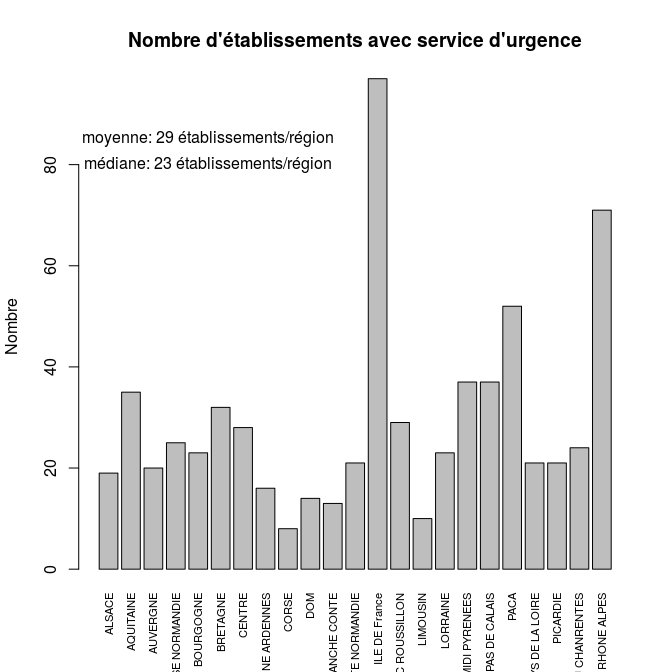
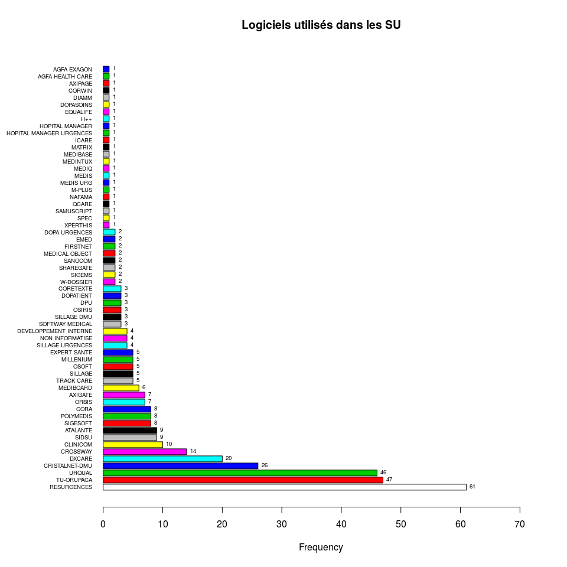

Enquête FEDORU
========================================================

La FEDORU a décidé de faire sa propre enquête concernant les logiciels utilisés dans les servives d'urgence. RESURAL a été chargé de cette enquête.

Méthodologie
------------

La liste des SU a été récupérée à partir du fichier [FINESS](adresse ?) en sélectionnant toutes les régions de France + médecine d'urgence. L'export se fait en utilisabt le format étendu. Le fichier résultant est enregistré sous __DATA/SU_France_2014.csv__. A partir de ce fichier, les colonnes ... ont été isolées. Le fichier obtenu a été mis en ligne via __google drive__ et mis à la disposition des membres du CA.

Google ayant modifié les conditions d'accès au _drive_, il faut procéder en trois temps pour récupérer les données:

1. ouvrir le fichier dans drive et importer le fichier au format .csv.
2. l'ouvrir dans calc et le réenregisterer au format .csv en précisant que les champs doivent être entourés de guillemets (sinon ça plante)
2. transférer le ficher dans le répertoire de travail et le renommer __su_France_ + AAAAMMJJ + .csv__.


```
##  [1] "X"                       "Région"                 
##  [3] "Dpt"                     "FINNES"                 
##  [5] "Raison.sociale"          "Complement.distribution"
##  [7] "Adresse"                 "Lieudit.BP"             
##  [9] "Code.postal"             "Libelle.routage"        
## [11] "Tel"                     "nom.correspondant"      
## [13] "mail"                    "logiciel"               
## [15] "editeur"                 "RPU..OUI.NON."          
## [17] "Remarque"
```

```
## 'data.frame':	682 obs. of  17 variables:
##  $ X                      : int  437 438 439 440 441 442 443 444 445 446 ...
##  $ Région                 : Factor w/ 23 levels "ALSACE","AQUITAINE",..: 1 1 1 1 1 1 1 1 1 1 ...
##  $ Dpt                    : Factor w/ 100 levels "Ain","Aine","Allier",..: 12 12 12 12 12 12 12 12 12 42 ...
##  $ FINNES                 : Factor w/ 680 levels "","100000090",..: 412 413 414 415 416 417 418 419 420 421 ...
##  $ Raison.sociale         : Factor w/ 676 levels "AMERICAN MEMORIAL HOSPITAL CHU REIMS",..: 531 59 383 314 102 476 441 474 534 443 ...
##  $ Complement.distribution: Factor w/ 53 levels "","25-29","2-avr.",..: 1 1 1 1 1 1 1 1 1 1 ...
##  $ Adresse                : Factor w/ 663 levels "","100 BOULEVARD DU GENERAL LECLERC",..: 137 437 117 199 196 452 277 101 126 168 ...
##  $ Lieudit.BP             : Factor w/ 299 levels "","2 AV DU 11 NOVEMBRE 1918",..: 160 148 75 73 121 1 246 1 1 31 ...
##  $ Code.postal            : Factor w/ 660 levels "1000","10003",..: 396 401 403 399 402 398 395 395 397 408 ...
##  $ Libelle.routage        : Factor w/ 615 levels "ABBEVILLE CEDEX",..: 551 247 491 614 494 550 551 551 552 386 ...
##  $ Tel                    : Factor w/ 662 levels "","01 30 69 45 00 OU 15",..: 352 351 358 356 357 354 353 355 352 362 ...
##  $ nom.correspondant      : Factor w/ 186 levels ""," ","Accueil des urgences : 02 28 25 50 15",..: 1 1 1 1 1 1 1 1 1 1 ...
##  $ mail                   : Factor w/ 335 levels "","abdelattif.diani@ch-ghsa.fr",..: 1 1 1 1 1 1 1 1 1 1 ...
##  $ logiciel               : Factor w/ 72 levels "","AGFA EXAGON",..: 23 52 23 4 8 23 4 44 23 4 ...
##  $ editeur                : Factor w/ 28 levels "","\n","(Calystène)",..: 1 1 1 1 1 1 1 1 1 1 ...
##  $ RPU..OUI.NON.          : Factor w/ 9 levels "","?","\n","NON",..: 7 7 7 7 7 7 7 7 7 7 ...
##  $ Remarque               : Factor w/ 19 levels "","\n","à partir de janvier 2015 : Logiciel DxCare V7.4",..: 1 1 1 1 1 1 3 1 1 1 ...
```
#### Normalisation du fichier

- Suppression des blancs
- suppression des caractères accentués
- correction du nom des logiciels (+++)


#### Nombre (théorique) de SU par région:


```
              ALSACE            AQUITAINE             AUVERGNE 
                  19                   35                   20 
     BASSE NORMANDIE            BOURGOGNE             BRETAGNE 
                  25                   23                   32 
              CENTRE   CHAMPAGNE ARDENNES                CORSE 
                  28                   16                    8 
                 DOM        FRANCHE CONTE      HAUTE NORMANDIE 
                  14                   13                   21 
       ILE DE France LANGUEDOC ROUSSILLON             LIMOUSIN 
                  97                   34                   10 
            LORRAINE        MIDI PYRENEES   NORD PAS DE CALAIS 
                  24                   37                   37 
                PACA     PAYS DE LA LOIRE             PICARDIE 
                  52                   21                   21 
   POITOU CHANRENTES          RHONE ALPES 
                  24                   71 
```

 

#### Table des logiciels répertoriés

On exclu les colonnes:

 - "MAIL ENVOYÉ SUR LE SITE RUBRIQUE NOUS CONTACTER" (28)
 - "MAIL ATTENTE REPONSE" (27)
 - "NON INFORMATISÉ" (39)

```
Loading required package: foreign
Loading required package: survival
Loading required package: splines
Loading required package: MASS
Loading required package: nnet
```

```
          AGFA EXAGON      AGFA HEALTH CARE              ATALANTE 
                    1                     1                     9 
              AXIGATE               AXIPAGE              CLINICOM 
                    7                     1                     9 
                 CORA             CORETEXTE                CORWIN 
                    8                     3                     1 
       CRISTALNET-DMU              CROSSWAY DEVELOPPEMENT INTERNE 
                   26                    14                     2 
                DIAMM             DOPASOINS             DOPATIENT 
                    1                     1                     3 
        DOPA URGENCES                   DPU                DXCARE 
                    2                     3                    19 
                 EMED              EQUALIFE          EXPERT SANTE 
                    1                     1                     2 
             FIRSTNET                   H++       HOPITAL MANAGER 
                    2                     1                     1 
                ICARE                MATRIX              MEDIBASE 
                    1                     1                     1 
            MEDIBOARD        MEDICAL OBJECT              MEDINTUX 
                    5                     2                     1 
                MEDIQ             MEDIS URG             MILLENIUM 
                    1                     1                     5 
               M-PLUS                NAFAMA       NON INFORMATISE 
                    1                     1                     5 
                ORBIS                OSIRIS                 OSOFT 
                    6                     2                     2 
 POLIMEDIS - EQUAFILE             POLYMEDIS                 QCARE 
                    1                     7                     1 
          RESURGENCES            SAMUSCRIPT               SANOCOM 
                   53                     1                     2 
            SHAREGATE                 SIDSU                SIGEMS 
                    2                     9                     2 
              SILLAGE       SOFTWAY MEDICAL                  SPEC 
                    7                     3                     1 
           TRACK CARE            TU-ORUPACA                 URCAL 
                    5                    47                     1 
               URQUAL              XPERTHIS                  NA's 
                   35                     1                   194 
```

 

```
l : 
                      Frequency   %(NA+)   %(NA-)
AGFA EXAGON                   1      0.2      0.3
AGFA HEALTH CARE              1      0.2      0.3
AXIPAGE                       1      0.2      0.3
CORWIN                        1      0.2      0.3
DIAMM                         1      0.2      0.3
DOPASOINS                     1      0.2      0.3
EMED                          1      0.2      0.3
EQUALIFE                      1      0.2      0.3
H++                           1      0.2      0.3
HOPITAL MANAGER               1      0.2      0.3
ICARE                         1      0.2      0.3
MATRIX                        1      0.2      0.3
MEDIBASE                      1      0.2      0.3
MEDINTUX                      1      0.2      0.3
MEDIQ                         1      0.2      0.3
MEDIS URG                     1      0.2      0.3
M-PLUS                        1      0.2      0.3
NAFAMA                        1      0.2      0.3
POLIMEDIS - EQUAFILE          1      0.2      0.3
QCARE                         1      0.2      0.3
SAMUSCRIPT                    1      0.2      0.3
SPEC                          1      0.2      0.3
URCAL                         1      0.2      0.3
XPERTHIS                      1      0.2      0.3
DEVELOPPEMENT INTERNE         2      0.4      0.6
DOPA URGENCES                 2      0.4      0.6
EXPERT SANTE                  2      0.4      0.6
FIRSTNET                      2      0.4      0.6
MEDICAL OBJECT                2      0.4      0.6
OSIRIS                        2      0.4      0.6
OSOFT                         2      0.4      0.6
SANOCOM                       2      0.4      0.6
SHAREGATE                     2      0.4      0.6
SIGEMS                        2      0.4      0.6
CORETEXTE                     3      0.6      0.9
DOPATIENT                     3      0.6      0.9
DPU                           3      0.6      0.9
SOFTWAY MEDICAL               3      0.6      0.9
MEDIBOARD                     5      1.0      1.5
MILLENIUM                     5      1.0      1.5
NON INFORMATISE               5      1.0      1.5
TRACK CARE                    5      1.0      1.5
ORBIS                         6      1.1      1.8
AXIGATE                       7      1.3      2.1
POLYMEDIS                     7      1.3      2.1
SILLAGE                       7      1.3      2.1
CORA                          8      1.5      2.4
ATALANTE                      9      1.7      2.7
CLINICOM                      9      1.7      2.7
SIDSU                         9      1.7      2.7
CROSSWAY                     14      2.7      4.2
DXCARE                       19      3.6      5.7
CRISTALNET-DMU               26      4.9      7.8
URQUAL                       35      6.7     10.5
TU-ORUPACA                   47      8.9     14.2
RESURGENCES                  53     10.1     16.0
<NA>                        194     36.9      0.0
  Total                     526    100.0    100.0
```

Nombre total de SU identifiés: 682

Nombre total de logiciels identifiés: 332

Taux d'exhaustivité: 48.68 %

Nombre de fournisseurs identifiés: 57

SU non informatisés: 6

SU contactés en attente de réponse: 156

#### Table logiciels par région:


```
                      
                       AGFA EXAGON AGFA HEALTH CARE ATALANTE AXIGATE
  ALSACE                         0                0        7       0
  AQUITAINE                      0                0        0       1
  AUVERGNE                       0                0        0       0
  BASSE NORMANDIE                0                0        1       2
  BOURGOGNE                      1                0        1       0
  BRETAGNE                       0                0        0       0
  CENTRE                         0                0        0       1
  CHAMPAGNE ARDENNES             0                0        0       0
  CORSE                          0                0        0       0
  DOM                            0                1        0       0
  FRANCHE CONTE                  0                0        0       0
  HAUTE NORMANDIE                0                0        0       3
  ILE DE France                  0                0        0       0
  LANGUEDOC ROUSSILLON           0                0        0       0
  LIMOUSIN                       0                0        0       0
  LORRAINE                       0                0        0       0
  MIDI PYRENEES                  0                0        0       0
  NORD PAS DE CALAIS             0                0        0       0
  PACA                           0                0        0       0
  PAYS DE LA LOIRE               0                0        0       0
  PICARDIE                       0                0        0       0
  POITOU CHANRENTES              0                0        0       0
  RHONE ALPES                    0                0        0       0
                      
                       AXIPAGE CLINICOM CORA CORETEXTE CORWIN
  ALSACE                     0        1    0         0      0
  AQUITAINE                  0        1    0         0      0
  AUVERGNE                   0        0    0         0      0
  BASSE NORMANDIE            0        0    1         0      0
  BOURGOGNE                  0        0    0         0      0
  BRETAGNE                   0        0    0         0      0
  CENTRE                     0        1    1         0      0
  CHAMPAGNE ARDENNES         0        0    0         0      0
  CORSE                      0        0    0         0      0
  DOM                        0        0    0         0      0
  FRANCHE CONTE              0        0    0         0      0
  HAUTE NORMANDIE            0        1    0         0      0
  ILE DE France              1        0    0         0      0
  LANGUEDOC ROUSSILLON       0        0    1         0      0
  LIMOUSIN                   0        0    0         0      0
  LORRAINE                   0        0    0         1      0
  MIDI PYRENEES              0        0    0         2      1
  NORD PAS DE CALAIS         0        3    2         0      0
  PACA                       0        0    0         0      0
  PAYS DE LA LOIRE           0        1    2         0      0
  PICARDIE                   0        0    0         0      0
  POITOU CHANRENTES          0        0    0         0      0
  RHONE ALPES                0        1    1         0      0
                      
                       CRISTALNET-DMU CROSSWAY DEVELOPPEMENT INTERNE DIAMM
  ALSACE                            3        0                     0     0
  AQUITAINE                         0        3                     0     0
  AUVERGNE                          0        0                     0     0
  BASSE NORMANDIE                   1        0                     0     0
  BOURGOGNE                         6        3                     0     0
  BRETAGNE                          0        0                     0     0
  CENTRE                            0        0                     0     0
  CHAMPAGNE ARDENNES                3        0                     0     0
  CORSE                             0        0                     0     0
  DOM                               0        0                     0     0
  FRANCHE CONTE                     0        1                     0     0
  HAUTE NORMANDIE                   0        0                     0     0
  ILE DE France                     0        0                     0     0
  LANGUEDOC ROUSSILLON              0        0                     0     0
  LIMOUSIN                          0        0                     0     0
  LORRAINE                          0        1                     1     0
  MIDI PYRENEES                     0        6                     1     1
  NORD PAS DE CALAIS                2        0                     0     0
  PACA                              2        0                     0     0
  PAYS DE LA LOIRE                  0        0                     0     0
  PICARDIE                          1        0                     0     0
  POITOU CHANRENTES                 0        0                     0     0
  RHONE ALPES                       8        0                     0     0
                      
                       DOPASOINS DOPATIENT DOPA URGENCES DPU DXCARE EMED
  ALSACE                       0         0             0   0      4    0
  AQUITAINE                    1         0             0   0      5    0
  AUVERGNE                     0         0             0   0      0    0
  BASSE NORMANDIE              0         0             0   0      0    0
  BOURGOGNE                    0         0             0   0      0    0
  BRETAGNE                     0         0             0   0      0    0
  CENTRE                       0         0             0   0      2    0
  CHAMPAGNE ARDENNES           0         0             2   0      1    0
  CORSE                        0         0             0   0      0    0
  DOM                          0         0             0   0      1    0
  FRANCHE CONTE                0         0             0   0      0    0
  HAUTE NORMANDIE              0         0             0   0      1    0
  ILE DE France                0         0             0   0      0    0
  LANGUEDOC ROUSSILLON         0         0             0   0      0    0
  LIMOUSIN                     0         0             0   0      0    0
  LORRAINE                     0         0             0   0      1    0
  MIDI PYRENEES                0         3             0   1      2    1
  NORD PAS DE CALAIS           0         0             0   0      2    0
  PACA                         0         0             0   0      0    0
  PAYS DE LA LOIRE             0         0             0   0      0    0
  PICARDIE                     0         0             0   0      0    0
  POITOU CHANRENTES            0         0             0   0      0    0
  RHONE ALPES                  0         0             0   2      0    0
                      
                       EQUALIFE EXPERT SANTE FIRSTNET H++ HOPITAL MANAGER
  ALSACE                      0            0        0   0               0
  AQUITAINE                   0            0        0   0               0
  AUVERGNE                    0            0        0   0               0
  BASSE NORMANDIE             0            0        0   0               0
  BOURGOGNE                   0            0        0   0               0
  BRETAGNE                    0            0        0   0               0
  CENTRE                      0            0        1   0               0
  CHAMPAGNE ARDENNES          0            0        0   0               0
  CORSE                       0            0        0   0               0
  DOM                         0            0        0   0               0
  FRANCHE CONTE               1            0        1   0               0
  HAUTE NORMANDIE             0            0        0   0               0
  ILE DE France               0            0        0   1               0
  LANGUEDOC ROUSSILLON        0            0        0   0               0
  LIMOUSIN                    0            0        0   0               0
  LORRAINE                    0            0        0   0               0
  MIDI PYRENEES               0            1        0   0               0
  NORD PAS DE CALAIS          0            0        0   0               1
  PACA                        0            0        0   0               0
  PAYS DE LA LOIRE            0            0        0   0               0
  PICARDIE                    0            0        0   0               0
  POITOU CHANRENTES           0            0        0   0               0
  RHONE ALPES                 0            1        0   0               0
                      
                       ICARE MAIL ATTENTE REPONSE MEDIBASE MEDIBOARD
  ALSACE                   0                    0        0         0
  AQUITAINE                0                    0        1         0
  AUVERGNE                 0                   11        0         0
  BASSE NORMANDIE          0                   10        0         0
  BOURGOGNE                0                    0        0         0
  BRETAGNE                 0                    6        0         0
  CENTRE                   0                   14        0         0
  CHAMPAGNE ARDENNES       0                    0        0         0
  CORSE                    0                    0        0         0
  DOM                      0                   11        0         0
  FRANCHE CONTE            0                    0        0         0
  HAUTE NORMANDIE          1                    6        0         0
  ILE DE France            0                   14        0         0
  LANGUEDOC ROUSSILLON     0                    7        0         0
  LIMOUSIN                 0                    0        0         0
  LORRAINE                 0                    0        0         0
  MIDI PYRENEES            0                    0        0         2
  NORD PAS DE CALAIS       0                    0        0         0
  PACA                     0                    0        0         0
  PAYS DE LA LOIRE         0                    8        0         0
  PICARDIE                 0                   15        0         0
  POITOU CHANRENTES        0                   16        0         0
  RHONE ALPES              0                   32        0         3
                      
                       MEDICAL OBJECT MEDINTUX MEDIQ MEDIS URG MILLENIUM
  ALSACE                            0        0     0         0         0
  AQUITAINE                         0        0     0         0         0
  AUVERGNE                          0        0     0         0         0
  BASSE NORMANDIE                   0        0     0         0         0
  BOURGOGNE                         0        0     0         0         0
  BRETAGNE                          0        0     0         1         0
  CENTRE                            0        0     0         0         0
  CHAMPAGNE ARDENNES                0        0     0         0         0
  CORSE                             0        0     0         0         0
  DOM                               0        0     0         0         0
  FRANCHE CONTE                     0        0     0         0         4
  HAUTE NORMANDIE                   0        0     0         0         0
  ILE DE France                     0        0     1         0         0
  LANGUEDOC ROUSSILLON              0        0     0         0         0
  LIMOUSIN                          0        0     0         0         0
  LORRAINE                          0        0     0         0         0
  MIDI PYRENEES                     2        0     0         0         0
  NORD PAS DE CALAIS                0        0     0         0         1
  PACA                              0        1     0         0         0
  PAYS DE LA LOIRE                  0        0     0         0         0
  PICARDIE                          0        0     0         0         0
  POITOU CHANRENTES                 0        0     0         0         0
  RHONE ALPES                       0        0     0         0         0
                      
                       M-PLUS NAFAMA NON INFORMATISE OSIRIS OSOFT
  ALSACE                    0      0               0      0     0
  AQUITAINE                 1      0               0      0     0
  AUVERGNE                  0      0               0      0     0
  BASSE NORMANDIE           0      0               0      1     0
  BOURGOGNE                 0      0               0      0     0
  BRETAGNE                  0      0               2      0     0
  CENTRE                    0      0               1      0     0
  CHAMPAGNE ARDENNES        0      1               0      0     0
  CORSE                     0      0               0      0     0
  DOM                       0      0               0      0     0
  FRANCHE CONTE             0      0               0      0     0
  HAUTE NORMANDIE           0      0               0      0     0
  ILE DE France             0      0               0      0     0
  LANGUEDOC ROUSSILLON      0      0               0      0     0
  LIMOUSIN                  0      0               0      0     0
  LORRAINE                  0      0               0      0     0
  MIDI PYRENEES             0      0               0      0     0
  NORD PAS DE CALAIS        0      0               0      1     1
  PACA                      0      0               0      0     0
  PAYS DE LA LOIRE          0      0               0      0     0
  PICARDIE                  0      0               1      0     0
  POITOU CHANRENTES         0      0               1      0     0
  RHONE ALPES               0      0               0      0     1
                      
                       POLIMEDIS - EQUAFILE POLYMEDIS QCARE RESURGENCES
  ALSACE                                  0         0     0           1
  AQUITAINE                               0         0     0           1
  AUVERGNE                                0         0     0           0
  BASSE NORMANDIE                         0         0     0           2
  BOURGOGNE                               0         0     0           3
  BRETAGNE                                0         0     0           3
  CENTRE                                  0         0     0           0
  CHAMPAGNE ARDENNES                      0         5     0           1
  CORSE                                   0         0     0           0
  DOM                                     0         0     0           0
  FRANCHE CONTE                           1         0     0           5
  HAUTE NORMANDIE                         0         0     0           1
  ILE DE France                           0         0     0           0
  LANGUEDOC ROUSSILLON                    0         0     0           0
  LIMOUSIN                                0         0     0           7
  LORRAINE                                0         1     0          17
  MIDI PYRENEES                           0         0     0           0
  NORD PAS DE CALAIS                      0         1     0           4
  PACA                                    0         0     1           2
  PAYS DE LA LOIRE                        0         0     0           3
  PICARDIE                                0         0     0           0
  POITOU CHANRENTES                       0         0     0           2
  RHONE ALPES                             0         0     0           1
                      
                       SAMUSCRIPT SANOCOM SHAREGATE SIDSU SIGEMS SILLAGE
  ALSACE                        0       0         0     0      0       0
  AQUITAINE                     0       2         2     9      2       2
  AUVERGNE                      0       0         0     0      0       0
  BASSE NORMANDIE               0       0         0     0      0       1
  BOURGOGNE                     0       0         0     0      0       0
  BRETAGNE                      0       0         0     0      0       3
  CENTRE                        0       0         0     0      0       0
  CHAMPAGNE ARDENNES            0       0         0     0      0       0
  CORSE                         0       0         0     0      0       0
  DOM                           0       0         0     0      0       0
  FRANCHE CONTE                 0       0         0     0      0       0
  HAUTE NORMANDIE               0       0         0     0      0       0
  ILE DE France                 1       0         0     0      0       0
  LANGUEDOC ROUSSILLON          0       0         0     0      0       0
  LIMOUSIN                      0       0         0     0      0       0
  LORRAINE                      0       0         0     0      0       0
  MIDI PYRENEES                 0       0         0     0      0       0
  NORD PAS DE CALAIS            0       0         0     0      0       1
  PACA                          0       0         0     0      0       0
  PAYS DE LA LOIRE              0       0         0     0      0       0
  PICARDIE                      0       0         0     0      0       0
  POITOU CHANRENTES             0       0         0     0      0       0
  RHONE ALPES                   0       0         0     0      0       0
                      
                       SOFTWAY MEDICAL SPEC TRACK CARE TU-ORUPACA URCAL
  ALSACE                             0    0          0          0     0
  AQUITAINE                          0    0          1          0     0
  AUVERGNE                           0    0          0          0     0
  BASSE NORMANDIE                    0    0          0          0     0
  BOURGOGNE                          3    0          0          0     0
  BRETAGNE                           0    0          0          0     0
  CENTRE                             0    0          0          0     1
  CHAMPAGNE ARDENNES                 0    0          0          0     0
  CORSE                              0    0          0          4     0
  DOM                                0    0          0          0     0
  FRANCHE CONTE                      0    0          0          0     0
  HAUTE NORMANDIE                    0    0          0          0     0
  ILE DE France                      0    0          0          0     0
  LANGUEDOC ROUSSILLON               0    0          0          1     0
  LIMOUSIN                           0    1          0          0     0
  LORRAINE                           0    0          0          0     0
  MIDI PYRENEES                      0    0          0          2     0
  NORD PAS DE CALAIS                 0    0          4          0     0
  PACA                               0    0          0         40     0
  PAYS DE LA LOIRE                   0    0          0          0     0
  PICARDIE                           0    0          0          0     0
  POITOU CHANRENTES                  0    0          0          0     0
  RHONE ALPES                        0    0          0          0     0
                      
                       URQUAL XPERTHIS
  ALSACE                    1        0
  AQUITAINE                 3        0
  AUVERGNE                  1        0
  BASSE NORMANDIE           0        0
  BOURGOGNE                 3        0
  BRETAGNE                  1        0
  CENTRE                    0        0
  CHAMPAGNE ARDENNES        3        0
  CORSE                     0        0
  DOM                       0        0
  FRANCHE CONTE             0        0
  HAUTE NORMANDIE           1        0
  ILE DE France             5        0
  LANGUEDOC ROUSSILLON      1        0
  LIMOUSIN                  2        0
  LORRAINE                  0        1
  MIDI PYRENEES             5        0
  NORD PAS DE CALAIS        4        0
  PACA                      2        0
  PAYS DE LA LOIRE          2        0
  PICARDIE                  0        0
  POITOU CHANRENTES         0        0
  RHONE ALPES               1        0
```

 


#### Comparaison nb SU/Logiciels par région

- SU: nombre de services d'urgence
- Logiciels: nombre de logiciels répertorié (au 1/9/2014)
- Rapport: % d'équipement


```
                     Logiciels SU rapport reg.id
ALSACE                      17 19   89.47     42
AQUITAINE                   35 35  100.00     72
AUVERGNE                    12 20   60.00     83
BASSE NORMANDIE             19 25   76.00     25
BOURGOGNE                   20 23   86.96     26
BRETAGNE                    16 32   50.00     53
CENTRE                      22 28   78.57     24
CHAMPAGNE ARDENNES          16 16  100.00     21
CORSE                        4  8   50.00     94
DOM                         13 14   92.86    100
FRANCHE CONTE               13 13  100.00     43
HAUTE NORMANDIE             14 21   66.67     23
ILE DE France               23 97   23.71     11
LANGUEDOC ROUSSILLON        10 34   29.41     91
LIMOUSIN                    10 10  100.00     74
LORRAINE                    23 24   95.83     41
MIDI PYRENEES               30 37   81.08     73
NORD PAS DE CALAIS          27 37   72.97     31
PACA                        48 52   92.31     93
PAYS DE LA LOIRE            16 21   76.19     52
PICARDIE                    17 21   80.95     22
POITOU CHANRENTES           19 24   79.17     54
RHONE ALPES                 51 71   71.83     82
```

```
                     Logiciels SU rapport reg.id
ILE DE France               23 97   23.71     11
LANGUEDOC ROUSSILLON        10 34   29.41     91
BRETAGNE                    16 32   50.00     53
CORSE                        4  8   50.00     94
AUVERGNE                    12 20   60.00     83
HAUTE NORMANDIE             14 21   66.67     23
RHONE ALPES                 51 71   71.83     82
NORD PAS DE CALAIS          27 37   72.97     31
BASSE NORMANDIE             19 25   76.00     25
PAYS DE LA LOIRE            16 21   76.19     52
CENTRE                      22 28   78.57     24
POITOU CHANRENTES           19 24   79.17     54
PICARDIE                    17 21   80.95     22
MIDI PYRENEES               30 37   81.08     73
BOURGOGNE                   20 23   86.96     26
ALSACE                      17 19   89.47     42
PACA                        48 52   92.31     93
DOM                         13 14   92.86    100
LORRAINE                    23 24   95.83     41
AQUITAINE                   35 35  100.00     72
CHAMPAGNE ARDENNES          16 16  100.00     21
FRANCHE CONTE               13 13  100.00     43
LIMOUSIN                    10 10  100.00     74
```
- nombre de logiciels répertoriés: 475
- nombre de services répertoriés: 682 . Le nombre de SU est surestimé par le répertoire FINESS (par ex. des établissements sans SU mais avec une antenne SMUR saisonnière y figurent).
 
Comparer public, privé et PSPH

Cartographie
============


```
[1] "reg.id"    "reg.nom"   "x"         "y"         "Logiciels" "SU"       
[7] "rapport"  
```

   

Transmission des RPU
-------------------


```
  ?  NA NON OUI 
  1 307  35 339 
```

```
                                                NON OUI     V5
ATALANTE                                          0   8   0.00
CORA                                              0   8   0.00
CORWIN                                            0   1   0.00
DEVELOPPEMENT INTERNE                             0   2   0.00
DIAMM                                             0   1   0.00
DOPASOINS                                         0   1   0.00
DOPATIENT                                         0   3   0.00
DOPA URGENCES                                     0   2   0.00
DPU                                               0   3   0.00
EMED                                              0   1   0.00
EQUALIFE                                          0   1   0.00
EXPERT SANTE                                      0   2   0.00
H++                                               0   1   0.00
MATRIX                                            0   1   0.00
MEDIBASE                                          0   1   0.00
MEDIBOARD                                         0   5   0.00
MEDICAL OBJECT                                    0   2   0.00
MEDINTUX                                          0   1   0.00
MEDIS URG                                         0   1   0.00
MILLENIUM                                         0   5   0.00
M-PLUS                                            0   1   0.00
NAFAMA                                            0   1   0.00
OSIRIS                                            0   2   0.00
OSOFT                                             0   2   0.00
POLIMEDIS - EQUAFILE                              0   1   0.00
POLYMEDIS                                         0   7   0.00
QCARE                                             0   1   0.00
SANOCOM                                           0   2   0.00
SHAREGATE                                         0   2   0.00
SIDSU                                             0   9   0.00
SPEC                                              0   1   0.00
TRACK CARE                                        0   5   0.00
URCAL                                             0   1   0.00
XPERTHIS                                          0   1   0.00
MAIL ATTENTE REPONSE                              1  26   3.85
RESURGENCES                                       2  48   4.17
CRISTALNET-DMU                                    1  21   4.76
DXCARE                                            1  18   5.56
TU-ORUPACA                                        3  44   6.82
CROSSWAY                                          1  11   9.09
URQUAL                                            3  28  10.71
CLINICOM                                          1   8  12.50
ORBIS                                             1   5  20.00
NON INFORMATISE                                   1   4  25.00
AXIGATE                                           2   5  40.00
CORETEXTE                                         1   2  50.00
SILLAGE                                           3   4  75.00
FIRSTNET                                          1   1 100.00
AGFA HEALTH CARE                                  1   0    Inf
AXIPAGE                                           1   0    Inf
HOPITAL MANAGER                                   1   0    Inf
ICARE                                             1   0    Inf
SAMUSCRIPT                                        1   0    Inf
SIGEMS                                            2   0    Inf
AGFA EXAGON                                       0   0    NaN
MAIL ENVOYE SUR LE SITE RUBRIQUE NOUS CONTACTER   0   0    NaN
MEDIQ                                             0   0    NaN
SOFTWAY MEDICAL                                   0   0    NaN
```

