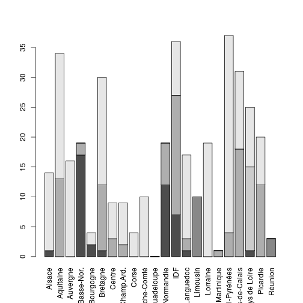
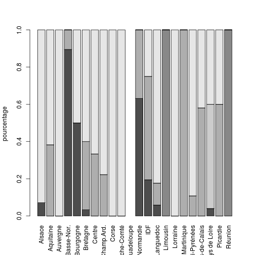
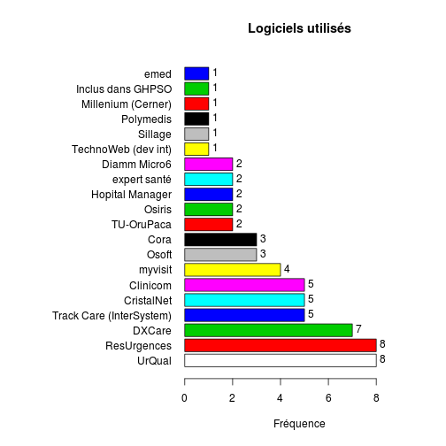

Title
========================================================

Fichier origine:

Fichier .csv: le fichier source est enregistré sous le nom de data3 avec les options:
- UTF8
- mettre des guillements autour des nom (sinon plantage à la lecture de R)
- séparateur = ';'

- SR serveur régional
- NR non réponse
- NA non disponible (Non Avalaible)
INVS envoi direct à l'INVS


```r
library("epicalc")
```

```
## Loading required package: foreign
## Loading required package: survival
## Loading required package: splines
## Loading required package: MASS
## Loading required package: nnet
```

```r
file <- "../DATA/data3.csv"
d <- read.table(file, header = TRUE, sep = ";")
nrow(d)
```

```
## [1] 529
```

```r
names(d)
```

```
## [1] "REGION"         "Raison.sociale" "Nom.ES.usuel"   "FINESS"        
## [5] "RPU.CAPA"       "RPU.QUI"        "LOGICIEL"       "INFORM."
```

```r
str(d)
```

```
## 'data.frame':	529 obs. of  8 variables:
##  $ REGION        : Factor w/ 22 levels "Alsace","Aquitaine",..: 1 1 1 1 1 1 1 1 1 1 ...
##  $ Raison.sociale: Factor w/ 525 levels "","AMERICAN MEMORIAL HOSPITAL CHU REIMS",..: 468 5 346 377 375 58 298 257 100 420 ...
##  $ Nom.ES.usuel  : Factor w/ 523 levels "","Alpha Santé - C.H. de Mont Saint-Martin",..: 474 25 363 391 389 142 201 251 203 427 ...
##  $ FINESS        : Factor w/ 525 levels "","100000090",..: 317 318 319 320 321 322 323 324 325 326 ...
##  $ RPU.CAPA      : Factor w/ 3 levels "Non","NR","Oui": 3 NA 1 1 1 3 3 3 3 3 ...
##  $ RPU.QUI       : Factor w/ 5 levels "INVS","INVS et SR",..: 5 NA NA NA NA 5 5 5 5 5 ...
##  $ LOGICIEL      : Factor w/ 41 levels "","ﾠ","autre",..: 1 1 1 1 1 1 1 1 1 1 ...
##  $ INFORM.       : Factor w/ 4 levels "","Non","NR",..: 1 1 1 1 1 1 1 1 1 1 ...
```

```r

# colnne LOGICIEL
a <- as.character(d$LOGICIEL)
a[a == ""] <- NA
a[a == "autre"] <- NA
a[a == "Christalnet (module DMU)"] <- "Cristalnet"
a[a == "Clinicom (Siemens)"] <- "Clinicom"
a[a == "CORA McKesson"] <- "Cora"
a[a == "CrystalNet"] <- "Cristalnet"
a[a == "DMU (CristalNet)"] <- "Cristalnet"
a[a == "DxCare MEDASYS"] <- "DXCare"
a[a == "RESURGENCE"] <- "ResUrgences"
a[a == "Resurgences"] <- "ResUrgences"
a[a == "RESURGENCE (Adulte) DxCare Medasys (Pédiatrie)"] <- "ResUrgences"
a[a == "urqual"] <- "UrQual"
a[a == "UrQual (McKesson)"] <- "UrQual"
a[a == "Urqual (McKesson)"] <- "UrQual"
a[a == "DXCARE (Medasys)"] <- "DXCare"
a[a == "Cristalnet"] <- "CristalNet"
a[a == "CORA"] <- "Cora"
a[a == "CLINICOM (Creil)"] <- "Clinicom"
a[a == "DxCare (Medasys)"] <- "DXCare"
a[a == "hopital manager"] <- "Hopital Manager"
a[a == "Osiris (Cormin)"] <- "Osiris"
a[a == "OSIRIS Evolucare"] <- "Osiris"
a[a == "OSOFT"] <- "Osoft"
a[a == "ﾠ"] <- NA
a[a == "cf ch lodeve"] <- NA
a[a == "Etablissement prioritaire !"] <- NA
a[a == "Pas de SAU"] <- NA
d$LOGICIEL <- a

summary(d$REGION)
```

```
##             Alsace          Aquitaine           Auvergne 
##                 20                 34                 16 
##         Basse-Nor.          Bourgogne           Bretagne 
##                 23                 24                 31 
##             Centre         Champ.Ard.              Corse 
##                 29                 16                  4 
##      Franche-Comté         Guadeloupe    Haute-Normandie 
##                 11                  5                 21 
##                IDF          Languedoc           Limousin 
##                 99                 32                 10 
##           Lorraine         Martinique      Midi-Pyrénées 
##                 27                  6                 37 
## Nord Pas-de-Calais      Pays de Loire           Picardie 
##                 32                 25                 24 
##            Réunion 
##                  3
```

```r
barplot(summary(d$REGION), main = "Nombre d'établissements avec service d'urgence", 
    ylab = "Nombre", las = 3)
```

 

```r

summary(d$RPU.CAPA)
```

```
##  Non   NR  Oui NA's 
##   66    8  297  158
```

```r
t <- table(d$REGION, d$RPU.CAPA)
t
```

```
##                     
##                      Non NR Oui
##   Alsace               4  0  14
##   Aquitaine           11  0  23
##   Auvergne             0  0  16
##   Basse-Nor.           1  0  18
##   Bourgogne            0  0   4
##   Bretagne             5  0  25
##   Centre               0  0   7
##   Champ.Ard.           0  0   9
##   Corse                0  0   4
##   Franche-Comté        0  0  10
##   Guadeloupe           0  0   0
##   Haute-Normandie      2  0  12
##   IDF                  6  7  23
##   Languedoc            0  0  23
##   Limousin             0  0  10
##   Lorraine             0  0  21
##   Martinique           0  1   1
##   Midi-Pyrénées        0  0  37
##   Nord Pas-de-Calais  17  0  14
##   Pays de Loire        8  0  15
##   Picardie            12  0   8
##   Réunion              0  0   3
```

```r
barplot(t(t), las = 3)
```

 

```r

summary(d$RPU.QUI)
```

```
##       INVS INVS et SR        Non    Non-SIB         SR       NA's 
##         42         13         95         14        203        162
```

```r
t <- table(d$REGION, d$RPU.QUI)
t
```

```
##                     
##                      INVS INVS et SR Non Non-SIB SR
##   Alsace                1          0   0       0 13
##   Aquitaine             0          0  13       0 21
##   Auvergne              0          0   0       0 16
##   Basse-Nor.           17          0   2       0  0
##   Bourgogne             2          0   0       0  2
##   Bretagne              1          0  11       0 18
##   Centre                0          0   3       0  6
##   Champ.Ard.            0          0   2       0  7
##   Corse                 0          0   0       0  4
##   Franche-Comté         0          0   0       0 10
##   Guadeloupe            0          0   0       0  0
##   Haute-Normandie      12          0   7       0  0
##   IDF                   7          0  20       0  9
##   Languedoc             1          0   2       0 14
##   Limousin              0         10   0       0  0
##   Lorraine              0          0   0       0 19
##   Martinique            0          0   1       0  0
##   Midi-Pyrénées         0          0   4       0 33
##   Nord Pas-de-Calais    0          0  18       0 13
##   Pays de Loire         1          0   0      14 10
##   Picardie              0          0  12       0  8
##   Réunion               0          3   0       0  0
```

```r
barplot(t(t), las = 3)
```

 

```r
barplot(t(prop.table(t, 1)), las = 3, ylab = "pourcentage")
```

 

```r

table(d$RPU.QUI, d$RPU.CAPA)
```

```
##             
##              Non  NR Oui
##   INVS         1   0  39
##   INVS et SR   0   0  13
##   Non         53   7  29
##   Non-SIB      8   0   4
##   SR           0   0 203
```

```r

summary(as.factor(d$LOGICIEL))
```

```
##                 Clinicom                     Cora               CristalNet 
##                        5                        3                        5 
##             Diamm Micro6                   DXCare                     emed 
##                        2                        7                        1 
##             expert santé          Hopital Manager        Inclus dans GHPSO 
##                        2                        2                        1 
##       Millenium (Cerner)                  myvisit                   Osiris 
##                        1                        4                        2 
##                    Osoft                Polymedis              ResUrgences 
##                        3                        1                        8 
##                  Sillage      TechnoWeb (dev int) Track Care (InterSystem) 
##                        1                        1                        5 
##               TU-OruPaca                   UrQual                     NA's 
##                        2                        8                      465
```

```r
tab1(d$LOGICIEL, missing = FALSE, sort.group = "increasing", main = "Logiciels utilisés", 
    xlab = "Fréquence")
```

 

```
## d$LOGICIEL : 
##                          Frequency   %(NA+)   %(NA-)
## emed                             1      0.2      1.6
## Inclus dans GHPSO                1      0.2      1.6
## Millenium (Cerner)               1      0.2      1.6
## Polymedis                        1      0.2      1.6
## Sillage                          1      0.2      1.6
## TechnoWeb (dev int)              1      0.2      1.6
## Diamm Micro6                     2      0.4      3.1
## expert santé                     2      0.4      3.1
## Hopital Manager                  2      0.4      3.1
## Osiris                           2      0.4      3.1
## TU-OruPaca                       2      0.4      3.1
## Cora                             3      0.6      4.7
## Osoft                            3      0.6      4.7
## myvisit                          4      0.8      6.2
## Clinicom                         5      0.9      7.8
## CristalNet                       5      0.9      7.8
## Track Care (InterSystem)         5      0.9      7.8
## DXCare                           7      1.3     10.9
## ResUrgences                      8      1.5     12.5
## UrQual                           8      1.5     12.5
## <NA>                           465     87.9      0.0
##   Total                        529    100.0    100.0
```


