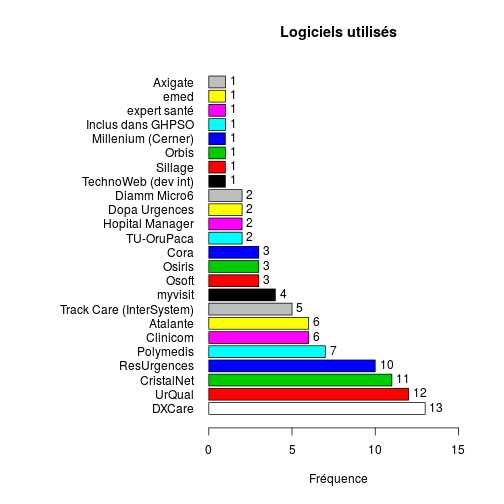

Consolidation OSIS-SAU (Novembre 2013)
========================================================

Fichier origine:

NB: utiliser le fichier **data3.csv** pour les modifications.

Fichier .csv: le fichier source est enregistré sous le nom de data3 avec les options:
- UTF8
- mettre des guillements autour des nom (sinon plantage à la lecture de R)
- séparateur = ';'

- SR serveur régional
- NR non réponse
- NA non disponible (Non Avalaible)
- INVS envoi direct à l'INVS
- INFORM. Le SU est-il informatisé ? (oui/non)
- CAPA Capacité à renvoyer des RPU ? (oui/non)


```r
library("epicalc")
```

```
## Loading required package: foreign
## Loading required package: survival
## Loading required package: splines
## Loading required package: MASS
## Loading required package: nnet
```

```r
file <- "../DATA/data3.csv"
d <- read.table(file, header = TRUE, sep = ";")
d$INFORM.[d$INFORM. == ""] <- NA
d$INFORM. <- factor(d$INFORM.)

nrow(d)
```

```
## [1] 529
```

```r
names(d)
```

```
## [1] "REGION"         "Raison.sociale" "Nom.ES.usuel"   "FINESS"        
## [5] "RPU.CAPA"       "RPU.QUI"        "LOGICIEL"       "INFORM."
```

```r
str(d)
```

```
## 'data.frame':	529 obs. of  8 variables:
##  $ REGION        : Factor w/ 22 levels "Alsace","Aquitaine",..: 1 1 1 1 1 1 1 1 1 1 ...
##  $ Raison.sociale: Factor w/ 525 levels "","AMERICAN MEMORIAL HOSPITAL CHU REIMS",..: 468 5 346 377 375 58 298 257 100 420 ...
##  $ Nom.ES.usuel  : Factor w/ 523 levels "","Alpha Santé - C.H. de Mont Saint-Martin",..: 474 25 363 391 389 142 201 251 203 427 ...
##  $ FINESS        : Factor w/ 525 levels "","100000090",..: 317 318 319 320 321 322 323 324 325 326 ...
##  $ RPU.CAPA      : Factor w/ 3 levels "Non","NR","Oui": 3 NA 1 1 1 3 3 3 3 3 ...
##  $ RPU.QUI       : Factor w/ 5 levels "INVS","INVS et SR",..: 5 NA NA NA NA 5 5 5 5 5 ...
##  $ LOGICIEL      : Factor w/ 46 levels "","ﾠ","Atalante",..: 16 16 NA 16 28 35 16 3 7 16 ...
##  $ INFORM.       : Factor w/ 5 levels "non","Non","NR",..: 4 4 4 4 4 4 4 4 4 4 ...
```

```r

# colnne LOGICIEL
a <- as.character(d$LOGICIEL)
a[a == ""] <- NA
a[a == "autre"] <- NA
a[a == "Christalnet (module DMU)"] <- "Cristalnet"
a[a == "Clinicom (Siemens)"] <- "Clinicom"
a[a == "CORA McKesson"] <- "Cora"
a[a == "CrystalNet"] <- "Cristalnet"
a[a == "DMU (CristalNet)"] <- "Cristalnet"
a[a == "DxCare MEDASYS"] <- "DXCare"
a[a == "RESURGENCE"] <- "ResUrgences"
a[a == "Resurgences"] <- "ResUrgences"
a[a == "RESURGENCE (Adulte) DxCare Medasys (Pédiatrie)"] <- "ResUrgences"
a[a == "urqual"] <- "UrQual"
a[a == "UrQual (McKesson)"] <- "UrQual"
a[a == "Urqual (McKesson)"] <- "UrQual"
a[a == "DXCARE (Medasys)"] <- "DXCare"
a[a == "Cristalnet"] <- "CristalNet"
a[a == "CORA"] <- "Cora"
a[a == "CLINICOM (Creil)"] <- "Clinicom"
a[a == "DxCare (Medasys)"] <- "DXCare"
a[a == "hopital manager"] <- "Hopital Manager"
a[a == "Osiris (Cormin)"] <- "Osiris"
a[a == "OSIRIS Evolucare"] <- "Osiris"
a[a == "OSOFT"] <- "Osoft"
a[a == "ﾠ"] <- NA
a[a == "cf ch lodeve"] <- NA
a[a == "Etablissement prioritaire !"] <- NA
a[a == "Pas de SAU"] <- NA
d$LOGICIEL <- a

summary(d$REGION)
```

```
##             Alsace          Aquitaine           Auvergne 
##                 20                 34                 16 
##         Basse-Nor.          Bourgogne           Bretagne 
##                 23                 24                 31 
##             Centre         Champ.Ard.              Corse 
##                 29                 16                  4 
##      Franche-Comté         Guadeloupe    Haute-Normandie 
##                 11                  5                 21 
##                IDF          Languedoc           Limousin 
##                 99                 32                 10 
##           Lorraine         Martinique      Midi-Pyrénées 
##                 27                  6                 37 
## Nord Pas-de-Calais      Pays de Loire           Picardie 
##                 32                 25                 24 
##            Réunion 
##                  3
```

```r
barplot(summary(d$REGION), main = "Nombre d'établissements avec service d'urgence", 
    ylab = "Nombre", las = 3)
```

 

```r

summary(d$RPU.CAPA)
```

```
##  Non   NR  Oui NA's 
##   66    8  297  158
```

```r
t <- table(d$REGION, d$RPU.CAPA)
t
```

```
##                     
##                      Non NR Oui
##   Alsace               4  0  14
##   Aquitaine           11  0  23
##   Auvergne             0  0  16
##   Basse-Nor.           1  0  18
##   Bourgogne            0  0   4
##   Bretagne             5  0  25
##   Centre               0  0   7
##   Champ.Ard.           0  0   9
##   Corse                0  0   4
##   Franche-Comté        0  0  10
##   Guadeloupe           0  0   0
##   Haute-Normandie      2  0  12
##   IDF                  6  7  23
##   Languedoc            0  0  23
##   Limousin             0  0  10
##   Lorraine             0  0  21
##   Martinique           0  1   1
##   Midi-Pyrénées        0  0  37
##   Nord Pas-de-Calais  17  0  14
##   Pays de Loire        8  0  15
##   Picardie            12  0   8
##   Réunion              0  0   3
```

```r
barplot(t(t), las = 3)
```

 

```r

```


Analyse globale
===============

Informatisation des urgences
----------------------------
La question n'a été posée qu'aux régions suivantes:
- Martinique
- Midi-Pyrénées
- Nord Pas de Calais
- Pays de Loire
- Picardie
- Poitou-Charentes
- PACA
- Rhone-Alpes
- Guyane


```r
table(d$REGION, d$INFORM., useNA = "always")
```

```
##                     
##                      non Non NR oui Oui <NA>
##   Alsace               1   0  0  19   0    0
##   Aquitaine            0   0  0   0   0   34
##   Auvergne             0   0  0   0   0   16
##   Basse-Nor.           0   0  0   0   0   23
##   Bourgogne            0   0  0   0   0   24
##   Bretagne             0   0  0   0   0   31
##   Centre               0   0  0   0   0   29
##   Champ.Ard.           0   0  0   0   0   16
##   Corse                0   0  0   0   0    4
##   Franche-Comté        0   0  0   0   0   11
##   Guadeloupe           0   0  0   0   0    5
##   Haute-Normandie      0   0  0   0   0   21
##   IDF                  0   0  0   0   0   99
##   Languedoc            0   0  0   0   0   32
##   Limousin             0   0  0   0   0   10
##   Lorraine             0   0  0   0   0   27
##   Martinique           0   0  1   0   1    4
##   Midi-Pyrénées        0  18  0   0  19    0
##   Nord Pas-de-Calais   0   8  0   0  23    1
##   Pays de Loire        0   1  0   0  23    1
##   Picardie             0   3  0   0  17    4
##   Réunion              0   0  0   0   0    3
##   <NA>                 0   0  0   0   0    0
```


Capacité à remonter des RPU
---------------------------


```r
table(d$REGION, d$RPU.CAPA, useNA = "always")
```

```
##                     
##                      Non NR Oui <NA>
##   Alsace               4  0  14    2
##   Aquitaine           11  0  23    0
##   Auvergne             0  0  16    0
##   Basse-Nor.           1  0  18    4
##   Bourgogne            0  0   4   20
##   Bretagne             5  0  25    1
##   Centre               0  0   7   22
##   Champ.Ard.           0  0   9    7
##   Corse                0  0   4    0
##   Franche-Comté        0  0  10    1
##   Guadeloupe           0  0   0    5
##   Haute-Normandie      2  0  12    7
##   IDF                  6  7  23   63
##   Languedoc            0  0  23    9
##   Limousin             0  0  10    0
##   Lorraine             0  0  21    6
##   Martinique           0  1   1    4
##   Midi-Pyrénées        0  0  37    0
##   Nord Pas-de-Calais  17  0  14    1
##   Pays de Loire        8  0  15    2
##   Picardie            12  0   8    4
##   Réunion              0  0   3    0
##   <NA>                 0  0   0    0
```


Où vont les remontés les RPU ?
-----------------------------


```r
summary(d$RPU.QUI)
```

```
##       INVS INVS et SR        Non    Non-SIB         SR       NA's 
##         42         13         95         14        203        162
```

```r
table(d$REGION, d$RPU.QUI, useNA = "always")
```

```
##                     
##                      INVS INVS et SR Non Non-SIB SR <NA>
##   Alsace                1          0   0       0 13    6
##   Aquitaine             0          0  13       0 21    0
##   Auvergne              0          0   0       0 16    0
##   Basse-Nor.           17          0   2       0  0    4
##   Bourgogne             2          0   0       0  2   20
##   Bretagne              1          0  11       0 18    1
##   Centre                0          0   3       0  6   20
##   Champ.Ard.            0          0   2       0  7    7
##   Corse                 0          0   0       0  4    0
##   Franche-Comté         0          0   0       0 10    1
##   Guadeloupe            0          0   0       0  0    5
##   Haute-Normandie      12          0   7       0  0    2
##   IDF                   7          0  20       0  9   63
##   Languedoc             1          0   2       0 14   15
##   Limousin              0         10   0       0  0    0
##   Lorraine              0          0   0       0 19    8
##   Martinique            0          0   1       0  0    5
##   Midi-Pyrénées         0          0   4       0 33    0
##   Nord Pas-de-Calais    0          0  18       0 13    1
##   Pays de Loire         1          0   0      14 10    0
##   Picardie              0          0  12       0  8    4
##   Réunion               0          3   0       0  0    0
##   <NA>                  0          0   0       0  0    0
```

```r
t
```

```
##                     
##                      Non NR Oui
##   Alsace               4  0  14
##   Aquitaine           11  0  23
##   Auvergne             0  0  16
##   Basse-Nor.           1  0  18
##   Bourgogne            0  0   4
##   Bretagne             5  0  25
##   Centre               0  0   7
##   Champ.Ard.           0  0   9
##   Corse                0  0   4
##   Franche-Comté        0  0  10
##   Guadeloupe           0  0   0
##   Haute-Normandie      2  0  12
##   IDF                  6  7  23
##   Languedoc            0  0  23
##   Limousin             0  0  10
##   Lorraine             0  0  21
##   Martinique           0  1   1
##   Midi-Pyrénées        0  0  37
##   Nord Pas-de-Calais  17  0  14
##   Pays de Loire        8  0  15
##   Picardie            12  0   8
##   Réunion              0  0   3
```

```r
barplot(t(t), las = 3)
```

 

```r
barplot(t(prop.table(t, 1)), las = 3, ylab = "pourcentage")
```

 

```r

table(d$RPU.QUI, d$RPU.CAPA)
```

```
##             
##              Non  NR Oui
##   INVS         1   0  39
##   INVS et SR   0   0  13
##   Non         53   7  29
##   Non-SIB      8   0   4
##   SR           0   0 203
```


Quels sont les logiciels utilisés ?
------------------------------------


```r

table(d$REGION, d$LOGICIEL, useNA = "always")
```

```
##                     
##                      Atalante Clinicom Cora CristalNet Diamm Micro6 DxCare
##   Alsace                    6        1    0          3            0      5
##   Aquitaine                 0        0    0          0            0      0
##   Auvergne                  0        0    0          0            0      0
##   Basse-Nor.                0        0    1          1            0      0
##   Bourgogne                 0        0    0          0            0      0
##   Bretagne                  0        0    0          0            0      0
##   Centre                    0        0    0          0            0      0
##   Champ.Ard.                0        0    0          0            0      0
##   Corse                     0        0    0          0            0      0
##   Franche-Comté             0        0    0          0            0      0
##   Guadeloupe                0        0    0          0            0      0
##   Haute-Normandie           0        0    0          0            0      0
##   IDF                       0        0    0          0            0      0
##   Languedoc                 0        0    0          0            0      0
##   Limousin                  0        0    0          0            0      0
##   Lorraine                  0        0    0          0            0      0
##   Martinique                0        0    0          0            0      0
##   Midi-Pyrénées             0        0    0          0            0      0
##   Nord Pas-de-Calais        0        4    2          2            0      0
##   Pays de Loire             0        0    0          0            0      0
##   Picardie                  0        1    0          2            2      0
##   Réunion                   0        0    0          0            0      0
##   <NA>                      0        0    0          0            0      0
##                     
##                      DXCare emed expert santé Hopital Manager
##   Alsace                  0    0            0               0
##   Aquitaine               0    0            0               0
##   Auvergne                0    0            0               0
##   Basse-Nor.              0    0            0               0
##   Bourgogne               0    0            0               0
##   Bretagne                0    0            0               0
##   Centre                  0    0            0               0
##   Champ.Ard.              0    0            0               0
##   Corse                   0    0            0               0
##   Franche-Comté           0    0            0               0
##   Guadeloupe              0    0            0               0
##   Haute-Normandie         0    0            0               0
##   IDF                     0    0            0               0
##   Languedoc               0    1            2               1
##   Limousin                0    0            0               0
##   Lorraine                1    0            0               0
##   Martinique              0    0            0               0
##   Midi-Pyrénées           0    0            0               0
##   Nord Pas-de-Calais      3    0            0               1
##   Pays de Loire           0    0            0               0
##   Picardie                3    0            0               0
##   Réunion                 0    0            0               0
##   <NA>                    0    0            0               0
##                     
##                      Inclus dans GHPSO Millenium (Cerner) myvisit Orbis
##   Alsace                             0                  0       0     1
##   Aquitaine                          0                  0       0     0
##   Auvergne                           0                  0       0     0
##   Basse-Nor.                         0                  0       0     0
##   Bourgogne                          0                  0       0     0
##   Bretagne                           0                  0       0     0
##   Centre                             0                  0       0     0
##   Champ.Ard.                         0                  0       0     0
##   Corse                              0                  0       0     0
##   Franche-Comté                      0                  0       0     0
##   Guadeloupe                         0                  0       0     0
##   Haute-Normandie                    0                  0       0     0
##   IDF                                0                  0       0     0
##   Languedoc                          0                  0       4     0
##   Limousin                           0                  0       0     0
##   Lorraine                           0                  0       0     0
##   Martinique                         0                  0       0     0
##   Midi-Pyrénées                      0                  0       0     0
##   Nord Pas-de-Calais                 0                  1       0     0
##   Pays de Loire                      0                  0       0     0
##   Picardie                           1                  0       0     0
##   Réunion                            0                  0       0     0
##   <NA>                               0                  0       0     0
##                     
##                      Osiris Osoft Polymedis ResUrgences Sillage
##   Alsace                  0     0         0           1       0
##   Aquitaine               0     0         0           0       0
##   Auvergne                0     0         0           0       0
##   Basse-Nor.              0     0         0           2       0
##   Bourgogne               0     0         0           0       0
##   Bretagne                0     0         0           0       0
##   Centre                  0     0         0           0       0
##   Champ.Ard.              0     0         0           0       0
##   Corse                   0     0         0           0       0
##   Franche-Comté           0     0         0           0       0
##   Guadeloupe              0     0         0           0       0
##   Haute-Normandie         0     0         0           0       0
##   IDF                     0     0         0           0       0
##   Languedoc               0     1         0           0       0
##   Limousin                0     0         0           0       0
##   Lorraine                0     0         0           0       0
##   Martinique              0     0         0           0       0
##   Midi-Pyrénées           0     0         0           0       0
##   Nord Pas-de-Calais      1     1         1           2       1
##   Pays de Loire           0     0         0           0       0
##   Picardie                1     1         0           4       0
##   Réunion                 0     0         0           0       0
##   <NA>                    0     0         0           0       0
##                     
##                      TechnoWeb (dev int) Track Care (InterSystem)
##   Alsace                               0                        0
##   Aquitaine                            0                        0
##   Auvergne                             0                        0
##   Basse-Nor.                           0                        0
##   Bourgogne                            0                        0
##   Bretagne                             0                        0
##   Centre                               0                        0
##   Champ.Ard.                           0                        0
##   Corse                                0                        0
##   Franche-Comté                        0                        0
##   Guadeloupe                           0                        0
##   Haute-Normandie                      0                        0
##   IDF                                  0                        0
##   Languedoc                            0                        0
##   Limousin                             0                        0
##   Lorraine                             0                        0
##   Martinique                           0                        0
##   Midi-Pyrénées                        0                        0
##   Nord Pas-de-Calais                   1                        5
##   Pays de Loire                        0                        0
##   Picardie                             0                        0
##   Réunion                              0                        0
##   <NA>                                 0                        0
##                     
##                      TU-OruPaca Urqual UrQual <NA>
##   Alsace                      0      1      0    2
##   Aquitaine                   0      0      0   34
##   Auvergne                    0      0      0   16
##   Basse-Nor.                  0      0      0   19
##   Bourgogne                   0      0      0   24
##   Bretagne                    0      0      0   31
##   Centre                      0      0      0   29
##   Champ.Ard.                  0      0      0   16
##   Corse                       2      0      0    2
##   Franche-Comté               0      0      0   11
##   Guadeloupe                  0      0      0    5
##   Haute-Normandie             0      0      0   21
##   IDF                         0      0      0   99
##   Languedoc                   0      0      2   21
##   Limousin                    0      0      0   10
##   Lorraine                    0      0      0   26
##   Martinique                  0      0      0    6
##   Midi-Pyrénées               0      0      0   37
##   Nord Pas-de-Calais          0      0      3    4
##   Pays de Loire               0      0      0   25
##   Picardie                    0      0      3    6
##   Réunion                     0      0      0    3
##   <NA>                        0      0      0    0
```

```r

summary(as.factor(d$LOGICIEL))
```

```
##                 Atalante                 Clinicom                     Cora 
##                        6                        6                        3 
##               CristalNet             Diamm Micro6                   DxCare 
##                        8                        2                        5 
##                   DXCare                     emed             expert santé 
##                        7                        1                        2 
##          Hopital Manager        Inclus dans GHPSO       Millenium (Cerner) 
##                        2                        1                        1 
##                  myvisit                    Orbis                   Osiris 
##                        4                        1                        2 
##                    Osoft                Polymedis              ResUrgences 
##                        3                        1                        9 
##                  Sillage      TechnoWeb (dev int) Track Care (InterSystem) 
##                        1                        1                        5 
##               TU-OruPaca                   Urqual                   UrQual 
##                        2                        1                        8 
##                     NA's 
##                      447
```

```r
tab1(d$LOGICIEL, missing = FALSE, sort.group = "increasing", main = "Logiciels utilisés", 
    xlab = "Fréquence")
```

 

```
## d$LOGICIEL : 
##                          Frequency   %(NA+)   %(NA-)
## emed                             1      0.2      1.2
## Inclus dans GHPSO                1      0.2      1.2
## Millenium (Cerner)               1      0.2      1.2
## Orbis                            1      0.2      1.2
## Polymedis                        1      0.2      1.2
## Sillage                          1      0.2      1.2
## TechnoWeb (dev int)              1      0.2      1.2
## Urqual                           1      0.2      1.2
## Diamm Micro6                     2      0.4      2.4
## expert santé                     2      0.4      2.4
## Hopital Manager                  2      0.4      2.4
## Osiris                           2      0.4      2.4
## TU-OruPaca                       2      0.4      2.4
## Cora                             3      0.6      3.7
## Osoft                            3      0.6      3.7
## myvisit                          4      0.8      4.9
## DxCare                           5      0.9      6.1
## Track Care (InterSystem)         5      0.9      6.1
## Atalante                         6      1.1      7.3
## Clinicom                         6      1.1      7.3
## DXCare                           7      1.3      8.5
## CristalNet                       8      1.5      9.8
## UrQual                           8      1.5      9.8
## ResUrgences                      9      1.7     11.0
## <NA>                           447     84.5      0.0
##   Total                        529    100.0    100.0
```


