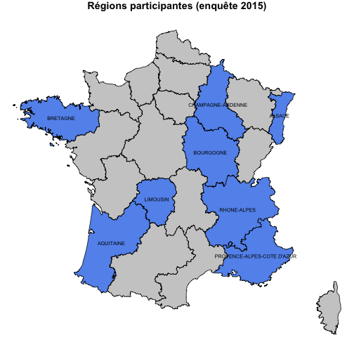
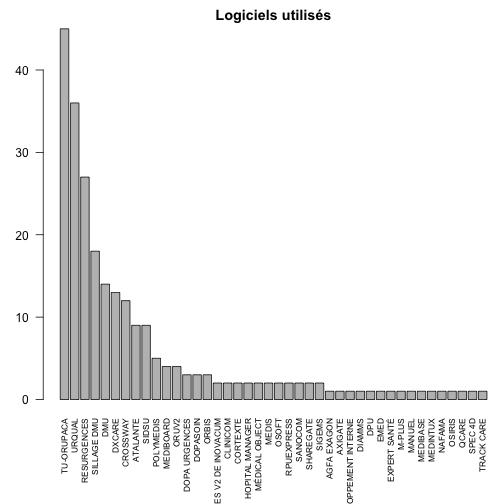
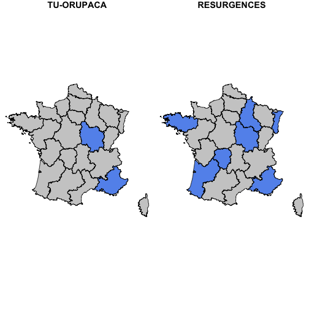
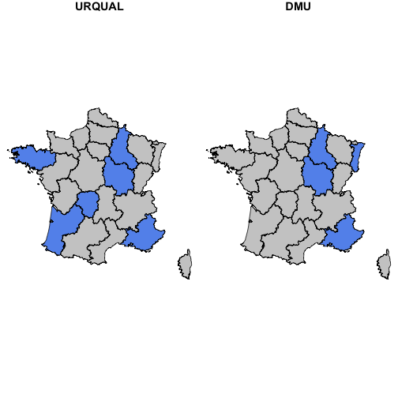
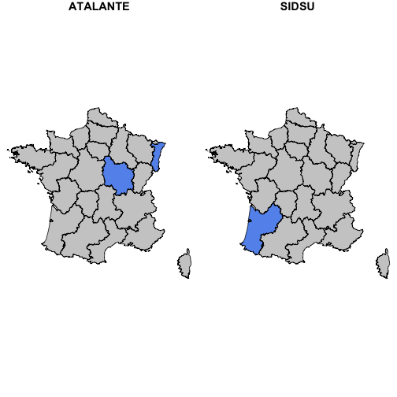
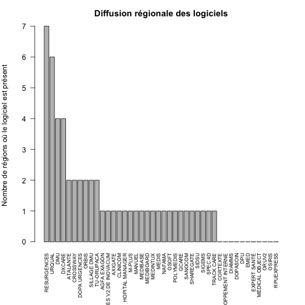

Présentation SI 2015
========================================================
author: FEDOU
date: Septembre 2015

Introduction
========================================================

- L'étude porte sur le premier trimestre 2015:
    - nombre de RPU remontés durant cette période
    - par quel logiciel (et version)
    - combien de jours manquants
- Trois indicateurs ont été retenus:
    - Date de naissance
    - Diagnostic principal (DP)
    - Mode de sortie
- Chaque indicateur a été évalué sur deux critères: __conformité__ et __exhaustivité__.


Données générales
========================================================


- Nombre de régions participantes: 8
- Nombre de sites: 224

Cartographie
============

Cartographie des régions participantes.
 

Editeurs
========


Logiciels 2015
==============


- Nombre de logiciels utilisés: __42__

Logiciels par ordre décroissant
===============================
 

Logiciels par région
====================

<!-- html table generated in R 3.1.3 by xtable 1.7-4 package -->
<!-- Thu Sep 17 17:18:28 2015 -->
<table border=1>
<tr> <th>  </th> <th> ALSACE </th> <th> AQUITAINE </th> <th> BOURGOGNE </th> <th> BRETAGNE </th> <th> CHAMPAGNE ARDENNES </th> <th> LIMOUSIN </th> <th> MIDI PYRENEES </th> <th> PACA </th>  </tr>
  <tr> <td align="right"> AGFA EXAGON </td> <td align="right">   0 </td> <td align="right">   0 </td> <td align="right">   1 </td> <td align="right">   0 </td> <td align="right">   0 </td> <td align="right">   0 </td> <td align="right">   0 </td> <td align="right">   0 </td> </tr>
  <tr> <td align="right"> ANTARES V2 DE INOVACUM </td> <td align="right">   2 </td> <td align="right">   0 </td> <td align="right">   0 </td> <td align="right">   0 </td> <td align="right">   0 </td> <td align="right">   0 </td> <td align="right">   0 </td> <td align="right">   0 </td> </tr>
  <tr> <td align="right"> ATALANTE </td> <td align="right">   8 </td> <td align="right">   0 </td> <td align="right">   1 </td> <td align="right">   0 </td> <td align="right">   0 </td> <td align="right">   0 </td> <td align="right">   0 </td> <td align="right">   0 </td> </tr>
  <tr> <td align="right"> AXIGATE </td> <td align="right">   0 </td> <td align="right">   1 </td> <td align="right">   0 </td> <td align="right">   0 </td> <td align="right">   0 </td> <td align="right">   0 </td> <td align="right">   0 </td> <td align="right">   0 </td> </tr>
  <tr> <td align="right"> CLINICOM </td> <td align="right">   1 </td> <td align="right">   0 </td> <td align="right">   0 </td> <td align="right">   0 </td> <td align="right">   0 </td> <td align="right">   0 </td> <td align="right">   1 </td> <td align="right">   0 </td> </tr>
  <tr> <td align="right"> CORTEXTE </td> <td align="right">   0 </td> <td align="right">   0 </td> <td align="right">   0 </td> <td align="right">   0 </td> <td align="right">   0 </td> <td align="right">   0 </td> <td align="right">   2 </td> <td align="right">   0 </td> </tr>
  <tr> <td align="right"> CROSSWAY </td> <td align="right">   0 </td> <td align="right">   3 </td> <td align="right">   3 </td> <td align="right">   0 </td> <td align="right">   0 </td> <td align="right">   0 </td> <td align="right">   6 </td> <td align="right">   0 </td> </tr>
  <tr> <td align="right"> DEVELOPPEMENT INTERNE </td> <td align="right">   0 </td> <td align="right">   0 </td> <td align="right">   0 </td> <td align="right">   0 </td> <td align="right">   0 </td> <td align="right">   0 </td> <td align="right">   1 </td> <td align="right">   0 </td> </tr>
  <tr> <td align="right"> DIAMMS </td> <td align="right">   0 </td> <td align="right">   0 </td> <td align="right">   0 </td> <td align="right">   0 </td> <td align="right">   0 </td> <td align="right">   0 </td> <td align="right">   1 </td> <td align="right">   0 </td> </tr>
  <tr> <td align="right"> DMU </td> <td align="right">   2 </td> <td align="right">   0 </td> <td align="right">   7 </td> <td align="right">   0 </td> <td align="right">   3 </td> <td align="right">   0 </td> <td align="right">   0 </td> <td align="right">   2 </td> </tr>
  <tr> <td align="right"> DOPA URGENCES </td> <td align="right">   0 </td> <td align="right">   1 </td> <td align="right">   0 </td> <td align="right">   0 </td> <td align="right">   2 </td> <td align="right">   0 </td> <td align="right">   0 </td> <td align="right">   0 </td> </tr>
  <tr> <td align="right"> DOPASOIN </td> <td align="right">   0 </td> <td align="right">   0 </td> <td align="right">   0 </td> <td align="right">   0 </td> <td align="right">   0 </td> <td align="right">   0 </td> <td align="right">   3 </td> <td align="right">   0 </td> </tr>
  <tr> <td align="right"> DPU </td> <td align="right">   0 </td> <td align="right">   0 </td> <td align="right">   0 </td> <td align="right">   0 </td> <td align="right">   0 </td> <td align="right">   0 </td> <td align="right">   1 </td> <td align="right">   0 </td> </tr>
  <tr> <td align="right"> DXCARE </td> <td align="right">   3 </td> <td align="right">   6 </td> <td align="right">   1 </td> <td align="right">   0 </td> <td align="right">   1 </td> <td align="right">   0 </td> <td align="right">   2 </td> <td align="right">   0 </td> </tr>
  <tr> <td align="right"> EMED </td> <td align="right">   0 </td> <td align="right">   0 </td> <td align="right">   0 </td> <td align="right">   0 </td> <td align="right">   0 </td> <td align="right">   0 </td> <td align="right">   1 </td> <td align="right">   0 </td> </tr>
  <tr> <td align="right"> EXPERT SANTÉ </td> <td align="right">   0 </td> <td align="right">   0 </td> <td align="right">   0 </td> <td align="right">   0 </td> <td align="right">   0 </td> <td align="right">   0 </td> <td align="right">   1 </td> <td align="right">   0 </td> </tr>
  <tr> <td align="right"> HOPITAL MANAGER </td> <td align="right">   0 </td> <td align="right">   0 </td> <td align="right">   2 </td> <td align="right">   0 </td> <td align="right">   0 </td> <td align="right">   0 </td> <td align="right">   0 </td> <td align="right">   0 </td> </tr>
  <tr> <td align="right"> M-PLUS </td> <td align="right">   0 </td> <td align="right">   1 </td> <td align="right">   0 </td> <td align="right">   0 </td> <td align="right">   0 </td> <td align="right">   0 </td> <td align="right">   0 </td> <td align="right">   0 </td> </tr>
  <tr> <td align="right"> MANUEL </td> <td align="right">   0 </td> <td align="right">   0 </td> <td align="right">   1 </td> <td align="right">   0 </td> <td align="right">   0 </td> <td align="right">   0 </td> <td align="right">   0 </td> <td align="right">   0 </td> </tr>
  <tr> <td align="right"> MEDIBASE </td> <td align="right">   0 </td> <td align="right">   1 </td> <td align="right">   0 </td> <td align="right">   0 </td> <td align="right">   0 </td> <td align="right">   0 </td> <td align="right">   0 </td> <td align="right">   0 </td> </tr>
  <tr> <td align="right"> MEDIBOARD </td> <td align="right">   0 </td> <td align="right">   0 </td> <td align="right">   0 </td> <td align="right">   2 </td> <td align="right">   0 </td> <td align="right">   0 </td> <td align="right">   2 </td> <td align="right">   0 </td> </tr>
  <tr> <td align="right"> MÉDICAL OBJECT </td> <td align="right">   0 </td> <td align="right">   0 </td> <td align="right">   0 </td> <td align="right">   0 </td> <td align="right">   0 </td> <td align="right">   0 </td> <td align="right">   2 </td> <td align="right">   0 </td> </tr>
  <tr> <td align="right"> MEDINTUX </td> <td align="right">   0 </td> <td align="right">   0 </td> <td align="right">   0 </td> <td align="right">   0 </td> <td align="right">   0 </td> <td align="right">   0 </td> <td align="right">   0 </td> <td align="right">   1 </td> </tr>
  <tr> <td align="right"> MEDIS </td> <td align="right">   0 </td> <td align="right">   0 </td> <td align="right">   0 </td> <td align="right">   2 </td> <td align="right">   0 </td> <td align="right">   0 </td> <td align="right">   0 </td> <td align="right">   0 </td> </tr>
  <tr> <td align="right"> NAFAMA </td> <td align="right">   0 </td> <td align="right">   0 </td> <td align="right">   0 </td> <td align="right">   0 </td> <td align="right">   1 </td> <td align="right">   0 </td> <td align="right">   0 </td> <td align="right">   0 </td> </tr>
  <tr> <td align="right"> ORBIS </td> <td align="right">   1 </td> <td align="right">   0 </td> <td align="right">   0 </td> <td align="right">   2 </td> <td align="right">   0 </td> <td align="right">   0 </td> <td align="right">   0 </td> <td align="right">   0 </td> </tr>
  <tr> <td align="right"> ORUV2 </td> <td align="right">   0 </td> <td align="right">   0 </td> <td align="right">   0 </td> <td align="right">   0 </td> <td align="right">   0 </td> <td align="right">   0 </td> <td align="right">   4 </td> <td align="right">   0 </td> </tr>
  <tr> <td align="right"> OSIRIS </td> <td align="right">   0 </td> <td align="right">   0 </td> <td align="right">   0 </td> <td align="right">   0 </td> <td align="right">   0 </td> <td align="right">   0 </td> <td align="right">   1 </td> <td align="right">   0 </td> </tr>
  <tr> <td align="right"> OSOFT </td> <td align="right">   0 </td> <td align="right">   0 </td> <td align="right">   0 </td> <td align="right">   2 </td> <td align="right">   0 </td> <td align="right">   0 </td> <td align="right">   0 </td> <td align="right">   0 </td> </tr>
  <tr> <td align="right"> POLYMEDIS </td> <td align="right">   0 </td> <td align="right">   0 </td> <td align="right">   0 </td> <td align="right">   0 </td> <td align="right">   5 </td> <td align="right">   0 </td> <td align="right">   0 </td> <td align="right">   0 </td> </tr>
  <tr> <td align="right"> QCARE </td> <td align="right">   0 </td> <td align="right">   0 </td> <td align="right">   0 </td> <td align="right">   0 </td> <td align="right">   0 </td> <td align="right">   0 </td> <td align="right">   0 </td> <td align="right">   1 </td> </tr>
  <tr> <td align="right"> RESURGENCES </td> <td align="right">   1 </td> <td align="right">   1 </td> <td align="right">   3 </td> <td align="right">  13 </td> <td align="right">   1 </td> <td align="right">   6 </td> <td align="right">   0 </td> <td align="right">   2 </td> </tr>
  <tr> <td align="right"> RPUEXPRESS </td> <td align="right">   0 </td> <td align="right">   0 </td> <td align="right">   0 </td> <td align="right">   0 </td> <td align="right">   0 </td> <td align="right">   0 </td> <td align="right">   2 </td> <td align="right">   0 </td> </tr>
  <tr> <td align="right"> SANOCOM </td> <td align="right">   0 </td> <td align="right">   2 </td> <td align="right">   0 </td> <td align="right">   0 </td> <td align="right">   0 </td> <td align="right">   0 </td> <td align="right">   0 </td> <td align="right">   0 </td> </tr>
  <tr> <td align="right"> SHAREGATE </td> <td align="right">   0 </td> <td align="right">   2 </td> <td align="right">   0 </td> <td align="right">   0 </td> <td align="right">   0 </td> <td align="right">   0 </td> <td align="right">   0 </td> <td align="right">   0 </td> </tr>
  <tr> <td align="right"> SIDSU </td> <td align="right">   0 </td> <td align="right">   9 </td> <td align="right">   0 </td> <td align="right">   0 </td> <td align="right">   0 </td> <td align="right">   0 </td> <td align="right">   0 </td> <td align="right">   0 </td> </tr>
  <tr> <td align="right"> SIGEMS </td> <td align="right">   0 </td> <td align="right">   2 </td> <td align="right">   0 </td> <td align="right">   0 </td> <td align="right">   0 </td> <td align="right">   0 </td> <td align="right">   0 </td> <td align="right">   0 </td> </tr>
  <tr> <td align="right"> SILLAGE DMU </td> <td align="right">   0 </td> <td align="right">   2 </td> <td align="right">   0 </td> <td align="right">  16 </td> <td align="right">   0 </td> <td align="right">   0 </td> <td align="right">   0 </td> <td align="right">   0 </td> </tr>
  <tr> <td align="right"> SPEC 4D </td> <td align="right">   0 </td> <td align="right">   0 </td> <td align="right">   0 </td> <td align="right">   0 </td> <td align="right">   0 </td> <td align="right">   1 </td> <td align="right">   0 </td> <td align="right">   0 </td> </tr>
  <tr> <td align="right"> TRACK CARE </td> <td align="right">   0 </td> <td align="right">   1 </td> <td align="right">   0 </td> <td align="right">   0 </td> <td align="right">   0 </td> <td align="right">   0 </td> <td align="right">   0 </td> <td align="right">   0 </td> </tr>
  <tr> <td align="right"> TU-ORUPACA </td> <td align="right">   0 </td> <td align="right">   0 </td> <td align="right">   1 </td> <td align="right">   0 </td> <td align="right">   0 </td> <td align="right">   0 </td> <td align="right">   2 </td> <td align="right">  42 </td> </tr>
  <tr> <td align="right"> URQUAL </td> <td align="right">   0 </td> <td align="right">   3 </td> <td align="right">   3 </td> <td align="right">  18 </td> <td align="right">   3 </td> <td align="right">   2 </td> <td align="right">   5 </td> <td align="right">   2 </td> </tr>
   </table>

Nombre de logiciels différents par région
==========================================


```
                     
ALSACE              7
AQUITAINE          14
BOURGOGNE          10
BRETAGNE            7
CHAMPAGNE ARDENNES  7
LIMOUSIN            3
MIDI PYRENEES      17
PACA                6
```

Cartographie des logiciels
===========================
    

Un logiciel est présent dans combien de régions ?
=================================================

 
