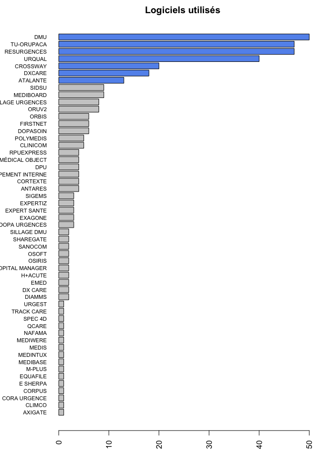
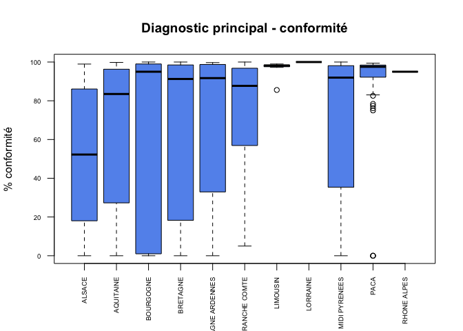

# Enquête logiciels SU - Septembre 2015
FEDORU  
07/09/2015  

7/9/2015
========
Reprise de l'exploitation des logiciels des SU

- fichier source: DATA/FEDORU - ENQUETE LOGICIEL 2015 - V2 (12 06 15) (3)
- création d'un dossier spécifique __Septembre2015__ contenent un sous dossier __data__ pour y stocker les résultats régionaux sous forme de fichier .csv. 

17/9/2015
---------
- récup données ORUMIP (Olivier Azema)

18/9/2015
---------
- données Bourgogne mises à jour

30/9/2015
---------
- intégration des données de la Franche-comté


Récupération des fichiers csv
-----------------------------

- les 5 premières lignes sont éliminées
- élimination du héader => il faudre en créer un

```{}
path = "./data/" # path = "./Septembre2015/data/" si console
out.file <- NULL
file.names <- dir(path, pattern =".csv") # seuls les fichiers se terminant par csv sont lus

for(i in 1:length(file.names)){
   file <- read.table(paste(path, file.names[i], sep=""), skip = 5, header = FALSE, sep=",", stringsAsFactors=FALSE)
   print(file.names[i])
   # on ne garde que les 22 premières colonnes
   file <- file[, 1:22]
   # on ne garde que les lignes où les colonnes 1 à 5 ne sont pas vides (http://genometoolbox.blogspot.fr/2014/01/remove-rows-with-na-values-from-r-data.html)
   file <- file[complete.cases(file[,1:5]),]
   # remplacement de la virgule écimale par le point décimal (soirce: http://stackoverflow.com/questions/5487164/r-how-to-replace-parts-of-variable-strings-within-data-frame)
   file <- as.data.frame(sapply(file, gsub, pattern = ",", replacement = "."))

   out.file <- rbind(out.file, file)
 }

n <- c("Region", "Departement", "FINESS", "Hopital", "CP", "Routage","Logiciel_2014","Editeur", "RPU_transmis","Nb_RPU_T1_2015", "Logiciel_2015", "Version_2015", "Coment", "Freq_remontee", "DN_exhaus","DN_confor", "DP_exhaus", "DP_confor", "MS_exhaus", "MS_confor", "Jours_manquants", "coment2")
 names(out.file) <- n

write.table(out.file, file = "archive.csv", sep=",", row.names = FALSE, qmethod = "double", fileEncoding="utf-8")
```

Récupération du fichier des données
-----------------------------------


- Nombre de régions participantes: 10
- Nombre de sites: 297


Cartographie
============

Cartographie des régions participantes et des logiciels.

  

Editeurs
========


Logiciels 2015
==============


- Nombre de logiciels utilisés: 51

Logiciels par ordre décroissant
-------------------------------

```

                  DMU            TU-ORUPACA                URQUAL 
                   50                    45                    35 
          RESURGENCES              CROSSWAY                DXCARE 
                   29                    13                    13 
             ATALANTE                 SIDSU      SILLAGE URGENCES 
                   10                     9                     8 
            MEDIBOARD              FIRSTNET                 ORBIS 
                    7                     6                     5 
            POLYMEDIS                 ORUV2              CLINICOM 
                    5                     4                     3 
DEVELOPPEMENT INTERNE              DOPASOIN         DOPA URGENCES 
                    3                     3                     3 
                  DPU               EXAGONE              EXPERTIZ 
                    3                     3                     3 
               SIGEMS               ANTARES              CORTEXTE 
                    3                     2                     2 
      HOPITAL MANAGER        MÉDICAL OBJECT                 OSOFT 
                    2                     2                     2 
           RPUEXPRESS               SANOCOM             SHAREGATE 
                    2                     2                     2 
          SILLAGE DMU               AXIGATE                CLIMCO 
                    2                     1                     1 
         CORA URGENCE                DIAMMS                  EMED 
                    1                     1                     1 
             EQUAFILE              E SHERPA          EXPERT SANTE 
                    1                     1                     1 
         EXPERT SANTÉ              MEDIBASE              MEDINTUX 
                    1                     1                     1 
                MEDIS              MEDIWERE                M-PLUS 
                    1                     1                     1 
               NAFAMA                OSIRIS                 QCARE 
                    1                     1                     1 
              SPEC 4D            TRACK CARE                URGEST 
                    1                     1                     1 
```

 

Logiciels par région
--------------------


```
                       
                        ALSACE AQUITAINE BOURGOGNE BRETAGNE
  ANTARES                    2         0         0        0
  ATALANTE                   8         0         2        0
  AXIGATE                    0         1         0        0
  CLIMCO                     0         0         0        0
  CLINICOM                   1         0         0        0
  CORA URGENCE               0         0         0        0
  CORTEXTE                   0         0         0        0
  CROSSWAY                   0         3         3        0
  DEVELOPPEMENT INTERNE      0         0         0        0
  DIAMMS                     0         0         0        0
  DMU                        2         0         7        0
  DOPASOIN                   0         0         0        0
  DOPA URGENCES              0         1         0        0
  DPU                        0         0         0        0
  DXCARE                     3         6         1        0
  EMED                       0         0         0        0
  EQUAFILE                   0         0         0        0
  E SHERPA                   0         0         0        0
  EXAGONE                    0         0         1        0
  EXPERTIZ                   0         0         0        0
  EXPERT SANTE               0         0         0        0
  EXPERT SANTÉ               0         0         0        0
  FIRSTNET                   0         0         0        0
  HOPITAL MANAGER            0         0         2        0
  MEDIBASE                   0         1         0        0
  MEDIBOARD                  0         0         0        1
  MÉDICAL OBJECT             0         0         0        0
  MEDINTUX                   0         0         0        0
  MEDIS                      0         0         0        1
  MEDIWERE                   0         0         0        0
  M-PLUS                     0         1         0        0
  NAFAMA                     0         0         0        0
  ORBIS                      1         0         0        1
  ORUV2                      0         0         0        0
  OSIRIS                     0         0         0        0
  OSOFT                      0         0         0        1
  POLYMEDIS                  0         0         0        0
  QCARE                      0         0         0        0
  RESURGENCES                1         1         3        7
  RPUEXPRESS                 0         0         0        0
  SANOCOM                    0         2         0        0
  SHAREGATE                  0         2         0        0
  SIDSU                      0         9         0        0
  SIGEMS                     0         2         0        0
  SILLAGE DMU                0         0         0        2
  SILLAGE URGENCES           0         2         0        6
  SPEC 4D                    0         0         0        0
  TRACK CARE                 0         1         0        0
  TU-ORUPACA                 0         0         1        0
  URGEST                     0         0         0        0
  URQUAL                     0         3         3       11
                       
                        CHAMPAGNE ARDENNES FRANCHE COMTE LIMOUSIN
  ANTARES                                0             0        0
  ATALANTE                               0             0        0
  AXIGATE                                0             0        0
  CLIMCO                                 0             0        0
  CLINICOM                               0             0        0
  CORA URGENCE                           0             0        0
  CORTEXTE                               0             0        0
  CROSSWAY                               0             1        0
  DEVELOPPEMENT INTERNE                  0             0        0
  DIAMMS                                 0             0        0
  DMU                                    3             0        0
  DOPASOIN                               0             0        0
  DOPA URGENCES                          2             0        0
  DPU                                    0             0        0
  DXCARE                                 1             0        0
  EMED                                   0             0        0
  EQUAFILE                               0             1        0
  E SHERPA                               0             0        0
  EXAGONE                                0             0        0
  EXPERTIZ                               0             0        0
  EXPERT SANTE                           0             0        0
  EXPERT SANTÉ                           0             0        0
  FIRSTNET                               0             6        0
  HOPITAL MANAGER                        0             0        0
  MEDIBASE                               0             0        0
  MEDIBOARD                              0             0        0
  MÉDICAL OBJECT                         0             0        0
  MEDINTUX                               0             0        0
  MEDIS                                  0             0        0
  MEDIWERE                               0             0        0
  M-PLUS                                 0             0        0
  NAFAMA                                 1             0        0
  ORBIS                                  0             0        0
  ORUV2                                  0             0        0
  OSIRIS                                 0             0        0
  OSOFT                                  0             0        0
  POLYMEDIS                              5             0        0
  QCARE                                  0             0        0
  RESURGENCES                            1             5        6
  RPUEXPRESS                             0             0        0
  SANOCOM                                0             0        0
  SHAREGATE                              0             0        0
  SIDSU                                  0             0        0
  SIGEMS                                 0             0        0
  SILLAGE DMU                            0             0        0
  SILLAGE URGENCES                       0             0        0
  SPEC 4D                                0             0        1
  TRACK CARE                             0             0        0
  TU-ORUPACA                             0             0        0
  URGEST                                 0             0        0
  URQUAL                                 3             0        2
                       
                        MIDI PYRENEES PACA RHONE ALPES
  ANTARES                           0    0           0
  ATALANTE                          0    0           0
  AXIGATE                           0    0           0
  CLIMCO                            0    0           1
  CLINICOM                          1    0           1
  CORA URGENCE                      0    0           1
  CORTEXTE                          2    0           0
  CROSSWAY                          6    0           0
  DEVELOPPEMENT INTERNE             1    0           2
  DIAMMS                            1    0           0
  DMU                               0    2          36
  DOPASOIN                          3    0           0
  DOPA URGENCES                     0    0           0
  DPU                               1    0           2
  DXCARE                            2    0           0
  EMED                              1    0           0
  EQUAFILE                          0    0           0
  E SHERPA                          0    0           1
  EXAGONE                           0    0           2
  EXPERTIZ                          0    0           3
  EXPERT SANTE                      0    0           1
  EXPERT SANTÉ                      1    0           0
  FIRSTNET                          0    0           0
  HOPITAL MANAGER                   0    0           0
  MEDIBASE                          0    0           0
  MEDIBOARD                         2    0           4
  MÉDICAL OBJECT                    2    0           0
  MEDINTUX                          0    1           0
  MEDIS                             0    0           0
  MEDIWERE                          0    0           1
  M-PLUS                            0    0           0
  NAFAMA                            0    0           0
  ORBIS                             0    0           3
  ORUV2                             4    0           0
  OSIRIS                            1    0           0
  OSOFT                             0    0           1
  POLYMEDIS                         0    0           0
  QCARE                             0    1           0
  RESURGENCES                       0    2           3
  RPUEXPRESS                        2    0           0
  SANOCOM                           0    0           0
  SHAREGATE                         0    0           0
  SIDSU                             0    0           0
  SIGEMS                            0    0           1
  SILLAGE DMU                       0    0           0
  SILLAGE URGENCES                  0    0           0
  SPEC 4D                           0    0           0
  TRACK CARE                        0    0           0
  TU-ORUPACA                        2   42           0
  URGEST                            0    0           1
  URQUAL                            5    2           6
```

Nombre de logiciels différents par région

```
            ALSACE          AQUITAINE          BOURGOGNE 
                 7                 14                  9 
          BRETAGNE CHAMPAGNE ARDENNES      FRANCHE COMTE 
                 8                  7                  4 
          LIMOUSIN      MIDI PYRENEES               PACA 
                 3                 17                  6 
       RHONE ALPES 
                18 
```

Cartographie des logiciels
--------------------------
    

Un logiciel est présent dans combien de régions ?
-------------------------------------------------

 

Analyse des RPU
===============


Nombre de RPU produits: 1913842

Nombre de RPU par logiciel
--------------------------

```
                      Nb de RPU
TU-ORUPACA               362364
URQUAL                   331497
DMU                      299522
RESURGENCES              207212
DXCARE                    97207
CROSSWAY                  66006
ATALANTE                  47216
SIDSU                     44401
DPU                       39714
MEDIBOARD                 33968
FIRSTNET                  33773
SILLAGE URGENCES          32519
POLYMEDIS                 20363
CLINICOM                  17623
DEVELOPPEMENT INTERNE     15723
EXPERTIZ                  15215
EXAGONE                   14004
MÉDICAL OBJECT            12577
CORTEXTE                  12369
SILLAGE DMU               11801
TRACK CARE                11345
ORUV2                     10715
ORBIS                     10669
DOPA URGENCES             10420
M-PLUS                     9970
DOPASOIN                   9329
ANTARES                    8974
SHAREGATE                  8639
CLIMCO                     8565
SIGEMS                     7231
SANOCOM                    7150
EXPERT SANTÉ               7058
OSOFT                      7050
SPEC 4D                    7015
MEDIS                      6974
CORA URGENCE               6618
EXPERT SANTE               6324
URGEST                     6321
MEDINTUX                   6224
MEDIWERE                   5676
RPUEXPRESS                 5205
NAFAMA                     5156
QCARE                      5131
AXIGATE                    4282
E SHERPA                   4090
MEDIBASE                   2913
HOPITAL MANAGER            2644
OSIRIS                     2019
DIAMMS                     1833
EMED                       1623
EQUAFILE                   1605
```

Nombre de jours manquants
-------------------------

### Par logiciel


```
                      Nb de jours manquants
URQUAL                               116.00
TU-ORUPACA                            90.00
CROSSWAY                              63.03
DOPASOIN                              59.00
EMED                                  50.00
SILLAGE URGENCES                      42.00
ORBIS                                 30.00
OSOFT                                 21.00
DMU                                   20.00
DEVELOPPEMENT INTERNE                 17.00
DPU                                    9.00
RESURGENCES                            5.56
CLINICOM                               4.00
HOPITAL MANAGER                        3.00
MEDIBOARD                              3.00
ATALANTE                               2.00
E SHERPA                               2.00
ANTARES                                1.00
EQUAFILE                               0.31
FIRSTNET                               0.04
AXIGATE                                0.00
CLIMCO                                 0.00
CORA URGENCE                           0.00
CORTEXTE                               0.00
DIAMMS                                 0.00
DOPA URGENCES                          0.00
DXCARE                                 0.00
EXAGONE                                0.00
EXPERTIZ                               0.00
EXPERT SANTE                           0.00
EXPERT SANTÉ                           0.00
MEDIBASE                               0.00
MÉDICAL OBJECT                         0.00
MEDINTUX                               0.00
MEDIS                                  0.00
MEDIWERE                               0.00
M-PLUS                                 0.00
NAFAMA                                 0.00
ORUV2                                  0.00
OSIRIS                                 0.00
POLYMEDIS                              0.00
QCARE                                  0.00
RPUEXPRESS                             0.00
SANOCOM                                0.00
SHAREGATE                              0.00
SIDSU                                  0.00
SIGEMS                                 0.00
SILLAGE DMU                            0.00
SPEC 4D                                0.00
TRACK CARE                             0.00
URGEST                                 0.00
```

### Par région


```
                   Nb de jours manquants
PACA                              180.00
MIDI PYRENEES                     111.00
RHONE ALPES                        73.00
AQUITAINE                          63.00
BRETAGNE                           52.00
ALSACE                             34.00
BOURGOGNE                          21.00
CHAMPAGNE ARDENNES                  3.00
FRANCHE COMTE                       0.94
LIMOUSIN                            0.00
```


Indicateurs
===========

Trois indicateurs ont été retenus:

- Date de naissance
- Diagnostic principal (DP)
- Mode de sortie

Chaque indicateur a été évalué sur deux critères: __conformité__ et __exhaustivité__.

Date de naissance
------------------

- taux de conformité:

```
   Min. 1st Qu.  Median    Mean 3rd Qu.    Max.    NA's 
   0.00  100.00  100.00   99.65  100.00  100.00       7 
```

- conformité par outil:


```
                         Min    Max   moyenne   ecart-type Nb
ANTARES               100.00 100.00 100.00000  0.000000000  2
ATALANTE              100.00 100.00 100.00000  0.000000000 10
AXIGATE               100.00 100.00 100.00000           NA  1
CLIMCO                100.00 100.00 100.00000           NA  1
CLINICOM              100.00 100.00 100.00000  0.000000000  3
CORA URGENCE          100.00 100.00 100.00000           NA  1
CORTEXTE              100.00 100.00 100.00000  0.000000000  2
CROSSWAY               99.98 100.00  99.99750  0.006215816 13
DEVELOPPEMENT INTERNE  99.94 100.00  99.98000  0.034641016  3
DIAMMS                100.00 100.00 100.00000           NA  1
DMU                   100.00 100.00 100.00000  0.000000000 50
DOPASOIN               99.96 100.00  99.97333  0.023094011  3
DOPA URGENCES         100.00 100.00 100.00000  0.000000000  3
DPU                   100.00 100.00 100.00000  0.000000000  3
DXCARE                100.00 100.00 100.00000  0.000000000 13
EMED                  100.00 100.00 100.00000           NA  1
EQUAFILE              100.00 100.00 100.00000           NA  1
E SHERPA              100.00 100.00 100.00000           NA  1
EXAGONE               100.00 100.00 100.00000  0.000000000  3
EXPERTIZ              100.00 100.00 100.00000  0.000000000  3
EXPERT SANTE          100.00 100.00 100.00000           NA  1
EXPERT SANTÉ          100.00 100.00 100.00000           NA  1
FIRSTNET              100.00 100.00 100.00000  0.000000000  6
HOPITAL MANAGER       100.00 100.00 100.00000  0.000000000  2
MEDIBASE              100.00 100.00 100.00000           NA  1
MEDIBOARD              99.98 100.00  99.99714  0.007559289  7
MÉDICAL OBJECT        100.00 100.00 100.00000  0.000000000  2
MEDINTUX               99.92  99.92  99.92000           NA  1
MEDIS                 100.00 100.00 100.00000           NA  1
MEDIWERE              100.00 100.00 100.00000           NA  1
M-PLUS                100.00 100.00 100.00000           NA  1
NAFAMA                 99.80  99.80  99.80000           NA  1
ORBIS                 100.00 100.00 100.00000  0.000000000  5
ORUV2                  98.74 100.00  99.64750  0.607144958  4
OSIRIS                 99.90  99.90  99.90000           NA  1
OSOFT                 100.00 100.00 100.00000  0.000000000  2
POLYMEDIS             100.00 100.00 100.00000  0.000000000  5
QCARE                  99.98  99.98  99.98000           NA  1
RESURGENCES            99.95 100.00  99.99793  0.009403385 29
RPUEXPRESS             99.89 100.00  99.94500  0.077781746  2
SANOCOM               100.00 100.00 100.00000  0.000000000  2
SHAREGATE             100.00 100.00 100.00000  0.000000000  2
SIDSU                 100.00 100.00 100.00000  0.000000000  9
SIGEMS                100.00 100.00 100.00000  0.000000000  3
SILLAGE DMU           100.00 100.00 100.00000  0.000000000  2
SILLAGE URGENCES      100.00 100.00 100.00000  0.000000000  8
SPEC 4D               100.00 100.00 100.00000           NA  1
TRACK CARE            100.00 100.00 100.00000           NA  1
TU-ORUPACA              0.00 100.00  97.77778 14.907119850 45
URGEST                100.00 100.00 100.00000           NA  1
URQUAL                 99.80 100.00  99.99206  0.034534077 35
```

 

- taux d'exhaustivité:


```
   Min. 1st Qu.  Median    Mean 3rd Qu.    Max.    NA's 
   0.00  100.00  100.00   99.64  100.00  100.00      20 
```

- exhaustivité par outil

```
Warning in FUN(X[[i]], ...): aucun argument trouvé pour min ; Inf est
renvoyé
```

```
Warning in FUN(X[[i]], ...): aucun argument trouvé pour min ; Inf est
renvoyé
```

```
Warning in FUN(X[[i]], ...): aucun argument pour max ; -Inf est renvoyé
```

```
Warning in FUN(X[[i]], ...): aucun argument pour max ; -Inf est renvoyé
```

```
                         Min    Max   moyenne   ecart-type Nb
ANTARES               100.00 100.00 100.00000  0.000000000  2
ATALANTE              100.00 100.00 100.00000  0.000000000 10
AXIGATE               100.00 100.00 100.00000           NA  1
CLIMCO                100.00 100.00 100.00000           NA  1
CLINICOM              100.00 100.00 100.00000  0.000000000  3
CORA URGENCE          100.00 100.00 100.00000           NA  1
CORTEXTE              100.00 100.00 100.00000  0.000000000  2
CROSSWAY              100.00 100.00 100.00000  0.000000000 13
DEVELOPPEMENT INTERNE 100.00 100.00 100.00000  0.000000000  3
DIAMMS                100.00 100.00 100.00000           NA  1
DMU                   100.00 100.00 100.00000  0.000000000 50
DOPASOIN               99.96 100.00  99.97333  0.023094011  3
DOPA URGENCES         100.00 100.00 100.00000  0.000000000  3
DPU                   100.00 100.00 100.00000  0.000000000  3
DXCARE                100.00 100.00 100.00000  0.000000000 13
EMED                  100.00 100.00 100.00000           NA  1
EQUAFILE                 Inf   -Inf       NaN           NA  1
E SHERPA              100.00 100.00 100.00000           NA  1
EXAGONE               100.00 100.00 100.00000  0.000000000  3
EXPERTIZ              100.00 100.00 100.00000  0.000000000  3
EXPERT SANTE          100.00 100.00 100.00000           NA  1
EXPERT SANTÉ          100.00 100.00 100.00000           NA  1
FIRSTNET                 Inf   -Inf       NaN           NA  6
HOPITAL MANAGER       100.00 100.00 100.00000  0.000000000  2
MEDIBASE              100.00 100.00 100.00000           NA  1
MEDIBOARD             100.00 100.00 100.00000  0.000000000  7
MÉDICAL OBJECT        100.00 100.00 100.00000  0.000000000  2
MEDINTUX               99.92  99.92  99.92000           NA  1
MEDIS                 100.00 100.00 100.00000           NA  1
MEDIWERE              100.00 100.00 100.00000           NA  1
M-PLUS                100.00 100.00 100.00000           NA  1
NAFAMA                 99.80  99.80  99.80000           NA  1
ORBIS                 100.00 100.00 100.00000  0.000000000  5
ORUV2                  99.97 100.00  99.99250  0.015000000  4
OSIRIS                100.00 100.00 100.00000           NA  1
OSOFT                 100.00 100.00 100.00000  0.000000000  2
POLYMEDIS             100.00 100.00 100.00000  0.000000000  5
QCARE                  99.98  99.98  99.98000           NA  1
RESURGENCES            99.95 100.00  99.99750  0.010320937 29
RPUEXPRESS            100.00 100.00 100.00000  0.000000000  2
SANOCOM               100.00 100.00 100.00000  0.000000000  2
SHAREGATE             100.00 100.00 100.00000  0.000000000  2
SIDSU                 100.00 100.00 100.00000  0.000000000  9
SIGEMS                100.00 100.00 100.00000  0.000000000  3
SILLAGE DMU           100.00 100.00 100.00000  0.000000000  2
SILLAGE URGENCES      100.00 100.00 100.00000  0.000000000  8
SPEC 4D               100.00 100.00 100.00000           NA  1
TRACK CARE            100.00 100.00 100.00000           NA  1
TU-ORUPACA              0.00 100.00  97.77778 14.907119850 45
URGEST                100.00 100.00 100.00000           NA  1
URQUAL                 99.99 100.00  99.99971  0.001714986 35
```

 

Diagnostic (DP)
---------- 

- taux de conformité:

```
   Min. 1st Qu.  Median    Mean 3rd Qu.    Max.    NA's 
   0.00   75.01   95.00   76.59   97.54  100.00       8 
```

- conformité par outil

```
                         Min    Max   moyenne  ecart-type Nb
ANTARES                45.84  90.51  68.17500 31.58645992  2
ATALANTE                0.00  98.95  44.20900 38.53260739 10
AXIGATE                 0.00   0.00   0.00000          NA  1
CLIMCO                 95.00  95.00  95.00000          NA  1
CLINICOM               95.00  98.03  96.39000  1.53039211  3
CORA URGENCE           95.00  95.00  95.00000          NA  1
CORTEXTE               87.11  99.49  93.30000  8.75398195  2
CROSSWAY                0.00 100.00  50.65583 43.36106348 13
DEVELOPPEMENT INTERNE  95.00 100.00  96.66667  2.88675135  3
DIAMMS                 78.56  78.56  78.56000          NA  1
DMU                    56.80  99.39  93.68574  6.92108585 50
DOPASOIN                0.00  97.49  32.49667 56.28587774  3
DOPA URGENCES           0.00  62.90  20.96667 36.31533193  3
DPU                    92.18  95.00  94.06000  1.62812776  3
DXCARE                  0.00  98.90  54.74923 35.50656429 13
EMED                   97.54  97.54  97.54000          NA  1
EQUAFILE              100.00 100.00 100.00000          NA  1
E SHERPA               95.00  95.00  95.00000          NA  1
EXAGONE                12.00  95.00  67.33333 47.92007234  3
EXPERTIZ               95.00  95.00  95.00000  0.00000000  3
EXPERT SANTE           95.00  95.00  95.00000          NA  1
EXPERT SANTÉ           29.20  29.20  29.20000          NA  1
FIRSTNET               31.40  87.70  61.76667 22.25683416  6
HOPITAL MANAGER        95.00 100.00  97.50000  3.53553391  2
MEDIBASE               96.40  96.40  96.40000          NA  1
MEDIBOARD               0.73  95.00  64.05857 40.50008083  7
MÉDICAL OBJECT         49.76  90.77  70.26500 28.99844910  2
MEDINTUX               92.15  92.15  92.15000          NA  1
MEDIS                  19.70  19.70  19.70000          NA  1
MEDIWERE               95.00  95.00  95.00000          NA  1
M-PLUS                 83.50  83.50  83.50000          NA  1
NAFAMA                 98.50  98.50  98.50000          NA  1
ORBIS                   0.00  95.00  31.66667 54.84827557  5
ORUV2                   0.00  98.90  58.10250 48.84531528  4
OSIRIS                100.00 100.00 100.00000          NA  1
OSOFT                  95.00  98.60  96.80000  2.54558441  2
POLYMEDIS              97.40  99.70  98.50000  1.04403065  5
QCARE                   0.00   0.00   0.00000          NA  1
RESURGENCES            76.00 100.00  95.80000  4.90218683 29
RPUEXPRESS             87.22  91.95  89.58500  3.34461508  2
SANOCOM                76.70  83.30  80.00000  4.66690476  2
SHAREGATE               0.00   0.10   0.05000  0.07071068  2
SIDSU                  27.30  99.80  87.05556 22.82515669  9
SIGEMS                  8.40  95.00  51.70000 61.23544725  3
SILLAGE DMU             0.90  10.50   5.70000  6.78822510  2
SILLAGE URGENCES        0.00  95.00  57.06250 42.86933428  8
SPEC 4D                85.57  85.57  85.57000          NA  1
TRACK CARE             96.30  96.30  96.30000          NA  1
TU-ORUPACA              0.00  99.29  92.82267 15.63095899 45
URGEST                 95.00  95.00  95.00000          NA  1
URQUAL                  0.00 100.00  61.16588 43.18051175 35
```

 

- taux de exhaustivité:

```
   Min. 1st Qu.  Median    Mean 3rd Qu.    Max.    NA's 
   0.00   61.00   94.00   73.48   98.44  100.00       8 
```

- exhaustivité par outil

```
                         Min    Max    moyenne  ecart-type Nb
ANTARES                45.84  90.51  68.175000 31.58645992  2
ATALANTE                0.00  99.00  44.309000 38.68869845 10
AXIGATE                 0.00   0.00   0.000000          NA  1
CLIMCO                 38.00  38.00  38.000000          NA  1
CLINICOM               72.00  98.03  88.723333 14.51362923  3
CORA URGENCE           95.00  95.00  95.000000          NA  1
CORTEXTE               87.57  99.52  93.545000  8.44992604  2
CROSSWAY                0.00 100.00  58.575833 42.93447110 13
DEVELOPPEMENT INTERNE  83.00 100.00  92.666667  8.73689495  3
DIAMMS                 78.72  78.72  78.720000          NA  1
DMU                     2.00 100.00  89.008511 16.79941963 50
DOPASOIN                0.00  97.71  32.570000 56.41289480  3
DOPA URGENCES           0.00  62.90  20.966667 36.31533193  3
DPU                    87.00  97.00  92.060000  5.00107988  3
DXCARE                  0.00  98.90  54.749231 35.50656429 13
EMED                   97.60  97.60  97.600000          NA  1
EQUAFILE              100.00 100.00 100.000000          NA  1
E SHERPA                0.00   0.00   0.000000          NA  1
EXAGONE                 0.00  12.00   5.333333  6.11010093  3
EXPERTIZ               82.00  94.00  88.666667  6.11010093  3
EXPERT SANTE           95.00  95.00  95.000000          NA  1
EXPERT SANTÉ           29.22  29.22  29.220000          NA  1
FIRSTNET              100.00 100.00 100.000000  0.00000000  6
HOPITAL MANAGER        95.00 100.00  97.500000  3.53553391  2
MEDIBASE               96.40  96.40  96.400000          NA  1
MEDIBOARD               0.00  43.20  10.344286 16.96571824  7
MÉDICAL OBJECT         49.76  90.77  70.265000 28.99844910  2
MEDINTUX              100.00 100.00 100.000000          NA  1
MEDIS                  19.70  19.70  19.700000          NA  1
MEDIWERE              100.00 100.00 100.000000          NA  1
M-PLUS                 83.50  83.50  83.500000          NA  1
NAFAMA                 99.80  99.80  99.800000          NA  1
ORBIS                   0.00   0.00   0.000000  0.00000000  5
ORUV2                   0.00  98.90  58.185000 48.93563017  4
OSIRIS                100.00 100.00 100.000000          NA  1
OSOFT                   0.00  98.60  49.300000 69.72072862  2
POLYMEDIS              97.40  99.70  98.740000  0.84734881  5
QCARE                   0.00   0.00   0.000000          NA  1
RESURGENCES            76.00 100.00  96.644828  5.05329569 29
RPUEXPRESS             87.22  91.95  89.585000  3.34461508  2
SANOCOM                76.70  83.30  80.000000  4.66690476  2
SHAREGATE               0.00   0.10   0.050000  0.07071068  2
SIDSU                  27.30  99.80  87.055556 22.82515669  9
SIGEMS                  8.40  80.00  44.200000 50.62884553  3
SILLAGE DMU             0.90  10.50   5.700000  6.78822510  2
SILLAGE URGENCES        0.00  95.00  57.062500 42.86933428  8
SPEC 4D                85.57  85.57  85.570000          NA  1
TRACK CARE             96.30  96.30  96.300000          NA  1
TU-ORUPACA              0.00  99.29  92.836222 15.63379909 45
URGEST                 98.00  98.00  98.000000          NA  1
URQUAL                  0.00 100.00  58.699412 42.77801580 35
```

 

Mode de sortie (MS)
-------------------

- taux de conformité:

```
   Min. 1st Qu.  Median    Mean 3rd Qu.    Max.    NA's 
   0.00   86.29   99.40   82.54   99.97  100.00      73 
```

- conformité par outil

```
Warning in FUN(X[[i]], ...): aucun argument trouvé pour min ; Inf est
renvoyé
```

```
Warning in FUN(X[[i]], ...): aucun argument trouvé pour min ; Inf est
renvoyé
```

```
Warning in FUN(X[[i]], ...): aucun argument trouvé pour min ; Inf est
renvoyé
```

```
Warning in FUN(X[[i]], ...): aucun argument trouvé pour min ; Inf est
renvoyé
```

```
Warning in FUN(X[[i]], ...): aucun argument trouvé pour min ; Inf est
renvoyé
```

```
Warning in FUN(X[[i]], ...): aucun argument trouvé pour min ; Inf est
renvoyé
```

```
Warning in FUN(X[[i]], ...): aucun argument trouvé pour min ; Inf est
renvoyé
```

```
Warning in FUN(X[[i]], ...): aucun argument pour max ; -Inf est renvoyé
```

```
Warning in FUN(X[[i]], ...): aucun argument pour max ; -Inf est renvoyé
```

```
Warning in FUN(X[[i]], ...): aucun argument pour max ; -Inf est renvoyé
```

```
Warning in FUN(X[[i]], ...): aucun argument pour max ; -Inf est renvoyé
```

```
Warning in FUN(X[[i]], ...): aucun argument pour max ; -Inf est renvoyé
```

```
Warning in FUN(X[[i]], ...): aucun argument pour max ; -Inf est renvoyé
```

```
Warning in FUN(X[[i]], ...): aucun argument pour max ; -Inf est renvoyé
```

```
                         Min    Max       moyenne  ecart-type Nb
ANTARES                83.99  84.48  84.235000000  0.34648232  2
ATALANTE                0.00  99.14  63.701000000 37.09343651 10
AXIGATE                99.90  99.90  99.900000000          NA  1
CLIMCO                   Inf   -Inf           NaN          NA  1
CLINICOM               98.66 100.00  99.330000000  0.94752309  3
CORA URGENCE             Inf   -Inf           NaN          NA  1
CORTEXTE               99.43  99.70  99.565000000  0.19091883  2
CROSSWAY                0.00  99.44  45.463333333 47.91778837 13
DEVELOPPEMENT INTERNE  99.89  99.89  99.890000000          NA  3
DIAMMS                 80.47  80.47  80.470000000          NA  1
DMU                    97.41 100.00  99.266923077  1.10009382 50
DOPASOIN               72.48  86.54  78.593333333  7.20706135  3
DOPA URGENCES          69.10  82.60  77.366666667  7.24315769  3
DPU                    99.76  99.76  99.760000000          NA  3
DXCARE                 21.05 100.00  86.825384615 29.35655169 13
EMED                  100.00 100.00 100.000000000          NA  1
EQUAFILE                0.31   0.31   0.310000000          NA  1
E SHERPA                 Inf   -Inf           NaN          NA  1
EXAGONE               100.00 100.00 100.000000000          NA  3
EXPERTIZ                 Inf   -Inf           NaN          NA  3
EXPERT SANTE             Inf   -Inf           NaN          NA  1
EXPERT SANTÉ           99.93  99.93  99.930000000          NA  1
FIRSTNET                0.00   0.04   0.006666667  0.01632993  6
HOPITAL MANAGER       100.00 100.00 100.000000000  0.00000000  2
MEDIBASE               65.70  65.70  65.700000000          NA  1
MEDIBOARD              99.53  99.96  99.813333333  0.24542480  7
MÉDICAL OBJECT         49.52  90.67  70.095000000 29.09744405  2
MEDINTUX              100.00 100.00 100.000000000          NA  1
MEDIS                  13.50  13.50  13.500000000          NA  1
MEDIWERE                 Inf   -Inf           NaN          NA  1
M-PLUS                 16.80  16.80  16.800000000          NA  1
NAFAMA                 99.80  99.80  99.800000000          NA  1
ORBIS                  15.70  19.80  17.750000000  2.89913780  5
ORUV2                  39.45  99.92  84.270000000 29.88452108  4
OSIRIS                100.00 100.00 100.000000000          NA  1
OSOFT                 100.00 100.00 100.000000000          NA  2
POLYMEDIS              99.30  99.90  99.680000000  0.26832816  5
QCARE                   0.00   0.00   0.000000000          NA  1
RESURGENCES             0.00 100.00  68.790769231 46.75955055 29
RPUEXPRESS             93.58  94.01  93.795000000  0.30405592  2
SANOCOM               100.00 100.00 100.000000000  0.00000000  2
SHAREGATE             100.00 100.00 100.000000000  0.00000000  2
SIDSU                  98.20 100.00  99.455555556  0.56593089  9
SIGEMS                 99.90  99.90  99.900000000          NA  3
SILLAGE DMU            98.80 100.00  99.400000000  0.84852814  2
SILLAGE URGENCES       68.50  99.90  94.375000000 10.77639616  8
SPEC 4D                99.97  99.97  99.970000000          NA  1
TRACK CARE             98.30  98.30  98.300000000          NA  1
TU-ORUPACA              0.00 100.00  94.657555556 15.66551586 45
URGEST                   Inf   -Inf           NaN          NA  1
URQUAL                 14.29 100.00  93.606206897 16.44861662 35
```

 

- taux de exhaustivité:

```
   Min. 1st Qu.  Median    Mean 3rd Qu.    Max.    NA's 
   0.00   94.29   99.70   87.03  100.00  100.00       8 
```

- exhaustivité par outil

```
                         Min    Max   moyenne  ecart-type Nb
ANTARES                83.99  84.48  84.23500  0.34648232  2
ATALANTE                0.00  99.14  63.70100 37.09343651 10
AXIGATE               100.00 100.00 100.00000          NA  1
CLIMCO                  0.00   0.00   0.00000          NA  1
CLINICOM               99.92 100.00  99.97333  0.04618802  3
CORA URGENCE           31.00  31.00  31.00000          NA  1
CORTEXTE               99.43  99.70  99.56500  0.19091883  2
CROSSWAY                0.00  99.44  45.87750 47.52636974 13
DEVELOPPEMENT INTERNE  95.00 100.00  98.33333  2.88675135  3
DIAMMS                 80.47  80.47  80.47000          NA  1
DMU                    97.41 100.00  99.77596  0.66184084 50
DOPASOIN               72.48 100.00  86.34000 13.76109007  3
DOPA URGENCES          69.10  82.60  77.36667  7.24315769  3
DPU                    99.76 100.00  99.92000  0.13856406  3
DXCARE                 21.05 100.00  86.85923 29.37125847 13
EMED                  100.00 100.00 100.00000          NA  1
EQUAFILE               99.10  99.10  99.10000          NA  1
E SHERPA              100.00 100.00 100.00000          NA  1
EXAGONE                 5.00 100.00  68.33333 54.84827557  3
EXPERTIZ               99.00 100.00  99.66667  0.57735027  3
EXPERT SANTE           81.00  81.00  81.00000          NA  1
EXPERT SANTÉ          100.00 100.00 100.00000          NA  1
FIRSTNET               31.20  87.30  61.43333 22.18284623  6
HOPITAL MANAGER       100.00 100.00 100.00000  0.00000000  2
MEDIBASE               65.70  65.70  65.70000          NA  1
MEDIBOARD               2.00 100.00  84.92000 36.60915232  7
MÉDICAL OBJECT         49.76  90.69  70.22500 28.94188055  2
MEDINTUX              100.00 100.00 100.00000          NA  1
MEDIS                  13.50  13.50  13.50000          NA  1
MEDIWERE              100.00 100.00 100.00000          NA  1
M-PLUS                 16.80  16.80  16.80000          NA  1
NAFAMA                 99.80  99.80  99.80000          NA  1
ORBIS                  15.70  97.00  44.16667 45.80090974  5
ORUV2                  99.04 100.00  99.71000  0.44944410  4
OSIRIS                100.00 100.00 100.00000          NA  1
OSOFT                 100.00 100.00 100.00000  0.00000000  2
POLYMEDIS              99.30  99.90  99.68000  0.26832816  5
QCARE                   0.00   0.00   0.00000          NA  1
RESURGENCES             0.00 100.00  81.57931 37.96997704 29
RPUEXPRESS             98.37  99.94  99.15500  1.11015765  2
SANOCOM               100.00 100.00 100.00000  0.00000000  2
SHAREGATE             100.00 100.00 100.00000  0.00000000  2
SIDSU                  98.20 100.00  99.45556  0.56593089  9
SIGEMS                 55.00  99.90  77.45000 31.74909448  3
SILLAGE DMU            98.80 100.00  99.40000  0.84852814  2
SILLAGE URGENCES       68.50  99.90  94.37500 10.77639616  8
SPEC 4D                99.97  99.97  99.97000          NA  1
TRACK CARE             98.30  98.30  98.30000          NA  1
TU-ORUPACA              0.00 100.00  94.65756 15.66551586 45
URGEST                  0.00   0.00   0.00000          NA  1
URQUAL                  0.00 100.00  90.87000 22.09346414 35
```

 

Conformité par région
=====================

Date de naissance
------------------

```
                      Min Max   moyenne  ecart-type Nb
ALSACE             100.00 100 100.00000  0.00000000 18
AQUITAINE          100.00 100 100.00000  0.00000000 35
BOURGOGNE          100.00 100 100.00000  0.00000000 23
BRETAGNE            99.80 100  99.99167  0.03677362 30
CHAMPAGNE ARDENNES  99.80 100  99.98750  0.05000000 16
FRANCHE COMTE      100.00 100 100.00000  0.00000000 13
LIMOUSIN            99.95 100  99.99333  0.01658312  9
MIDI PYRENEES       98.74 100  99.95054  0.20698827 37
PACA                 0.00 100  97.99800 14.14185177 50
RHONE ALPES        100.00 100 100.00000  0.00000000 70
```

 

Diagnostic (DP)
---------------

```
                     Min    Max  moyenne ecart-type Nb
ALSACE              0.00  98.95 52.12889  34.353078 18
AQUITAINE           0.00  99.80 63.42121  39.782563 35
BOURGOGNE           0.00 100.00 62.18182  44.985327 23
BRETAGNE            0.00 100.00 63.90567  40.977779 30
CHAMPAGNE ARDENNES  0.00  99.70 67.61875  41.100790 16
FRANCHE COMTE       5.00 100.00 73.45385  30.568655 13
LIMOUSIN           85.57  98.98 96.81667   4.256727  9
MIDI PYRENEES       0.00 100.00 70.32676  37.940900 37
PACA                0.00  99.39 88.78780  23.584018 50
RHONE ALPES        95.00  95.00 95.00000   0.000000 70
```

 

Mode de sortie (MS)
-------------------

```
                     Min    Max     moyenne ecart-type Nb
ALSACE             15.70 100.00 68.77500000 32.8245757 18
AQUITAINE           0.00 100.00 89.24242424 27.5958220 35
BOURGOGNE           0.00 100.00 81.18181818 39.1901790 23
BRETAGNE           13.50 100.00 91.54533333 21.6244593 30
CHAMPAGNE ARDENNES 69.10 100.00 94.84375000  9.6193533 16
FRANCHE COMTE       0.00   0.31  0.07230769  0.1115164 13
LIMOUSIN           99.39 100.00 99.88666667  0.2200568  9
MIDI PYRENEES       0.00 100.00 89.86405405 20.8648135 37
PACA                0.00 100.00 87.24620000 29.0773015 50
RHONE ALPES          Inf   -Inf         NaN         NA 70
```

 

Exhaustivié par région
======================

Date de naissance
------------------

```
Warning in FUN(X[[i]], ...): aucun argument trouvé pour min ; Inf est
renvoyé
```

```
Warning in FUN(X[[i]], ...): aucun argument pour max ; -Inf est renvoyé
```

```
                      Min  Max   moyenne  ecart-type Nb
ALSACE             100.00  100 100.00000  0.00000000 18
AQUITAINE          100.00  100 100.00000  0.00000000 35
BOURGOGNE          100.00  100 100.00000  0.00000000 23
BRETAGNE           100.00  100 100.00000  0.00000000 30
CHAMPAGNE ARDENNES  99.80  100  99.98750  0.05000000 16
FRANCHE COMTE         Inf -Inf       NaN          NA 13
LIMOUSIN            99.95  100  99.99333  0.01658312  9
MIDI PYRENEES       99.96  100  99.99676  0.01028863 37
PACA                 0.00  100  97.99800 14.14185177 50
RHONE ALPES        100.00  100 100.00000  0.00000000 70
```

 

Diagnostic (DP)
---------------

```
                     Min    Max  moyenne  ecart-type Nb
ALSACE              0.00  98.95 52.12889 34.35307810 18
AQUITAINE           0.00  99.80 63.42424 39.78499270 35
BOURGOGNE           0.00 100.00 62.22727 45.02373112 23
BRETAGNE            0.00 100.00 66.77667 39.33143591 30
CHAMPAGNE ARDENNES  0.00  99.80 74.30625 37.78316148 16
FRANCHE COMTE      99.90 100.00 99.99231  0.02773501 13
LIMOUSIN           85.57  98.98 96.81667  4.25672703  9
MIDI PYRENEES       0.00 100.00 70.79919 38.08214975 37
PACA                0.00 100.00 89.00340 23.62753734 50
RHONE ALPES         0.00 100.00 72.23077 36.68479301 70
```

 

Mode de sortie (MS)
-------------------

```
                     Min   Max  moyenne ecart-type Nb
ALSACE             15.70 100.0 68.77500 32.8245757 18
AQUITAINE           0.00 100.0 89.24848 27.5976915 35
BOURGOGNE           0.00 100.0 81.18182 39.1901790 23
BRETAGNE           13.50 100.0 91.54533 21.6244593 30
CHAMPAGNE ARDENNES 69.10 100.0 94.84375  9.6193533 16
FRANCHE COMTE       4.90  99.1 73.18462 30.5388781 13
LIMOUSIN           99.39 100.0 99.88667  0.2200568  9
MIDI PYRENEES       0.00 100.0 92.50892 19.0664729 37
PACA                0.00 100.0 87.24620 29.0773015 50
RHONE ALPES         0.00 100.0 86.63077 31.7227093 70
```

 

Résultats secondaires
=====================

% de SU ne faisant pas de remontée de RPU
------------------------------------------

```

 NON NON   OUI OUI  
  15    1  284    1 
```

```
[1] "4.98 %"  "0.33 %"  "94.35 %" "0.33 %" 
```

Messges pour les éditeurs, la DGOS, les DSI qui est responsable de quoi ? intégratin systématique  des thésaurus, démarche d'amélioration.
Information proactive des sociétés savantes pour la publicationn des Référentiels: info systématique de la Fedoru.
Focaliser sur les rectangles bleus. Voir si le n° de version permet de discriminer les urqual qui remntent de ceux qui remontent mal.

Analyse de Urqual
=================


