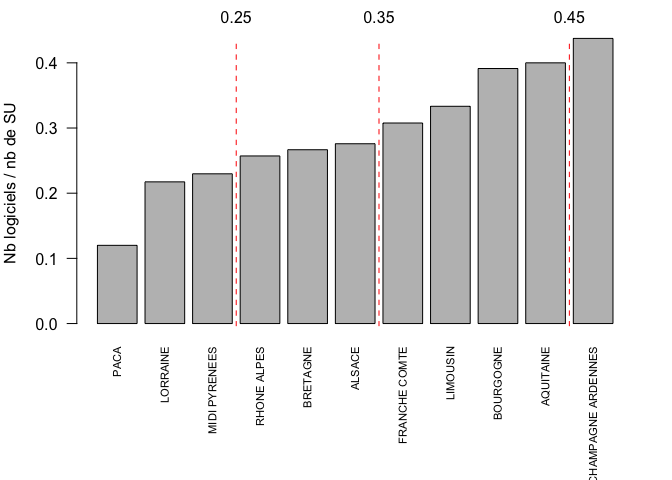
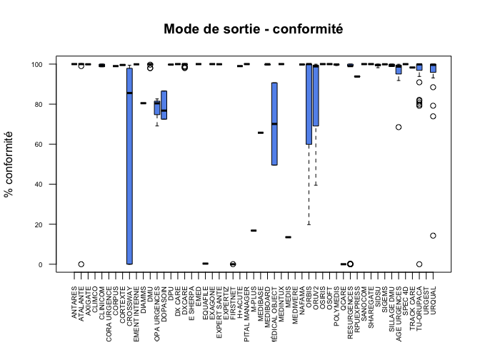
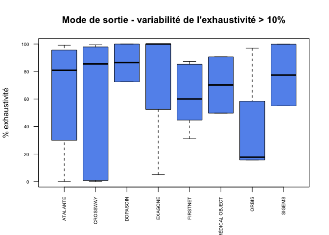

# Enquête logiciels SU - Septembre 2015
FEDORU  
07/09/2015  


Historique
==========

- 7/9/2015 Reprise de l'exploitation des logiciels des SU

    - fichier source: DATA/FEDORU - ENQUETE LOGICIEL 2015 - V2 (12 06 15) (3)
    - création d'un dossier spécifique __Septembre2015__ contenent un sous dossier __data__ pour y stocker les résultats régionaux sous forme de fichier .csv. 

- 17/9/2015 récup données ORUMIP (Olivier Azema)
- 18/9/2015 données Bourgogne mises à jour
- 30/9/2015 intégration des données de la Franche-comté
- 13/10/2015 intégration de la Lorraine

Récupération des fichiers csv
-----------------------------


Données générales
-----------------------------------


- Nombre de régions participantes: 11: 


```
 [1] "ALSACE"             "AQUITAINE"          "BOURGOGNE"          "BRETAGNE"          
 [5] "CHAMPAGNE ARDENNES" "FRANCHE COMTE"      "LIMOUSIN"           "LORRAINE"          
 [9] "MIDI PYRENEES"      "PACA"               "RHONE ALPES"       
```

- Nombre de sites concernés: 316


Cartographie
============
  
Cartographie des régions participantes et des logiciels.

 

Régions participantes à l'étude
 


Editeurs
========


```
                         AGFA               BERGER-LEVRAULT              DE LA SOCIÉTÉ C3 
                            2                            10                             1 
                  DE MÉDIBASE FIRSNET MILLENIUM FIN D'ANNÉE                       H+ACUTE 
                            1                             1                             2 
                     IMPROOVE            INTÉGRÉ À CROSSWAY               LOGICIEL MAISON 
                            6                             1                             1 
                     MAINCARE                      MCKESSON                     MC KESSON 
                            2                            17                             3 
    MCKESSON - HÔPITAL ADAPTÉ                       MEDASYS                     (MEDASYS) 
                            1                             4                             2 
                     MEDIBASE                     OPENXTREM                       (OSOFT) 
                            1                             1                             1 
                       RESURA                           SIB              SOCIÉTÉ ENOVACOM 
                            9                             7                             2 
                 (WARESYSTEM)                      WEBSANTE                          NA's 
                            2                             1                           246 
```
Dna la majorité des cas, les répondants ne connaissent pas leur éditeur.

Logiciels 2015
==============
  


- Nombre de logiciels utilisés: 53
- Huit produits sont cités 10 fois ou plus.

Logiciels par ordre décroissant
-------------------------------


```

                  DMU            TU-ORUPACA                URQUAL           RESURGENCES 
                   50                    45                    35                    29 
         RESURGENCES                 DXCARE              CROSSWAY              ATALANTE 
                   17                    15                    14                    10 
                SIDSU      SILLAGE URGENCES             MEDIBOARD              FIRSTNET 
                    9                     8                     7                     6 
                ORBIS             POLYMEDIS                 ORUV2              CLINICOM 
                    5                     5                     4                     3 
DEVELOPPEMENT INTERNE              DOPASOIN         DOPA URGENCES                   DPU 
                    3                     3                     3                     3 
              EXAGONE              EXPERTIZ                SIGEMS               ANTARES 
                    3                     3                     3                     2 
             CORTEXTE          EXPERT SANTE               H+ACUTE       HOPITAL MANAGER 
                    2                     2                     2                     2 
       MÉDICAL OBJECT                 OSOFT            RPUEXPRESS               SANOCOM 
                    2                     2                     2                     2 
            SHAREGATE           SILLAGE DMU               AXIGATE                CLIMCO 
                    2                     2                     1                     1 
         CORA URGENCE                CORPUS                DIAMMS                  EMED 
                    1                     1                     1                     1 
             EQUAFILE              E SHERPA              MEDIBASE              MEDINTUX 
                    1                     1                     1                     1 
                MEDIS              MEDIWERE                M-PLUS                NAFAMA 
                    1                     1                     1                     1 
               OSIRIS                 QCARE               SPEC 4D            TRACK CARE 
                    1                     1                     1                     1 
               URGEST 
                    1 
```

 

Logiciels par région
--------------------
  

```
                       
                        ALSACE AQUITAINE BOURGOGNE BRETAGNE CHAMPAGNE ARDENNES
  ANTARES                    2         0         0        0                  0
  ATALANTE                   8         0         2        0                  0
  AXIGATE                    0         1         0        0                  0
  CLIMCO                     0         0         0        0                  0
  CLINICOM                   1         0         0        0                  0
  CORA URGENCE               0         0         0        0                  0
  CORPUS                     0         0         0        0                  0
  CORTEXTE                   0         0         0        0                  0
  CROSSWAY                   0         3         3        0                  0
  DEVELOPPEMENT INTERNE      0         0         0        0                  0
  DIAMMS                     0         0         0        0                  0
  DMU                        2         0         7        0                  3
  DOPASOIN                   0         0         0        0                  0
  DOPA URGENCES              0         1         0        0                  2
  DPU                        0         0         0        0                  0
  DXCARE                     3         6         1        0                  1
  EMED                       0         0         0        0                  0
  EQUAFILE                   0         0         0        0                  0
  E SHERPA                   0         0         0        0                  0
  EXAGONE                    0         0         1        0                  0
  EXPERTIZ                   0         0         0        0                  0
  EXPERT SANTE               0         0         0        0                  0
  FIRSTNET                   0         0         0        0                  0
  H+ACUTE                    0         0         0        0                  0
  HOPITAL MANAGER            0         0         2        0                  0
  MEDIBASE                   0         1         0        0                  0
  MEDIBOARD                  0         0         0        1                  0
  MÉDICAL OBJECT             0         0         0        0                  0
  MEDINTUX                   0         0         0        0                  0
  MEDIS                      0         0         0        1                  0
  MEDIWERE                   0         0         0        0                  0
  M-PLUS                     0         1         0        0                  0
  NAFAMA                     0         0         0        0                  1
  ORBIS                      1         0         0        1                  0
  ORUV2                      0         0         0        0                  0
  OSIRIS                     0         0         0        0                  0
  OSOFT                      0         0         0        1                  0
  POLYMEDIS                  0         0         0        0                  5
  QCARE                      0         0         0        0                  0
  RESURGENCES                1         1         3        7                  1
  RESURGENCES                0         0         0        0                  0
  RPUEXPRESS                 0         0         0        0                  0
  SANOCOM                    0         2         0        0                  0
  SHAREGATE                  0         2         0        0                  0
  SIDSU                      0         9         0        0                  0
  SIGEMS                     0         2         0        0                  0
  SILLAGE DMU                0         0         0        2                  0
  SILLAGE URGENCES           0         2         0        6                  0
  SPEC 4D                    0         0         0        0                  0
  TRACK CARE                 0         1         0        0                  0
  TU-ORUPACA                 0         0         1        0                  0
  URGEST                     0         0         0        0                  0
  URQUAL                     0         3         3       11                  3
                       
                        FRANCHE COMTE LIMOUSIN LORRAINE MIDI PYRENEES PACA RHONE ALPES
  ANTARES                           0        0        0             0    0           0
  ATALANTE                          0        0        0             0    0           0
  AXIGATE                           0        0        0             0    0           0
  CLIMCO                            0        0        0             0    0           1
  CLINICOM                          0        0        0             1    0           1
  CORA URGENCE                      0        0        0             0    0           1
  CORPUS                            0        0        1             0    0           0
  CORTEXTE                          0        0        0             2    0           0
  CROSSWAY                          1        0        1             6    0           0
  DEVELOPPEMENT INTERNE             0        0        0             1    0           2
  DIAMMS                            0        0        0             1    0           0
  DMU                               0        0        0             0    2          36
  DOPASOIN                          0        0        0             3    0           0
  DOPA URGENCES                     0        0        0             0    0           0
  DPU                               0        0        0             1    0           2
  DXCARE                            0        0        2             2    0           0
  EMED                              0        0        0             1    0           0
  EQUAFILE                          1        0        0             0    0           0
  E SHERPA                          0        0        0             0    0           1
  EXAGONE                           0        0        0             0    0           2
  EXPERTIZ                          0        0        0             0    0           3
  EXPERT SANTE                      0        0        0             1    0           1
  FIRSTNET                          6        0        0             0    0           0
  H+ACUTE                           0        0        2             0    0           0
  HOPITAL MANAGER                   0        0        0             0    0           0
  MEDIBASE                          0        0        0             0    0           0
  MEDIBOARD                         0        0        0             2    0           4
  MÉDICAL OBJECT                    0        0        0             2    0           0
  MEDINTUX                          0        0        0             0    1           0
  MEDIS                             0        0        0             0    0           0
  MEDIWERE                          0        0        0             0    0           1
  M-PLUS                            0        0        0             0    0           0
  NAFAMA                            0        0        0             0    0           0
  ORBIS                             0        0        0             0    0           3
  ORUV2                             0        0        0             4    0           0
  OSIRIS                            0        0        0             1    0           0
  OSOFT                             0        0        0             0    0           1
  POLYMEDIS                         0        0        0             0    0           0
  QCARE                             0        0        0             0    1           0
  RESURGENCES                       5        6        0             0    2           3
  RESURGENCES                       0        0       17             0    0           0
  RPUEXPRESS                        0        0        0             2    0           0
  SANOCOM                           0        0        0             0    0           0
  SHAREGATE                         0        0        0             0    0           0
  SIDSU                             0        0        0             0    0           0
  SIGEMS                            0        0        0             0    0           1
  SILLAGE DMU                       0        0        0             0    0           0
  SILLAGE URGENCES                  0        0        0             0    0           0
  SPEC 4D                           0        1        0             0    0           0
  TRACK CARE                        0        0        0             0    0           0
  TU-ORUPACA                        0        0        0             2   42           0
  URGEST                            0        0        0             0    0           1
  URQUAL                            0        2        0             5    2           6
```

Nombre de logiciels différents par région

```
            ALSACE          AQUITAINE          BOURGOGNE           BRETAGNE 
                 7                 14                  9                  8 
CHAMPAGNE ARDENNES      FRANCHE COMTE           LIMOUSIN           LORRAINE 
                 7                  4                  3                  5 
     MIDI PYRENEES               PACA        RHONE ALPES 
                17                  6                 18 
```

Nombre de logiciels différents par rapport au nombre de SU de la région

```

              PACA           LORRAINE        RHONE ALPES           BRETAGNE 
              0.12               0.22               0.26               0.27 
     FRANCHE COMTE           LIMOUSIN             ALSACE          BOURGOGNE 
              0.31               0.33               0.39               0.39 
         AQUITAINE CHAMPAGNE ARDENNES      MIDI PYRENEES 
              0.40               0.44               0.46 
```

 

Cartographie des logiciels
--------------------------

    

Un logiciel est présent dans combien de régions ?
-------------------------------------------------
  
 

Analyse des RPU
===============
  


Nombre de RPU produits: 2065115

Nombre de RPU par logiciel
--------------------------


```
                      Nb de RPU
TU-ORUPACA               362364
URQUAL                   331497
DMU                      299522
RESURGENCES              207212
RESURGENCES              128584
DXCARE                   103059
CROSSWAY                  69480
ATALANTE                  47216
SIDSU                     44401
DPU                       39714
MEDIBOARD                 33968
FIRSTNET                  33773
SILLAGE URGENCES          32519
POLYMEDIS                 20363
CLINICOM                  17623
DEVELOPPEMENT INTERNE     15723
EXPERTIZ                  15215
EXAGONE                   14004
EXPERT SANTE              13382
MÉDICAL OBJECT            12577
CORTEXTE                  12369
SILLAGE DMU               11801
TRACK CARE                11345
ORUV2                     10715
ORBIS                     10669
DOPA URGENCES             10420
M-PLUS                     9970
H+ACUTE                    9762
DOPASOIN                   9329
ANTARES                    8974
SHAREGATE                  8639
CLIMCO                     8565
SIGEMS                     7231
SANOCOM                    7150
OSOFT                      7050
SPEC 4D                    7015
MEDIS                      6974
CORA URGENCE               6618
URGEST                     6321
MEDINTUX                   6224
MEDIWERE                   5676
RPUEXPRESS                 5205
NAFAMA                     5156
QCARE                      5131
AXIGATE                    4282
E SHERPA                   4090
CORPUS                     3601
MEDIBASE                   2913
HOPITAL MANAGER            2644
OSIRIS                     2019
DIAMMS                     1833
EMED                       1623
EQUAFILE                   1605
```

Nombre de jours manquants
-------------------------
  
  ### Par logiciel
  

```
                      Nb de jours manquants
URQUAL                               116.00
TU-ORUPACA                            90.00
CROSSWAY                              63.03
DOPASOIN                              59.00
EMED                                  50.00
SILLAGE URGENCES                      42.00
ORBIS                                 30.00
OSOFT                                 21.00
DMU                                   20.00
DEVELOPPEMENT INTERNE                 17.00
DPU                                    9.00
RESURGENCES                            5.56
CLINICOM                               4.00
HOPITAL MANAGER                        3.00
MEDIBOARD                              3.00
ATALANTE                               2.00
E SHERPA                               2.00
ANTARES                                1.00
EQUAFILE                               0.31
FIRSTNET                               0.04
AXIGATE                                0.00
CLIMCO                                 0.00
CORA URGENCE                           0.00
CORPUS                                 0.00
CORTEXTE                               0.00
DIAMMS                                 0.00
DOPA URGENCES                          0.00
DXCARE                                 0.00
EXAGONE                                0.00
EXPERTIZ                               0.00
EXPERT SANTE                           0.00
H+ACUTE                                0.00
MEDIBASE                               0.00
MÉDICAL OBJECT                         0.00
MEDINTUX                               0.00
MEDIS                                  0.00
MEDIWERE                               0.00
M-PLUS                                 0.00
NAFAMA                                 0.00
ORUV2                                  0.00
OSIRIS                                 0.00
POLYMEDIS                              0.00
QCARE                                  0.00
RESURGENCES                            0.00
RPUEXPRESS                             0.00
SANOCOM                                0.00
SHAREGATE                              0.00
SIDSU                                  0.00
SIGEMS                                 0.00
SILLAGE DMU                            0.00
SPEC 4D                                0.00
TRACK CARE                             0.00
URGEST                                 0.00
```

### Par région


```
                   Nb de jours manquants
PACA                              180.00
MIDI PYRENEES                     111.00
RHONE ALPES                        73.00
AQUITAINE                          63.00
BRETAGNE                           52.00
ALSACE                             34.00
BOURGOGNE                          21.00
CHAMPAGNE ARDENNES                  3.00
FRANCHE COMTE                       0.94
LIMOUSIN                            0.00
LORRAINE                            0.00
```


Indicateurs
===========
  
Trois indicateurs ont été retenus:
  
- Date de naissance
- Diagnostic principal (DP)
- Mode de sortie

Chaque indicateur a été évalué sur deux critères: __conformité__ et __exhaustivité__.

Date de naissance
------------------
  
- taux de conformité:

```
   Min. 1st Qu.  Median    Mean 3rd Qu.    Max.    NA's 
      0     100     100     100     100     100       7 
```

- conformité par outil:
  

```
                      Min Max moyenne médiane ecart.type Nb Q25 Q75
ANTARES               100 100     100     100     0.0000  2 100 100
ATALANTE              100 100     100     100     0.0000 10 100 100
AXIGATE               100 100     100     100         NA  1 100 100
CLIMCO                100 100     100     100         NA  1 100 100
CLINICOM              100 100     100     100     0.0000  3 100 100
CORA URGENCE          100 100     100     100         NA  1 100 100
CORPUS                100 100     100     100         NA  1 100 100
CORTEXTE              100 100     100     100     0.0000  2 100 100
CROSSWAY              100 100     100     100     0.0060 14 100 100
DEVELOPPEMENT INTERNE 100 100     100     100     0.0346  3 100 100
DIAMMS                100 100     100     100         NA  1 100 100
DMU                   100 100     100     100     0.0000 50 100 100
DOPASOIN              100 100     100     100     0.0231  3 100 100
DOPA URGENCES         100 100     100     100     0.0000  3 100 100
DPU                   100 100     100     100     0.0000  3 100 100
DXCARE                100 100     100     100     0.0000 15 100 100
EMED                  100 100     100     100         NA  1 100 100
EQUAFILE              100 100     100     100         NA  1 100 100
E SHERPA              100 100     100     100         NA  1 100 100
EXAGONE               100 100     100     100     0.0000  3 100 100
EXPERTIZ              100 100     100     100     0.0000  3 100 100
EXPERT SANTE          100 100     100     100     0.0000  2 100 100
FIRSTNET              100 100     100     100     0.0000  6 100 100
H+ACUTE               100 100     100     100     0.0000  2 100 100
HOPITAL MANAGER       100 100     100     100     0.0000  2 100 100
MEDIBASE              100 100     100     100         NA  1 100 100
MEDIBOARD             100 100     100     100     0.0076  7 100 100
MÉDICAL OBJECT        100 100     100     100     0.0000  2 100 100
MEDINTUX              100 100     100     100         NA  1 100 100
MEDIS                 100 100     100     100         NA  1 100 100
MEDIWERE              100 100     100     100         NA  1 100 100
M-PLUS                100 100     100     100         NA  1 100 100
NAFAMA                100 100     100     100         NA  1 100 100
ORBIS                 100 100     100     100     0.0000  5 100 100
ORUV2                  99 100     100     100     0.6071  4 100 100
OSIRIS                100 100     100     100         NA  1 100 100
OSOFT                 100 100     100     100     0.0000  2 100 100
POLYMEDIS             100 100     100     100     0.0000  5 100 100
QCARE                 100 100     100     100         NA  1 100 100
RESURGENCES           100 100     100     100     0.0094 29 100 100
RESURGENCES           100 100     100     100     0.0000 17 100 100
RPUEXPRESS            100 100     100     100     0.0778  2 100 100
SANOCOM               100 100     100     100     0.0000  2 100 100
SHAREGATE             100 100     100     100     0.0000  2 100 100
SIDSU                 100 100     100     100     0.0000  9 100 100
SIGEMS                100 100     100     100     0.0000  3 100 100
SILLAGE DMU           100 100     100     100     0.0000  2 100 100
SILLAGE URGENCES      100 100     100     100     0.0000  8 100 100
SPEC 4D               100 100     100     100         NA  1 100 100
TRACK CARE            100 100     100     100         NA  1 100 100
TU-ORUPACA              0 100      98     100    14.9071 45 100 100
URGEST                100 100     100     100         NA  1 100 100
URQUAL                100 100     100     100     0.0345 35 100 100
```

 

- taux d'exhaustivité:


```
   Min. 1st Qu.  Median    Mean 3rd Qu.    Max.    NA's 
      0     100     100     100     100     100      20 
```

- exhaustivité par outil
 

Diagnostic (DP)
---------- 

- taux de conformité:

```
   Min. 1st Qu.  Median    Mean 3rd Qu.    Max.    NA's 
      0      77      95      78      98     100       8 
```

- conformité par outil

```
                         Min   Max moyenne médiane ecart.type Nb     Q25     Q75
ANTARES                45.84  90.5   68.18   68.18     31.586  2  57.008  79.343
ATALANTE                0.00  99.0   44.21   28.92     38.533 10  18.040  80.210
AXIGATE                 0.00   0.0    0.00    0.00         NA  1   0.000   0.000
CLIMCO                 95.00  95.0   95.00   95.00         NA  1  95.000  95.000
CLINICOM               95.00  98.0   96.39   96.14      1.530  3  95.570  97.085
CORA URGENCE           95.00  95.0   95.00   95.00         NA  1  95.000  95.000
CORPUS                100.00 100.0  100.00  100.00         NA  1 100.000 100.000
CORTEXTE               87.11  99.5   93.30   93.30      8.754  2  90.205  96.395
CROSSWAY                0.00 100.0   54.45   72.11     43.713 14   5.000  96.280
DEVELOPPEMENT INTERNE  95.00 100.0   96.67   95.00      2.887  3  95.000  97.500
DIAMMS                 78.56  78.6   78.56   78.56         NA  1  78.560  78.560
DMU                    56.80  99.4   93.69   95.00      6.921 50  95.000  95.000
DOPASOIN                0.00  97.5   32.50    0.00     56.286  3   0.000  48.745
DOPA URGENCES           0.00  62.9   20.97    0.00     36.315  3   0.000  31.450
DPU                    92.18  95.0   94.06   95.00      1.628  3  93.590  95.000
DXCARE                  0.00 100.0   60.78   65.80     36.526 15  43.620  97.030
EMED                   97.54  97.5   97.54   97.54         NA  1  97.540  97.540
EQUAFILE              100.00 100.0  100.00  100.00         NA  1 100.000 100.000
E SHERPA               95.00  95.0   95.00   95.00         NA  1  95.000  95.000
EXAGONE                12.00  95.0   67.33   95.00     47.920  3  53.500  95.000
EXPERTIZ               95.00  95.0   95.00   95.00      0.000  3  95.000  95.000
EXPERT SANTE           29.20  95.0   62.10   62.10     46.528  2  45.650  78.550
FIRSTNET               31.40  87.7   61.77   60.40     22.257  6  47.975  80.250
H+ACUTE               100.00 100.0  100.00  100.00      0.000  2 100.000 100.000
HOPITAL MANAGER        95.00 100.0   97.50   97.50      3.536  2  96.250  98.750
MEDIBASE               96.40  96.4   96.40   96.40         NA  1  96.400  96.400
MEDIBOARD               0.73  95.0   64.06   95.00     40.500  7  33.840  95.000
MÉDICAL OBJECT         49.76  90.8   70.27   70.27     28.998  2  60.013  80.517
MEDINTUX               92.15  92.2   92.15   92.15         NA  1  92.150  92.150
MEDIS                  19.70  19.7   19.70   19.70         NA  1  19.700  19.700
MEDIWERE               95.00  95.0   95.00   95.00         NA  1  95.000  95.000
M-PLUS                 83.50  83.5   83.50   83.50         NA  1  83.500  83.500
NAFAMA                 98.50  98.5   98.50   98.50         NA  1  98.500  98.500
ORBIS                   0.00  95.0   31.67    0.00     54.848  5   0.000  47.500
ORUV2                   0.00  98.9   58.10   66.75     48.845  4  26.543  98.315
OSIRIS                100.00 100.0  100.00  100.00         NA  1 100.000 100.000
OSOFT                  95.00  98.6   96.80   96.80      2.546  2  95.900  97.700
POLYMEDIS              97.40  99.7   98.50   99.00      1.044  5  97.400  99.000
QCARE                   0.00   0.0    0.00    0.00         NA  1   0.000   0.000
RESURGENCES            76.00 100.0   95.80   97.00      4.902 29  95.000  98.980
RESURGENCES           100.00 100.0  100.00  100.00      0.000 17 100.000 100.000
RPUEXPRESS             87.22  92.0   89.59   89.59      3.345  2  88.402  90.768
SANOCOM                76.70  83.3   80.00   80.00      4.667  2  78.350  81.650
SHAREGATE               0.00   0.1    0.05    0.05      0.071  2   0.025   0.075
SIDSU                  27.30  99.8   87.06   95.80     22.825  9  88.800  96.700
SIGEMS                  8.40  95.0   51.70   51.70     61.235  3  30.050  73.350
SILLAGE DMU             0.90  10.5    5.70    5.70      6.788  2   3.300   8.100
SILLAGE URGENCES        0.00  95.0   57.06   81.80     42.869  8  13.750  88.975
SPEC 4D                85.57  85.6   85.57   85.57         NA  1  85.570  85.570
TRACK CARE             96.30  96.3   96.30   96.30         NA  1  96.300  96.300
TU-ORUPACA              0.00  99.3   92.82   97.74     15.631 45  94.860  98.440
URGEST                 95.00  95.0   95.00   95.00         NA  1  95.000  95.000
URQUAL                  0.00 100.0   61.17   86.89     43.181 35   4.210  98.025
```

 

- taux de exhaustivité:

```
   Min. 1st Qu.  Median    Mean 3rd Qu.    Max.    NA's 
      0      68      95      75      99     100       8 
```

- exhaustivité par outil

```
                        Min   Max moyenne médiane ecart.type Nb     Q25     Q75
ANTARES                45.8  90.5   68.18   68.18     31.586  2  57.008  79.343
ATALANTE                0.0  99.0   44.31   28.92     38.689 10  18.040  80.210
AXIGATE                 0.0   0.0    0.00    0.00         NA  1   0.000   0.000
CLIMCO                 38.0  38.0   38.00   38.00         NA  1  38.000  38.000
CLINICOM               72.0  98.0   88.72   96.14     14.514  3  84.070  97.085
CORA URGENCE           95.0  95.0   95.00   95.00         NA  1  95.000  95.000
CORPUS                100.0 100.0  100.00  100.00         NA  1 100.000 100.000
CORTEXTE               87.6  99.5   93.54   93.54      8.450  2  90.557  96.532
CROSSWAY                0.0 100.0   56.61   72.11     41.714 14  28.000  96.280
DEVELOPPEMENT INTERNE  83.0 100.0   92.67   95.00      8.737  3  89.000  97.500
DIAMMS                 78.7  78.7   78.72   78.72         NA  1  78.720  78.720
DMU                     2.0 100.0   89.01   95.00     16.799 50  86.080  97.500
DOPASOIN                0.0  97.7   32.57    0.00     56.413  3   0.000  48.855
DOPA URGENCES           0.0  62.9   20.97    0.00     36.315  3   0.000  31.450
DPU                    87.0  97.0   92.06   92.18      5.001  3  89.590  94.590
DXCARE                  0.0  98.9   60.12   65.80     35.794 15  43.620  95.000
EMED                   97.6  97.6   97.60   97.60         NA  1  97.600  97.600
EQUAFILE              100.0 100.0  100.00  100.00         NA  1 100.000 100.000
E SHERPA                0.0   0.0    0.00    0.00         NA  1   0.000   0.000
EXAGONE                 0.0  12.0    5.33    4.00      6.110  3   2.000   8.000
EXPERTIZ               82.0  94.0   88.67   90.00      6.110  3  86.000  92.000
EXPERT SANTE           29.2  95.0   62.11   62.11     46.513  2  45.665  78.555
FIRSTNET              100.0 100.0  100.00  100.00      0.000  6 100.000 100.000
H+ACUTE                99.0 100.0   99.50   99.50      0.707  2  99.250  99.750
HOPITAL MANAGER        95.0 100.0   97.50   97.50      3.536  2  96.250  98.750
MEDIBASE               96.4  96.4   96.40   96.40         NA  1  96.400  96.400
MEDIBOARD               0.0  43.2   10.34    1.00     16.966  7   0.365  13.740
MÉDICAL OBJECT         49.8  90.8   70.27   70.27     28.998  2  60.013  80.517
MEDINTUX              100.0 100.0  100.00  100.00         NA  1 100.000 100.000
MEDIS                  19.7  19.7   19.70   19.70         NA  1  19.700  19.700
MEDIWERE              100.0 100.0  100.00  100.00         NA  1 100.000 100.000
M-PLUS                 83.5  83.5   83.50   83.50         NA  1  83.500  83.500
NAFAMA                 99.8  99.8   99.80   99.80         NA  1  99.800  99.800
ORBIS                   0.0   0.0    0.00    0.00      0.000  5   0.000   0.000
ORUV2                   0.0  98.9   58.19   66.92     48.936  4  26.543  98.562
OSIRIS                100.0 100.0  100.00  100.00         NA  1 100.000 100.000
OSOFT                   0.0  98.6   49.30   49.30     69.721  2  24.650  73.950
POLYMEDIS              97.4  99.7   98.74   99.00      0.847  5  98.600  99.000
QCARE                   0.0   0.0    0.00    0.00         NA  1   0.000   0.000
RESURGENCES            76.0 100.0   96.64   98.56      5.053 29  95.410 100.000
RESURGENCES            93.0 100.0   99.35  100.00      1.730 17 100.000 100.000
RPUEXPRESS             87.2  92.0   89.59   89.59      3.345  2  88.402  90.768
SANOCOM                76.7  83.3   80.00   80.00      4.667  2  78.350  81.650
SHAREGATE               0.0   0.1    0.05    0.05      0.071  2   0.025   0.075
SIDSU                  27.3  99.8   87.06   95.80     22.825  9  88.800  96.700
SIGEMS                  8.4  80.0   44.20   44.20     50.629  3  26.300  62.100
SILLAGE DMU             0.9  10.5    5.70    5.70      6.788  2   3.300   8.100
SILLAGE URGENCES        0.0  95.0   57.06   81.80     42.869  8  13.750  88.975
SPEC 4D                85.6  85.6   85.57   85.57         NA  1  85.570  85.570
TRACK CARE             96.3  96.3   96.30   96.30         NA  1  96.300  96.300
TU-ORUPACA              0.0  99.3   92.84   97.74     15.634 45  95.030  98.440
URGEST                 98.0  98.0   98.00   98.00         NA  1  98.000  98.000
URQUAL                  0.0 100.0   58.70   80.12     42.778 35   4.210  98.475
```

 

Mode de sortie (MS)
-------------------

- taux de conformité:

```
   Min. 1st Qu.  Median    Mean 3rd Qu.    Max.    NA's 
      1      14      62      59      95     126      70 
```

- conformité par outil

```
                      Min  Max moyenne médiane ecart.type Nb   Q25 Q75
ANTARES                43   44    43.5      44       0.71  2  43.2  44
ATALANTE                2   91    43.4      36      29.63 10  22.0  61
AXIGATE               117  117   117.0     117         NA  1 117.0 117
CLIMCO                Inf -Inf     NaN      NA         NA  1    NA  NA
CLINICOM               14   81    47.5      48      47.38  3  30.8  64
CORA URGENCE          Inf -Inf     NaN      NA         NA  1    NA  NA
CORPUS                 87   87    87.0      87         NA  1  87.0  87
CORTEXTE               97  105   101.0     101       5.66  2  99.0 103
CROSSWAY                1   98    35.9      22      36.93 14   2.5  67
DEVELOPPEMENT INTERNE 116  116   116.0     116         NA  3 116.0 116
DIAMMS                 37   37    37.0      37         NA  1  37.0  37
DMU                    12  122    49.9      43      40.94 50  12.2  74
DOPASOIN               29   46    35.3      31       9.29  3  30.0  38
DOPA URGENCES          28   42    35.3      36       7.02  3  32.0  39
DPU                   108  108   108.0     108         NA  3 108.0 108
DXCARE                 12  117    50.1      21      42.38 15  13.0  83
EMED                   14   14    14.0      14         NA  1  14.0  14
EQUAFILE               11   11    11.0      11         NA  1  11.0  11
E SHERPA              Inf -Inf     NaN      NA         NA  1    NA  NA
EXAGONE                12   12    12.0      12         NA  3  12.0  12
EXPERTIZ              Inf -Inf     NaN      NA         NA  3    NA  NA
EXPERT SANTE          121  121   121.0     121         NA  2 121.0 121
FIRSTNET                4    6     4.3       4       0.82  6   4.0   4
H+ACUTE                87   87    87.0      87       0.00  2  87.0  87
HOPITAL MANAGER        12   12    12.0      12       0.00  2  12.0  12
MEDIBASE               25   25    25.0      25         NA  1  25.0  25
MEDIBOARD             100  123   115.0     122      13.00  7 111.0 122
MÉDICAL OBJECT         24   50    37.0      37      18.38  2  30.5  44
MEDINTUX               14   14    14.0      14         NA  1  14.0  14
MEDIS                  15   15    15.0      15         NA  1  15.0  15
MEDIWERE              Inf -Inf     NaN      NA         NA  1    NA  NA
M-PLUS                 19   19    19.0      19         NA  1  19.0  19
NAFAMA                109  109   109.0     109         NA  1 109.0 109
ORBIS                  18   20    19.0      19       1.41  5  18.5  20
ORUV2                  23  120    78.5      86      40.52  4  67.2  97
OSIRIS                 14   14    14.0      14         NA  1  14.0  14
OSOFT                  13   13    13.0      13         NA  2  13.0  13
POLYMEDIS              94  117   107.2     109      10.45  5  99.0 117
QCARE                   4    4     4.0       4         NA  1   4.0   4
RESURGENCES             3  125    26.1      13      34.71 29   9.2  14
RESURGENCES            87   87    87.0      87       0.00 17  87.0  87
RPUEXPRESS             55   57    56.0      56       1.41  2  55.5  56
SANOCOM                13   13    13.0      13       0.00  2  13.0  13
SHAREGATE              13   13    13.0      13       0.00  2  13.0  13
SIDSU                  13  117    78.2      93      38.51  9  76.0  99
SIGEMS                  1  117    59.0      59      82.02  3  30.0  88
SILLAGE DMU            13   84    48.5      48      50.20  2  30.8  66
SILLAGE URGENCES       27  117    79.8      84      28.62  8  70.8  98
SPEC 4D               124  124   124.0     124         NA  1 124.0 124
TRACK CARE             77   77    77.0      77         NA  1  77.0  77
TU-ORUPACA              4  126    84.2     100      38.72 45  56.0 118
URGEST                Inf -Inf     NaN      NA         NA  1    NA  NA
URQUAL                 12  114    58.5      62      34.98 35  16.0  86
```

 

- taux de exhaustivité:

```
   Min. 1st Qu.  Median    Mean 3rd Qu.    Max.    NA's 
      0      96     100      88     100     100       8 
```

- exhaustivité par outil

```
               Min Max moyenne médiane ecart.type Nb Q25 Q75 iqr
CROSSWAY         0  99      50      68         48 14   0  97  97
ATALANTE         0  99      64      80         37 10  30  95  65
EXAGONE          5 100      68     100         55  3  52 100  48
ORBIS           16  97      44      20         46  5  18  58  41
FIRSTNET        31  87      61      60         22  6  48  80  32
SIGEMS          55 100      77      77         32  3  66  89  22
MÉDICAL OBJECT  50  91      70      70         29  2  60  80  20
DOPASOIN        72 100      86      87         14  3  80  93  14
```

  

Conformité par région
=====================

Date de naissance
------------------

```
                   Min Max moyenne médiane ecart.type Nb Q25 Q75
ALSACE             100 100     100     100      0.000 18 100 100
AQUITAINE          100 100     100     100      0.000 35 100 100
BOURGOGNE          100 100     100     100      0.000 23 100 100
BRETAGNE           100 100     100     100      0.037 30 100 100
CHAMPAGNE ARDENNES 100 100     100     100      0.050 16 100 100
FRANCHE COMTE      100 100     100     100      0.000 13 100 100
LIMOUSIN           100 100     100     100      0.017  9 100 100
LORRAINE           100 100     100     100      0.000 23 100 100
MIDI PYRENEES       99 100     100     100      0.207 37 100 100
PACA                 0 100      98     100     14.142 50 100 100
RHONE ALPES        100 100     100     100      0.000 70 100 100
```

 

Diagnostic (DP)
---------------

```
                   Min Max moyenne médiane ecart.type Nb   Q25 Q75
ALSACE               0  99      52      52       34.4 18  18.0  86
AQUITAINE            0 100      63      84       39.8 35  27.3  96
BOURGOGNE            0 100      62      95       45.0 23   3.8  99
BRETAGNE             0 100      64      91       41.0 30  18.7  98
CHAMPAGNE ARDENNES   0 100      68      92       41.1 16  44.9  99
FRANCHE COMTE        5 100      73      88       30.6 13  56.9  97
LIMOUSIN            86  99      97      98        4.3  9  97.6  99
LORRAINE           100 100     100     100        0.0 23 100.0 100
MIDI PYRENEES        0 100      70      92       37.9 37  35.4  98
PACA                 0  99      89      98       23.6 50  92.3  98
RHONE ALPES         95  95      95      95        0.0 70  95.0  95
```

 

Mode de sortie (MS)
-------------------

```
                   Min  Max moyenne médiane ecart.type Nb Q25 Q75
ALSACE              14   91    41.5      41       22.3 18  22  53
AQUITAINE            1  117    53.0      42       43.5 35  13  96
BOURGOGNE            2   92    30.2      12       32.8 23  12  64
BRETAGNE            13  123    56.5      65       39.0 30  13  86
CHAMPAGNE ARDENNES  13  117    70.6      80       41.9 16  32 109
FRANCHE COMTE        4   11     6.2       5        2.6 13   4   8
LIMOUSIN            14  125    57.4      14       52.3  9  14 103
LORRAINE            74   87    86.4      87        2.7 23  87  87
MIDI PYRENEES        4  124    63.3      57       40.6 37  24 100
PACA                 4  126    77.3      94       42.5 50  40 116
RHONE ALPES        Inf -Inf     NaN      NA         NA 70  NA  NA
```

 

Exhaustivié par région
======================

Date de naissance
------------------

```
                   Min  Max moyenne médiane ecart.type Nb Q25 Q75
ALSACE             100  100     100     100      0.000 18 100 100
AQUITAINE          100  100     100     100      0.000 35 100 100
BOURGOGNE          100  100     100     100      0.000 23 100 100
BRETAGNE           100  100     100     100      0.000 30 100 100
CHAMPAGNE ARDENNES 100  100     100     100      0.050 16 100 100
FRANCHE COMTE      Inf -Inf     NaN      NA         NA 13  NA  NA
LIMOUSIN           100  100     100     100      0.017  9 100 100
LORRAINE           100  100     100     100      0.000 23 100 100
MIDI PYRENEES      100  100     100     100      0.010 37 100 100
PACA                 0  100      98     100     14.142 50 100 100
RHONE ALPES        100  100     100     100      0.000 70 100 100
```

 

Diagnostic (DP)
---------------

```
                   Min Max moyenne médiane ecart.type Nb   Q25 Q75
ALSACE               0  99      52      52     34.353 18  18.0  86
AQUITAINE            0 100      63      84     39.785 35  27.3  96
BOURGOGNE            0 100      62      95     45.024 23   3.8  99
BRETAGNE             0 100      67      91     39.331 30  24.0  98
CHAMPAGNE ARDENNES   0 100      74      98     37.783 16  63.6  99
FRANCHE COMTE      100 100     100     100      0.028 13 100.0 100
LIMOUSIN            86  99      97      98      4.257  9  97.6  99
LORRAINE            33 100      96     100     13.900 23  99.0 100
MIDI PYRENEES        0 100      71      92     38.082 37  35.4  98
PACA                 0 100      89      98     23.628 50  92.9  98
RHONE ALPES          0 100      72      92     36.685 70  66.0  96
```

 

Mode de sortie (MS)
-------------------

```
                    Min Max moyenne médiane ecart.type Nb Q25 Q75
ALSACE             15.7 100      69      84      32.82 18  30  95
AQUITAINE           0.0 100      89     100      27.60 35  98 100
BOURGOGNE           0.0 100      81     100      39.19 23  97 100
BRETAGNE           13.5 100      92      99      21.62 30  98 100
CHAMPAGNE ARDENNES 69.1 100      95     100       9.62 16  96 100
FRANCHE COMTE       4.9  99      73      87      30.54 13  57  97
LIMOUSIN           99.4 100     100     100       0.22  9 100 100
LORRAINE           98.0  99      99      99       0.21 23  99  99
MIDI PYRENEES       0.0 100      93     100      19.07 37  98 100
PACA                0.0 100      87     100      29.08 50  94 100
RHONE ALPES         0.0 100      87     100      31.72 70  97 100
```

 

Résultats secondaires
=====================

% de SU ne faisant pas de remontée de RPU
------------------------------------------

```

 NON NON   OUI OUI  
  15    1  307    1 
```

```
[1] "4.63 %"  "0.31 %"  "94.75 %" "0.31 %" 
```

Messges pour les éditeurs, la DGOS, les DSI qui est responsable de quoi ? intégratin systématique  des thésaurus, démarche d'amélioration.
Information proactive des sociétés savantes pour la publicationn des Référentiels: info systématique de la Fedoru.
Focaliser sur les rectangles bleus. Voir si le n° de version permet de discriminer les urqual qui remntent de ceux qui remontent mal.

Analyse de Urqual
=================
  

