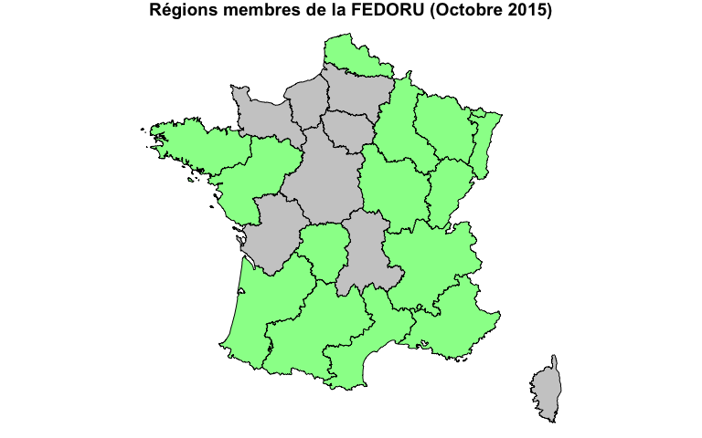
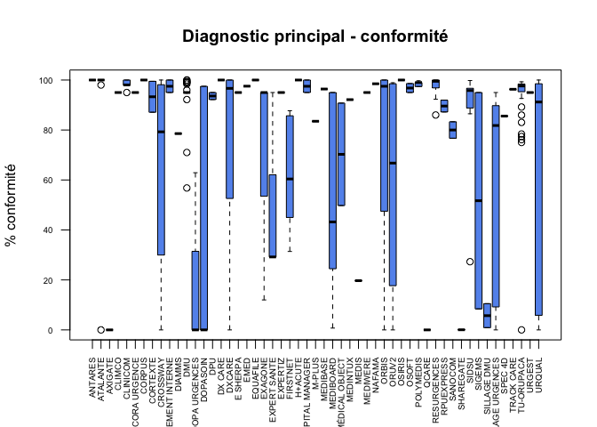
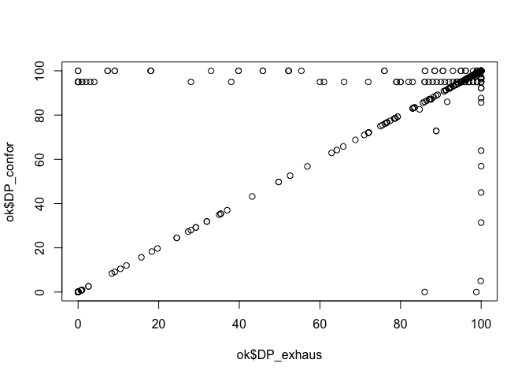

# Enquête logiciels SU - Septembre 2015
FEDORU  
07/09/2015  

7/9/2015
========
Reprise de l'exploitation des logiciels des SU

- fichier source: DATA/FEDORU - ENQUETE LOGICIEL 2015 - V2 (12 06 15) (3)
- création d'un dossier spécifique __Septembre2015__ contenent un sous dossier __data__ pour y stocker les résultats régionaux sous forme de fichier .csv. 

Récupération des fichiers csv
-----------------------------

- les 5 premières lignes sont éliminées
- élimination du héader => il faudre en créer un

```{}
path = "./data/" # ./Septembre2015/data/ si console
out.file <- NULL
file.names <- dir(path, pattern =".csv") # seuls les fichiers se terminant par csv sont lus
for(i in 1:length(file.names)){
   file <- read.table(paste(path, file.names[i], sep=""), skip = 5, header = FALSE, sep=",", stringsAsFactors=FALSE)
   # on ne garde que les 22 premières colonnes
   file <- file[, 1:22]
   # on ne garde que les lignes où les colonnes 1 à 5 ne sont pas vides (http://genometoolbox.blogspot.fr/2014/01/remove-rows-with-na-values-from-r-data.html)
   file <- file[complete.cases(file[,1:5]),]
   # remplacement de la virgule écimale par le point décimal (soirce: http://stackoverflow.com/questions/5487164/r-how-to-replace-parts-of-variable-strings-within-data-frame)
   file <- as.data.frame(sapply(file, gsub, pattern = ",", replacement = "."))

   out.file <- rbind(out.file, file)
 }

n <- c("Region", "Departement", "FINESS", "Hopital", "CP", "Routage","Logiciel_2014","Editeur", "RPU_transmis","Nb_RPU_T1_2015", "Logiciel_2015", "Version_2015", "Coment", "Freq_remontee", "DN_exhaus","DN_confor", "DP_exhaus", "DP_confor", "MS_exhaus", "MS_confor", "Jours_manquants", "coment2")
 names(out.file) <- n

write.table(out.file, file = "archive.csv", sep=",", row.names = FALSE, qmethod = "double", fileEncoding="utf-8")
```

Récupération du fichier des données
-----------------------------------


- Nombre de régions participantes: 7
- Nombre de sites: 182


Cartographie
============

Cartographie des régions participantes et des logiciels.

 

Logiciels 2015
==============


- Nombre de logiciels utilisés: 31

Logiciels par ordre décroissant
-------------------------------

```

     TU-ORUPACA          URQUAL     RESURGENCES             DMU 
             43              24              21              14 
         DXCARE     SILLAGE DMU        ATALANTE           SIDSU 
             11              10               9               9 
       CROSSWAY       POLYMEDIS   DOPA URGENCES         ANTARES 
              6               5               3               2 
HOPITAL MANAGER           ORBIS         SANOCOM       SHAREGATE 
              2               2               2               2 
         SIGEMS     AGFA EXAGON         AXIGATE        CLINICOM 
              2               1               1               1 
         MANUEL        MEDIBASE       MEDIBOARD        MEDINTUX 
              1               1               1               1 
          MEDIS          M-PLUS          NAFAMA           OSOFT 
              1               1               1               1 
          QCARE         SPEC 4D      TRACK CARE 
              1               1               1 
```

 

Logiciels par région
--------------------


```
                 
                  ALSACE AQUITAINE BOURGOGNE BRETAGNE CHAMPAGNE ARDENNES
  AGFA EXAGON          0         0         1        0                  0
  ANTARES              2         0         0        0                  0
  ATALANTE             8         0         1        0                  0
  AXIGATE              0         1         0        0                  0
  CLINICOM             1         0         0        0                  0
  CROSSWAY             0         3         3        0                  0
  DMU                  2         0         7        0                  3
  DOPA URGENCES        0         1         0        0                  2
  DXCARE               3         6         1        0                  1
  HOPITAL MANAGER      0         0         2        0                  0
  MANUEL               0         0         1        0                  0
  MEDIBASE             0         1         0        0                  0
  MEDIBOARD            0         0         0        1                  0
  MEDINTUX             0         0         0        0                  0
  MEDIS                0         0         0        1                  0
  M-PLUS               0         1         0        0                  0
  NAFAMA               0         0         0        0                  1
  ORBIS                1         0         0        1                  0
  OSOFT                0         0         0        1                  0
  POLYMEDIS            0         0         0        0                  5
  QCARE                0         0         0        0                  0
  RESURGENCES          1         1         3        7                  1
  SANOCOM              0         2         0        0                  0
  SHAREGATE            0         2         0        0                  0
  SIDSU                0         9         0        0                  0
  SIGEMS               0         2         0        0                  0
  SILLAGE DMU          0         2         0        8                  0
  SPEC 4D              0         0         0        0                  0
  TRACK CARE           0         1         0        0                  0
  TU-ORUPACA           0         0         1        0                  0
  URQUAL               0         3         3       11                  3
                 
                  LIMOUSIN PACA
  AGFA EXAGON            0    0
  ANTARES                0    0
  ATALANTE               0    0
  AXIGATE                0    0
  CLINICOM               0    0
  CROSSWAY               0    0
  DMU                    0    2
  DOPA URGENCES          0    0
  DXCARE                 0    0
  HOPITAL MANAGER        0    0
  MANUEL                 0    0
  MEDIBASE               0    0
  MEDIBOARD              0    0
  MEDINTUX               0    1
  MEDIS                  0    0
  M-PLUS                 0    0
  NAFAMA                 0    0
  ORBIS                  0    0
  OSOFT                  0    0
  POLYMEDIS              0    0
  QCARE                  0    1
  RESURGENCES            6    2
  SANOCOM                0    0
  SHAREGATE              0    0
  SIDSU                  0    0
  SIGEMS                 0    0
  SILLAGE DMU            0    0
  SPEC 4D                1    0
  TRACK CARE             0    0
  TU-ORUPACA             0   42
  URQUAL                 2    2
```

Nombre de logiciels différents par région

```
            ALSACE          AQUITAINE          BOURGOGNE 
                 7                 14                 10 
          BRETAGNE CHAMPAGNE ARDENNES           LIMOUSIN 
                 7                  7                  3 
              PACA 
                 6 
```

Cartographie des logiciels
--------------------------
    

Un logiciel est présent dans combien de régions ?
-------------------------------------------------

 

Analyse des RPU
===============


Nombre de RPU produits: 1239246

Nombre de RPU par logiciel
--------------------------

```
                Nb de RPU
TU-ORUPACA         357014
URQUAL             243561
RESURGENCES        167160
DXCARE              84584
DMU                 80896
ATALANTE            44712
SIDSU               44401
SILLAGE DMU         44320
CROSSWAY            23376
POLYMEDIS           20363
TRACK CARE          11345
DOPA URGENCES       10420
M-PLUS               9970
ANTARES              8974
SHAREGATE            8639
SANOCOM              7150
MEDIBOARD            7080
CLINICOM             7023
SPEC 4D              7015
MEDIS                6974
MEDINTUX             6224
ORBIS                6204
NAFAMA               5156
QCARE                5131
AXIGATE              4282
OSOFT                3404
SIGEMS               3266
MEDIBASE             2913
HOPITAL MANAGER      2644
AGFA EXAGON          2541
MANUEL               2504
```

Nombre de jours manquants
-------------------------

### Par logiciel


```
                Nb de jours manquants
URQUAL                            111
TU-ORUPACA                         90
CROSSWAY                           63
SILLAGE DMU                        42
ORBIS                              30
RESURGENCES                         5
CLINICOM                            4
HOPITAL MANAGER                     3
ATALANTE                            2
DMU                                 2
ANTARES                             1
AGFA EXAGON                         0
AXIGATE                             0
DOPA URGENCES                       0
DXCARE                              0
MANUEL                              0
MEDIBASE                            0
MEDIBOARD                           0
MEDINTUX                            0
MEDIS                               0
M-PLUS                              0
NAFAMA                              0
OSOFT                               0
POLYMEDIS                           0
QCARE                               0
SANOCOM                             0
SHAREGATE                           0
SIDSU                               0
SIGEMS                              0
SPEC 4D                             0
TRACK CARE                          0
```

### Par région


```
                   Nb de jours manquants
PACA                                 180
AQUITAINE                             63
BRETAGNE                              52
ALSACE                                34
BOURGOGNE                             21
CHAMPAGNE ARDENNES                     3
LIMOUSIN                               0
```


Indicateurs
===========

Trois indicateurs ont été retenus:

- Date de naissance
- Diagnostic principal (DP)
- Mode de sortie

Chaque indicateur a été évalué sur deux critères: __conformité__ et __exhaustivité__.

Date de naissance
------------------

- taux de conformité:

```
   Min. 1st Qu.  Median    Mean 3rd Qu.    Max.    NA's 
   0.00  100.00  100.00   99.44  100.00  100.00       2 
```

- conformité par outil:


```
                   Min    Max   moyenne  ecart-type Nb
AGFA EXAGON     100.00 100.00 100.00000          NA  1
ANTARES         100.00 100.00 100.00000  0.00000000  2
ATALANTE        100.00 100.00 100.00000  0.00000000  9
AXIGATE         100.00 100.00 100.00000          NA  1
CLINICOM        100.00 100.00 100.00000          NA  1
CROSSWAY        100.00 100.00 100.00000  0.00000000  6
DMU             100.00 100.00 100.00000  0.00000000 14
DOPA URGENCES   100.00 100.00 100.00000  0.00000000  3
DXCARE          100.00 100.00 100.00000  0.00000000 11
HOPITAL MANAGER 100.00 100.00 100.00000  0.00000000  2
MANUEL          100.00 100.00 100.00000          NA  1
MEDIBASE        100.00 100.00 100.00000          NA  1
MEDIBOARD       100.00 100.00 100.00000          NA  1
MEDINTUX         99.92  99.92  99.92000          NA  1
MEDIS           100.00 100.00 100.00000          NA  1
M-PLUS          100.00 100.00 100.00000          NA  1
NAFAMA           99.80  99.80  99.80000          NA  1
ORBIS           100.00 100.00 100.00000  0.00000000  2
OSOFT           100.00 100.00 100.00000          NA  1
POLYMEDIS       100.00 100.00 100.00000  0.00000000  5
QCARE            99.98  99.98  99.98000          NA  1
RESURGENCES      99.95 100.00  99.99714  0.01101946 21
SANOCOM         100.00 100.00 100.00000  0.00000000  2
SHAREGATE       100.00 100.00 100.00000  0.00000000  2
SIDSU           100.00 100.00 100.00000  0.00000000  9
SIGEMS          100.00 100.00 100.00000          NA  2
SILLAGE DMU     100.00 100.00 100.00000  0.00000000 10
SPEC 4D         100.00 100.00 100.00000          NA  1
TRACK CARE      100.00 100.00 100.00000          NA  1
TU-ORUPACA        0.00 100.00  97.67442 15.24985703 43
URQUAL           99.80 100.00  99.98958  0.04101741 24
```

 

- taux d'exhaustivité:


```
   Min. 1st Qu.  Median    Mean 3rd Qu.    Max.    NA's 
   0.00  100.00  100.00   99.44  100.00  100.00       2 
```

- exhaustivité par outil

```
                   Min    Max   moyenne  ecart-type Nb
AGFA EXAGON     100.00 100.00 100.00000          NA  1
ANTARES         100.00 100.00 100.00000  0.00000000  2
ATALANTE        100.00 100.00 100.00000  0.00000000  9
AXIGATE         100.00 100.00 100.00000          NA  1
CLINICOM        100.00 100.00 100.00000          NA  1
CROSSWAY        100.00 100.00 100.00000  0.00000000  6
DMU             100.00 100.00 100.00000  0.00000000 14
DOPA URGENCES   100.00 100.00 100.00000  0.00000000  3
DXCARE          100.00 100.00 100.00000  0.00000000 11
HOPITAL MANAGER 100.00 100.00 100.00000  0.00000000  2
MANUEL          100.00 100.00 100.00000          NA  1
MEDIBASE        100.00 100.00 100.00000          NA  1
MEDIBOARD       100.00 100.00 100.00000          NA  1
MEDINTUX         99.92  99.92  99.92000          NA  1
MEDIS           100.00 100.00 100.00000          NA  1
M-PLUS          100.00 100.00 100.00000          NA  1
NAFAMA           99.80  99.80  99.80000          NA  1
ORBIS           100.00 100.00 100.00000  0.00000000  2
OSOFT           100.00 100.00 100.00000          NA  1
POLYMEDIS       100.00 100.00 100.00000  0.00000000  5
QCARE            99.98  99.98  99.98000          NA  1
RESURGENCES      99.95 100.00  99.99714  0.01101946 21
SANOCOM         100.00 100.00 100.00000  0.00000000  2
SHAREGATE       100.00 100.00 100.00000  0.00000000  2
SIDSU           100.00 100.00 100.00000  0.00000000  9
SIGEMS          100.00 100.00 100.00000          NA  2
SILLAGE DMU     100.00 100.00 100.00000  0.00000000 10
SPEC 4D         100.00 100.00 100.00000          NA  1
TRACK CARE      100.00 100.00 100.00000          NA  1
TU-ORUPACA        0.00 100.00  97.67442 15.24985703 43
URQUAL          100.00 100.00 100.00000  0.00000000 24
```

 

Diagnostic (DP)
---------- 

- taux de conformité:

```
   Min. 1st Qu.  Median    Mean 3rd Qu.    Max.    NA's 
   0.00   52.24   93.80   71.48   98.32  100.00       3 
```

- conformité par outil

```
                  Min    Max  moyenne  ecart-type Nb
AGFA EXAGON     12.00  12.00 12.00000          NA  1
ANTARES         45.84  90.51 68.17500 31.58645992  2
ATALANTE         0.00  98.95 38.23222 35.61581102  9
AXIGATE          0.00   0.00  0.00000          NA  1
CLINICOM        96.14  96.14 96.14000          NA  1
CROSSWAY         0.00  94.30 24.66000 40.73362248  6
DMU             56.80 100.00 91.39615 13.10928649 14
DOPA URGENCES    0.00  62.90 20.96667 36.31533193  3
DXCARE           0.00  98.90 55.91636 32.18636086 11
HOPITAL MANAGER 95.00 100.00 97.50000  3.53553391  2
MANUEL          98.00  98.00 98.00000          NA  1
MEDIBASE        96.40  96.40 96.40000          NA  1
MEDIBOARD       43.20  43.20 43.20000          NA  1
MEDINTUX        92.15  92.15 92.15000          NA  1
MEDIS           19.70  19.70 19.70000          NA  1
M-PLUS          83.50  83.50 83.50000          NA  1
NAFAMA          98.50  98.50 98.50000          NA  1
ORBIS            0.00   0.00  0.00000  0.00000000  2
OSOFT           98.60  98.60 98.60000          NA  1
POLYMEDIS       97.40  99.70 98.50000  1.04403065  5
QCARE            0.00   0.00  0.00000          NA  1
RESURGENCES     76.00 100.00 95.90000  5.72101477 21
SANOCOM         76.70  83.30 80.00000  4.66690476  2
SHAREGATE        0.00   0.10  0.05000  0.07071068  2
SIDSU           27.30  99.80 87.05556 22.82515669  9
SIGEMS           8.40   8.40  8.40000          NA  2
SILLAGE DMU      0.00  95.00 46.79000 43.62913018 10
SPEC 4D         85.57  85.57 85.57000          NA  1
TRACK CARE      96.30  96.30 96.30000          NA  1
TU-ORUPACA       0.00  99.29 92.60605 15.96497910 43
URQUAL           0.00 100.00 51.27750 44.46701525 24
```

 

- taux de exhaustivité:

```
   Min. 1st Qu.  Median    Mean 3rd Qu.    Max.    NA's 
   0.00   53.30   94.03   72.63   98.43  100.00       3 
```

- exhaustivité par outil

```
                   Min    Max   moyenne  ecart-type Nb
AGFA EXAGON      12.00  12.00  12.00000          NA  1
ANTARES          45.84  90.51  68.17500 31.58645992  2
ATALANTE          0.00  98.95  38.23222 35.61581102  9
AXIGATE           0.00   0.00   0.00000          NA  1
CLINICOM         96.14  96.14  96.14000          NA  1
CROSSWAY          0.00  94.40  24.68000 40.77636570  6
DMU              56.90 100.00  91.40923 13.08995446 14
DOPA URGENCES     0.00  62.90  20.96667 36.31533193  3
DXCARE            0.00  98.90  55.91636 32.18636086 11
HOPITAL MANAGER  95.00 100.00  97.50000  3.53553391  2
MANUEL           99.00  99.00  99.00000          NA  1
MEDIBASE         96.40  96.40  96.40000          NA  1
MEDIBOARD        43.20  43.20  43.20000          NA  1
MEDINTUX        100.00 100.00 100.00000          NA  1
MEDIS            19.70  19.70  19.70000          NA  1
M-PLUS           83.50  83.50  83.50000          NA  1
NAFAMA           99.80  99.80  99.80000          NA  1
ORBIS             0.00   0.00   0.00000  0.00000000  2
OSOFT            98.60  98.60  98.60000          NA  1
POLYMEDIS        97.40  99.70  98.74000  0.84734881  5
QCARE             0.00   0.00   0.00000          NA  1
RESURGENCES      76.00 100.00  96.17619  5.35447801 21
SANOCOM          76.70  83.30  80.00000  4.66690476  2
SHAREGATE         0.00   0.10   0.05000  0.07071068  2
SIDSU            27.30  99.80  87.05556 22.82515669  9
SIGEMS            8.40   8.40   8.40000          NA  2
SILLAGE DMU       0.00  95.00  46.79000 43.62913018 10
SPEC 4D          85.57  85.57  85.57000          NA  1
TRACK CARE       96.30  96.30  96.30000          NA  1
TU-ORUPACA        0.00  99.29  92.61837 15.96750434 43
URQUAL            0.00 100.00  59.07167 42.92287387 24
```

 

Mode de sortie (MS)
-------------------

- taux de conformité:

```
   Min. 1st Qu.  Median    Mean 3rd Qu.    Max.    NA's 
   0.00   94.65   99.59   87.12  100.00  100.00       2 
```

- conformité par outil

```
                   Min    Max   moyenne ecart-type Nb
AGFA EXAGON     100.00 100.00 100.00000         NA  1
ANTARES          83.99  84.48  84.23500  0.3464823  2
ATALANTE          0.00  99.14  59.77889 37.0790394  9
AXIGATE          99.90  99.90  99.90000         NA  1
CLINICOM        100.00 100.00 100.00000         NA  1
CROSSWAY          0.00  95.00  19.30000 42.3225708  6
DMU              97.41 100.00  99.39071  1.0119096 14
DOPA URGENCES    69.10  82.60  77.36667  7.2431577  3
DXCARE           21.05 100.00  84.57545 31.5886994 11
HOPITAL MANAGER 100.00 100.00 100.00000  0.0000000  2
MANUEL           99.00  99.00  99.00000         NA  1
MEDIBASE         65.70  65.70  65.70000         NA  1
MEDIBOARD        99.96  99.96  99.96000         NA  1
MEDINTUX        100.00 100.00 100.00000         NA  1
MEDIS            13.50  13.50  13.50000         NA  1
M-PLUS           16.80  16.80  16.80000         NA  1
NAFAMA           99.80  99.80  99.80000         NA  1
ORBIS            15.70  19.80  17.75000  2.8991378  2
OSOFT           100.00 100.00 100.00000         NA  1
POLYMEDIS        99.30  99.90  99.68000  0.2683282  5
QCARE             0.00   0.00   0.00000         NA  1
RESURGENCES       0.00 100.00  85.14286 35.6807092 21
SANOCOM         100.00 100.00 100.00000  0.0000000  2
SHAREGATE       100.00 100.00 100.00000  0.0000000  2
SIDSU            98.20 100.00  99.45556  0.5659309  9
SIGEMS           99.90  99.90  99.90000         NA  2
SILLAGE DMU      68.50 100.00  95.38000  9.7412981 10
SPEC 4D          99.97  99.97  99.97000         NA  1
TRACK CARE       98.30  98.30  98.30000         NA  1
TU-ORUPACA        0.00 100.00  94.40977 15.9900007 43
URQUAL           14.29 100.00  92.29042 17.8575816 24
```

 

- taux de exhaustivité:

```
   Min. 1st Qu.  Median    Mean 3rd Qu.    Max.    NA's 
   0.00   94.65   99.59   87.12  100.00  100.00       2 
```

- exhaustivité par outil

```
                   Min    Max   moyenne ecart-type Nb
AGFA EXAGON     100.00 100.00 100.00000         NA  1
ANTARES          83.99  84.48  84.23500  0.3464823  2
ATALANTE          0.00  99.14  59.77889 37.0790394  9
AXIGATE         100.00 100.00 100.00000         NA  1
CLINICOM        100.00 100.00 100.00000         NA  1
CROSSWAY          0.00  95.10  19.32000 42.3672869  6
DMU              97.41 100.00  99.39071  1.0119096 14
DOPA URGENCES    69.10  82.60  77.36667  7.2431577  3
DXCARE           21.05 100.00  84.57545 31.5886994 11
HOPITAL MANAGER 100.00 100.00 100.00000  0.0000000  2
MANUEL           99.00  99.00  99.00000         NA  1
MEDIBASE         65.70  65.70  65.70000         NA  1
MEDIBOARD        99.96  99.96  99.96000         NA  1
MEDINTUX        100.00 100.00 100.00000         NA  1
MEDIS            13.50  13.50  13.50000         NA  1
M-PLUS           16.80  16.80  16.80000         NA  1
NAFAMA           99.80  99.80  99.80000         NA  1
ORBIS            15.70  19.80  17.75000  2.8991378  2
OSOFT           100.00 100.00 100.00000         NA  1
POLYMEDIS        99.30  99.90  99.68000  0.2683282  5
QCARE             0.00   0.00   0.00000         NA  1
RESURGENCES       0.00 100.00  85.14286 35.6807092 21
SANOCOM         100.00 100.00 100.00000  0.0000000  2
SHAREGATE       100.00 100.00 100.00000  0.0000000  2
SIDSU            98.20 100.00  99.45556  0.5659309  9
SIGEMS           99.90  99.90  99.90000         NA  2
SILLAGE DMU      68.50 100.00  95.38000  9.7412981 10
SPEC 4D          99.97  99.97  99.97000         NA  1
TRACK CARE       98.30  98.30  98.30000         NA  1
TU-ORUPACA        0.00 100.00  94.40977 15.9900007 43
URQUAL           14.29 100.00  92.29042 17.8575816 24
```

 

Conformité par région
=====================

Date de naissance
------------------

```
                      Min Max   moyenne  ecart-type Nb
ALSACE             100.00 100 100.00000  0.00000000 18
AQUITAINE          100.00 100 100.00000  0.00000000 35
BOURGOGNE          100.00 100 100.00000  0.00000000 23
BRETAGNE            99.80 100  99.99167  0.03677362 30
CHAMPAGNE ARDENNES  99.80 100  99.98750  0.05000000 16
LIMOUSIN            99.95 100  99.99333  0.01658312  9
PACA                 0.00 100  97.99800 14.14185177 50
```

 

Diagnostic (DP)
---------------

```
                     Min    Max  moyenne ecart-type Nb
ALSACE              0.00  98.95 50.13176  34.316355 18
AQUITAINE           0.00  99.80 63.42121  39.782563 35
BOURGOGNE           0.00 100.00 63.86957  44.685064 23
BRETAGNE            0.00 100.00 63.90567  40.977779 30
CHAMPAGNE ARDENNES  0.00  99.70 67.61875  41.100790 16
LIMOUSIN           85.57  98.98 96.81667   4.256727  9
PACA                0.00  99.39 88.78780  23.584018 50
```

 

Mode de sortie (MS)
-------------------

```
                     Min Max  moyenne ecart-type Nb
ALSACE             15.70 100 68.77500 32.8245757 18
AQUITAINE           0.00 100 89.24242 27.5958220 35
BOURGOGNE           0.00 100 82.04348 38.5091232 23
BRETAGNE           13.50 100 91.54533 21.6244593 30
CHAMPAGNE ARDENNES 69.10 100 94.84375  9.6193533 16
LIMOUSIN           99.39 100 99.88667  0.2200568  9
PACA                0.00 100 87.24620 29.0773015 50
```

 

Exhaustivié par région
======================

Date de naissance
------------------

```
                      Min Max   moyenne  ecart-type Nb
ALSACE             100.00 100 100.00000  0.00000000 18
AQUITAINE          100.00 100 100.00000  0.00000000 35
BOURGOGNE          100.00 100 100.00000  0.00000000 23
BRETAGNE           100.00 100 100.00000  0.00000000 30
CHAMPAGNE ARDENNES  99.80 100  99.98750  0.05000000 16
LIMOUSIN            99.95 100  99.99333  0.01658312  9
PACA                 0.00 100  97.99800 14.14185177 50
```

 

Diagnostic (DP)
---------------

```
                     Min    Max  moyenne ecart-type Nb
ALSACE              0.00  98.95 50.13176  34.316355 18
AQUITAINE           0.00  99.80 63.42424  39.784993 35
BOURGOGNE           0.00 100.00 63.91304  44.720255 23
BRETAGNE            0.00 100.00 66.77667  39.331436 30
CHAMPAGNE ARDENNES  0.00  99.80 74.30625  37.783161 16
LIMOUSIN           85.57  98.98 96.81667   4.256727  9
PACA                0.00 100.00 89.00340  23.627537 50
```

 

Mode de sortie (MS)
-------------------

```
                     Min Max  moyenne ecart-type Nb
ALSACE             15.70 100 68.77500 32.8245757 18
AQUITAINE           0.00 100 89.24848 27.5976915 35
BOURGOGNE           0.00 100 82.04348 38.5091232 23
BRETAGNE           13.50 100 91.54533 21.6244593 30
CHAMPAGNE ARDENNES 69.10 100 94.84375  9.6193533 16
LIMOUSIN           99.39 100 99.88667  0.2200568  9
PACA                0.00 100 87.24620 29.0773015 50
```

 

Résultats secondaires
=====================

% de SU ne faisant pas de remontée de RPU
------------------------------------------

```

NON OUI 
 10 171 
```

```
[1] "5.52 %"  "94.48 %"
```

