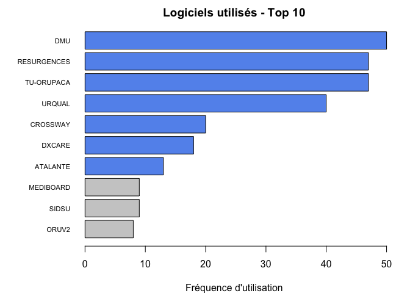
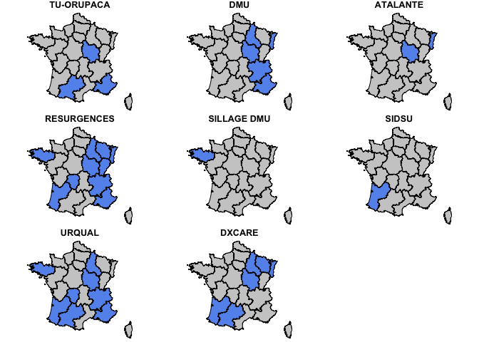
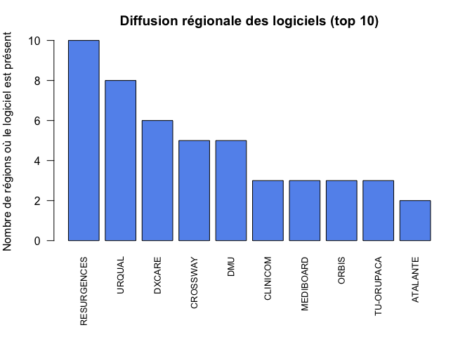
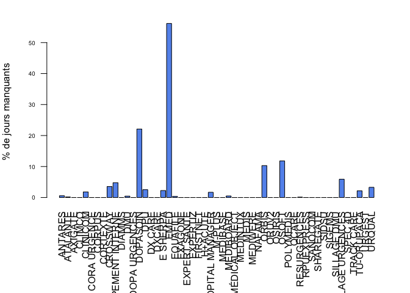
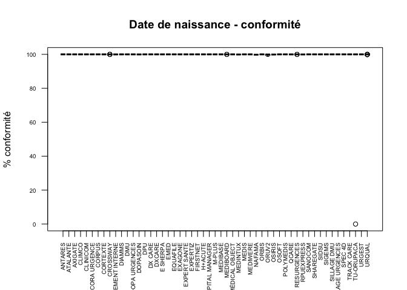
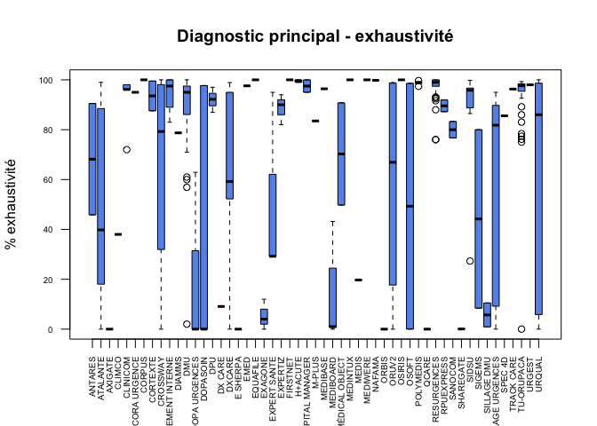
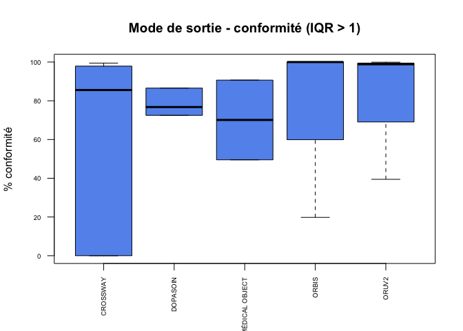
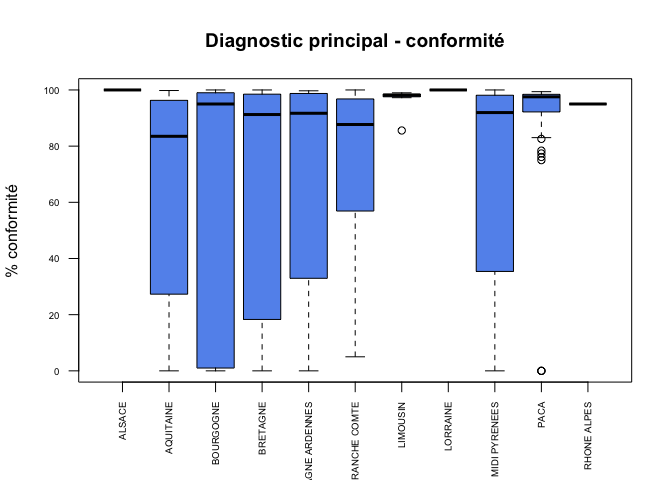

# Enquête logiciels SU - Septembre 2015
FEDORU  
07/09/2015  

Objectif: lesRPU sont produits par des ES disposant d'une autorisation de SU. Les informations sont issues des données d'un patient, recueillis par du personnel administratif, soignant et médical sur un logiciel mis à disposition par le service informatique de l'établissement. Le logiciel est fourni par un éditeur ou plus rarement développé localement et administré par le service informatique de l'établissement hospitalier (SIH). La qualité et l'exhaustivité des RPU dépend d'une chaine d'intervenant. Un RPU est considéré comme crée s'il comporte la date et heure d'entrée, le code postal, la commune et la date de naissance d'un consultant (?).L'exhaustivité est la diffférence entre le nombre de RPU produits pendant une période et le nombre de primo passage aux urgences sur la même période. Il n'y a pas de référentiel absolu pour mesurer le nombre de primo passages. Selon le cas il peut s'agir du nombre de RPU eux-mêmes, du chiffre de la SAE, d'une mesure à partir du PMSI.
La qualité des RPU se mesure par l'écart entre la valeur attendue d'un item et la réponse fournie. La réponse fournie peut être manquante ou non conforme à un référentiel de valeur. Le référentiel s'appuie sur la cahier des charges de l'INVS, sur des référentiels issus de sociétés savantes (SFMU) ou sur des consenssus d'expert (FEDORU).


Historique
==========

- 7/9/2015 Reprise de l'exploitation des logiciels des SU

    - fichier source: DATA/FEDORU - ENQUETE LOGICIEL 2015 - V2 (12 06 15) (3)
    - création d'un dossier spécifique __Septembre2015__ contenent un sous dossier __data__ pour y stocker les résultats régionaux sous forme de fichier .csv. 

- 17/9/2015 récup données ORUMIP (Olivier Azema)
- 18/9/2015 données Bourgogne mises à jour
- 30/9/2015 intégration des données de la Franche-comté
- 13/10/2015 intégration de la Lorraine

Récupération des fichiers csv
-----------------------------


```
[1] "alsace.csv"
[1] "alsace.csv~"
[1] "aquitaine.csv"
[1] "bourgogne.csv"
[1] "bretagne.csv"
[1] "champagne.csv"
[1] "franche_comte.csv"
[1] "limousin.csv"
[1] "lorraine2.csv"
[1] "midipy.csv"
[1] "ORUMIP.csv"
[1] "paca.csv"
[1] "rhone.csv"
```

```
[1] "/Users/jcb/Documents/FEDORU/InformatisationSU/Septembre2015"
```

Données générales
=================

Périmètre du questionnaire:

- période: 1er janvier 2015 au 31 mars 2015 (1er trimestre)
- concerne toutes les structures volontaires membres de la FEDORU. Coordination régionale assurée par les ORU
- questions


Résultats
---------

- Nombre de régions participantes: 11: 


```
 [1] "ALSACE"             "AQUITAINE"          "BOURGOGNE"          "BRETAGNE"          
 [5] "CHAMPAGNE ARDENNES" "FRANCHE COMTE"      "LIMOUSIN"           "LORRAINE"          
 [9] "MIDI PYRENEES"      "PACA"               "RHONE ALPES"       
```

- Nombre de sites concernés: 316


Cartographie
============
  
Cartographie des régions participantes et des logiciels.

 

Régions participantes à l'étude

 

  


Editeurs
========


- Dans la majorité des cas (79.03), les répondants ne connaissent pas leur éditeur.
- Il en est de même pour la version: 63.44 % des cas, la version n'est pas précisée.

Logiciels 2015
==============
  


- Nombre de logiciels utilisés: 53
- Huit produits sont cités 10 fois ou plus.

Logiciels par ordre décroissant
-------------------------------


```

                  DMU           RESURGENCES            TU-ORUPACA                URQUAL 
                   50                    47                    47                    40 
             CROSSWAY                DXCARE              ATALANTE             MEDIBOARD 
                   20                    18                    13                     9 
                SIDSU                 ORUV2      SILLAGE URGENCES              DOPASOIN 
                    9                     8                     8                     6 
             FIRSTNET                 ORBIS              CLINICOM             POLYMEDIS 
                    6                     6                     5                     5 
              ANTARES              CORTEXTE DEVELOPPEMENT INTERNE                   DPU 
                    4                     4                     4                     4 
       MÉDICAL OBJECT            RPUEXPRESS         DOPA URGENCES               EXAGONE 
                    4                     4                     3                     3 
         EXPERT SANTE              EXPERTIZ                SIGEMS                DIAMMS 
                    3                     3                     3                     2 
              DX CARE                  EMED               H+ACUTE       HOPITAL MANAGER 
                    2                     2                     2                     2 
               OSIRIS                 OSOFT               SANOCOM             SHAREGATE 
                    2                     2                     2                     2 
          SILLAGE DMU               AXIGATE                CLIMCO          CORA URGENCE 
                    2                     1                     1                     1 
               CORPUS              E SHERPA              EQUAFILE                M-PLUS 
                    1                     1                     1                     1 
             MEDIBASE              MEDINTUX                 MEDIS              MEDIWERE 
                    1                     1                     1                     1 
               NAFAMA                 QCARE               SPEC 4D            TRACK CARE 
                    1                     1                     1                     1 
               URGEST 
                    1 
```

 

Top Ten

```r
par(mar=c(4,7,2,2))
t <- sort(table(d$Logiciel_2015), decreasing = TRUE)
t10 <- t[10:1]
barplot(t10, horiz = TRUE, las = 1, cex.names = 0.7, main = "Logiciels utilisés - Top 10", col = ifelse(t10 > 9, "cornflowerblue", "gray80"), xlab = "Fréquence d'utilisation")
```

 


Logiciels par région
--------------------
  

```
                       
                        ALSACE AQUITAINE BOURGOGNE BRETAGNE CHAMPAGNE ARDENNES
  ANTARES                    4         0         0        0                  0
  ATALANTE                  11         0         2        0                  0
  AXIGATE                    0         1         0        0                  0
  CLIMCO                     0         0         0        0                  0
  CLINICOM                   2         0         0        0                  0
  CORA URGENCE               0         0         0        0                  0
  CORPUS                     0         0         0        0                  0
  CORTEXTE                   0         0         0        0                  0
  CROSSWAY                   0         3         3        0                  0
  DEVELOPPEMENT INTERNE      0         0         0        0                  0
  DIAMMS                     0         0         0        0                  0
  DMU                        2         0         7        0                  3
  DOPA URGENCES              0         1         0        0                  2
  DOPASOIN                   0         0         0        0                  0
  DPU                        0         0         0        0                  0
  DX CARE                    2         0         0        0                  0
  DXCARE                     4         6         1        0                  1
  E SHERPA                   0         0         0        0                  0
  EMED                       0         0         0        0                  0
  EQUAFILE                   0         0         0        0                  0
  EXAGONE                    0         0         1        0                  0
  EXPERT SANTE               0         0         0        0                  0
  EXPERTIZ                   0         0         0        0                  0
  FIRSTNET                   0         0         0        0                  0
  H+ACUTE                    0         0         0        0                  0
  HOPITAL MANAGER            0         0         2        0                  0
  M-PLUS                     0         1         0        0                  0
  MEDIBASE                   0         1         0        0                  0
  MEDIBOARD                  0         0         0        1                  0
  MÉDICAL OBJECT             0         0         0        0                  0
  MEDINTUX                   0         0         0        0                  0
  MEDIS                      0         0         0        1                  0
  MEDIWERE                   0         0         0        0                  0
  NAFAMA                     0         0         0        0                  1
  ORBIS                      2         0         0        1                  0
  ORUV2                      0         0         0        0                  0
  OSIRIS                     0         0         0        0                  0
  OSOFT                      0         0         0        1                  0
  POLYMEDIS                  0         0         0        0                  5
  QCARE                      0         0         0        0                  0
  RESURGENCES                2         1         3        7                  1
  RPUEXPRESS                 0         0         0        0                  0
  SANOCOM                    0         2         0        0                  0
  SHAREGATE                  0         2         0        0                  0
  SIDSU                      0         9         0        0                  0
  SIGEMS                     0         2         0        0                  0
  SILLAGE DMU                0         0         0        2                  0
  SILLAGE URGENCES           0         2         0        6                  0
  SPEC 4D                    0         0         0        0                  0
  TRACK CARE                 0         1         0        0                  0
  TU-ORUPACA                 0         0         1        0                  0
  URGEST                     0         0         0        0                  0
  URQUAL                     0         3         3       11                  3
                       
                        FRANCHE COMTE LIMOUSIN LORRAINE MIDI PYRENEES PACA RHONE ALPES
  ANTARES                           0        0        0             0    0           0
  ATALANTE                          0        0        0             0    0           0
  AXIGATE                           0        0        0             0    0           0
  CLIMCO                            0        0        0             0    0           1
  CLINICOM                          0        0        0             2    0           1
  CORA URGENCE                      0        0        0             0    0           1
  CORPUS                            0        0        1             0    0           0
  CORTEXTE                          0        0        0             4    0           0
  CROSSWAY                          1        0        1            12    0           0
  DEVELOPPEMENT INTERNE             0        0        0             2    0           2
  DIAMMS                            0        0        0             2    0           0
  DMU                               0        0        0             0    2          36
  DOPA URGENCES                     0        0        0             0    0           0
  DOPASOIN                          0        0        0             6    0           0
  DPU                               0        0        0             2    0           2
  DX CARE                           0        0        0             0    0           0
  DXCARE                            0        0        2             4    0           0
  E SHERPA                          0        0        0             0    0           1
  EMED                              0        0        0             2    0           0
  EQUAFILE                          1        0        0             0    0           0
  EXAGONE                           0        0        0             0    0           2
  EXPERT SANTE                      0        0        0             2    0           1
  EXPERTIZ                          0        0        0             0    0           3
  FIRSTNET                          6        0        0             0    0           0
  H+ACUTE                           0        0        2             0    0           0
  HOPITAL MANAGER                   0        0        0             0    0           0
  M-PLUS                            0        0        0             0    0           0
  MEDIBASE                          0        0        0             0    0           0
  MEDIBOARD                         0        0        0             4    0           4
  MÉDICAL OBJECT                    0        0        0             4    0           0
  MEDINTUX                          0        0        0             0    1           0
  MEDIS                             0        0        0             0    0           0
  MEDIWERE                          0        0        0             0    0           1
  NAFAMA                            0        0        0             0    0           0
  ORBIS                             0        0        0             0    0           3
  ORUV2                             0        0        0             8    0           0
  OSIRIS                            0        0        0             2    0           0
  OSOFT                             0        0        0             0    0           1
  POLYMEDIS                         0        0        0             0    0           0
  QCARE                             0        0        0             0    1           0
  RESURGENCES                       5        6       17             0    2           3
  RPUEXPRESS                        0        0        0             4    0           0
  SANOCOM                           0        0        0             0    0           0
  SHAREGATE                         0        0        0             0    0           0
  SIDSU                             0        0        0             0    0           0
  SIGEMS                            0        0        0             0    0           1
  SILLAGE DMU                       0        0        0             0    0           0
  SILLAGE URGENCES                  0        0        0             0    0           0
  SPEC 4D                           0        1        0             0    0           0
  TRACK CARE                        0        0        0             0    0           0
  TU-ORUPACA                        0        0        0             4   42           0
  URGEST                            0        0        0             0    0           1
  URQUAL                            0        2        0            10    2           6
```

Nombre de logiciels différents par région

```
            ALSACE          AQUITAINE          BOURGOGNE           BRETAGNE 
                 8                 14                  9                  8 
CHAMPAGNE ARDENNES      FRANCHE COMTE           LIMOUSIN           LORRAINE 
                 7                  4                  3                  5 
     MIDI PYRENEES               PACA        RHONE ALPES 
                17                  6                 18 
```

Nombre de logiciels différents par rapport au nombre de SU de la région

```

              PACA           LORRAINE      MIDI PYRENEES        RHONE ALPES 
              0.12               0.22               0.23               0.26 
          BRETAGNE             ALSACE      FRANCHE COMTE           LIMOUSIN 
              0.27               0.28               0.31               0.33 
         BOURGOGNE          AQUITAINE CHAMPAGNE ARDENNES 
              0.39               0.40               0.44 
```

 

Cartographie des logiciels
--------------------------

 

Un logiciel est présent dans combien de régions ?
-------------------------------------------------
  
  

Analyse des RPU
===============
  


Nombre de RPU produits: 2323895

Nombre de RPU par logiciel
--------------------------


```
                      Nb de RPU
URQUAL                   377231
TU-ORUPACA               367714
RESURGENCES              347104
DMU                      299522
DXCARE                   135660
CROSSWAY                 106311
ATALANTE                  59400
DPU                       45087
SIDSU                     44401
MEDIBOARD                 42388
FIRSTNET                  33773
SILLAGE URGENCES          32519
CLINICOM                  27188
MÉDICAL OBJECT            25154
CORTEXTE                  24738
ORUV2                     21430
EXPERT SANTE              20440
POLYMEDIS                 20363
DOPASOIN                  18658
ANTARES                   17948
DEVELOPPEMENT INTERNE     17490
EXPERTIZ                  15215
DX CARE                   14920
EXAGONE                   14004
ORBIS                     13694
SILLAGE DMU               11801
TRACK CARE                11345
DOPA URGENCES             10420
RPUEXPRESS                10410
M-PLUS                     9970
H+ACUTE                    9762
SHAREGATE                  8639
CLIMCO                     8565
SIGEMS                     7231
SANOCOM                    7150
OSOFT                      7050
SPEC 4D                    7015
MEDIS                      6974
CORA URGENCE               6618
URGEST                     6321
MEDINTUX                   6224
MEDIWERE                   5676
NAFAMA                     5156
QCARE                      5131
AXIGATE                    4282
E SHERPA                   4090
OSIRIS                     4038
DIAMMS                     3666
CORPUS                     3601
EMED                       3246
MEDIBASE                   2913
HOPITAL MANAGER            2644
EQUAFILE                   1605
```

Nombre de jours manquants
-------------------------
### nombre de jours


```r
n.jours <- as.numeric(difftime(as.Date("2015-03-31"), as.Date("2015-01-01")))

# nombre de jours logiciels
t2 <- summary(d$Logiciel_2015) * n.jours

# nombre total de jours-logiciels attendus
n.jour.logiciel = sum(t2)
n.jour.logiciel
```

```
[1] 33108
```


### Par logiciel
  

```
                      Nb de jours manquants
DOPASOIN                             118.00
URQUAL                               117.00
EMED                                 100.00
TU-ORUPACA                            90.00
CROSSWAY                              63.03
ORBIS                                 55.00
SILLAGE URGENCES                      42.00
OSOFT                                 21.00
DMU                                   20.00
DEVELOPPEMENT INTERNE                 17.00
DPU                                    9.00
CLINICOM                               8.00
RESURGENCES                            5.56
MEDIBOARD                              4.00
HOPITAL MANAGER                        3.00
ANTARES                                2.00
ATALANTE                               2.00
E SHERPA                               2.00
EQUAFILE                               0.31
FIRSTNET                               0.04
AXIGATE                                0.00
CLIMCO                                 0.00
CORA URGENCE                           0.00
CORPUS                                 0.00
CORTEXTE                               0.00
DIAMMS                                 0.00
DOPA URGENCES                          0.00
DX CARE                                0.00
DXCARE                                 0.00
EXAGONE                                0.00
EXPERT SANTE                           0.00
EXPERTIZ                               0.00
H+ACUTE                                0.00
M-PLUS                                 0.00
MEDIBASE                               0.00
MÉDICAL OBJECT                         0.00
MEDINTUX                               0.00
MEDIS                                  0.00
MEDIWERE                               0.00
NAFAMA                                 0.00
ORUV2                                  0.00
OSIRIS                                 0.00
POLYMEDIS                              0.00
QCARE                                  0.00
RPUEXPRESS                             0.00
SANOCOM                                0.00
SHAREGATE                              0.00
SIDSU                                  0.00
SIGEMS                                 0.00
SILLAGE DMU                            0.00
SPEC 4D                                0.00
TRACK CARE                             0.00
URGEST                                 0.00
```

```
                        Min   Max moyenne médiane ecart.type Nb   Q25   Q75
ANTARES                0.00  1.00  0.5000    0.50      0.577  4  0.00  1.00
ATALANTE               0.00  1.00  0.1538    0.00      0.376 13  0.00  0.00
AXIGATE                0.00  0.00  0.0000    0.00         NA  1  0.00  0.00
CLIMCO                 0.00  0.00  0.0000    0.00         NA  1  0.00  0.00
CLINICOM               0.00  4.00  1.6000    0.00      2.191  5  0.00  4.00
CORA URGENCE           0.00  0.00  0.0000    0.00         NA  1  0.00  0.00
CORPUS                  Inf  -Inf     NaN      NA         NA  1    NA    NA
CORTEXTE               0.00  0.00  0.0000    0.00      0.000  4  0.00  0.00
CROSSWAY               0.00 63.00  3.5017    0.00     14.849 20  0.00  0.00
DEVELOPPEMENT INTERNE  0.00 17.00  4.2500    0.00      8.500  4  0.00  4.25
DIAMMS                 0.00  0.00  0.0000    0.00      0.000  2  0.00  0.00
DMU                    0.00 16.00  0.4167    0.00      2.314 50  0.00  0.00
DOPA URGENCES          0.00  0.00  0.0000    0.00      0.000  3  0.00  0.00
DOPASOIN               0.00 59.00 19.6667    0.00     30.467  6  0.00 44.25
DPU                    0.00  9.00  2.2500    0.00      4.500  4  0.00  2.25
DX CARE                0.00  0.00  0.0000    0.00      0.000  2  0.00  0.00
DXCARE                 0.00  0.00  0.0000    0.00      0.000 18  0.00  0.00
E SHERPA               2.00  2.00  2.0000    2.00         NA  1  2.00  2.00
EMED                  50.00 50.00 50.0000   50.00      0.000  2 50.00 50.00
EQUAFILE               0.31  0.31  0.3100    0.31         NA  1  0.31  0.31
EXAGONE                0.00  0.00  0.0000    0.00      0.000  3  0.00  0.00
EXPERT SANTE           0.00  0.00  0.0000    0.00      0.000  3  0.00  0.00
EXPERTIZ               0.00  0.00  0.0000    0.00      0.000  3  0.00  0.00
FIRSTNET               0.00  0.04  0.0067    0.00      0.016  6  0.00  0.00
H+ACUTE                 Inf  -Inf     NaN      NA         NA  2    NA    NA
HOPITAL MANAGER        0.00  3.00  1.5000    1.50      2.121  2  0.75  2.25
M-PLUS                 0.00  0.00  0.0000    0.00         NA  1  0.00  0.00
MEDIBASE               0.00  0.00  0.0000    0.00         NA  1  0.00  0.00
MEDIBOARD              0.00  1.00  0.4444    0.00      0.527  9  0.00  1.00
MÉDICAL OBJECT         0.00  0.00  0.0000    0.00      0.000  4  0.00  0.00
MEDINTUX               0.00  0.00  0.0000    0.00         NA  1  0.00  0.00
MEDIS                  0.00  0.00  0.0000    0.00         NA  1  0.00  0.00
MEDIWERE               0.00  0.00  0.0000    0.00         NA  1  0.00  0.00
NAFAMA                 0.00  0.00  0.0000    0.00         NA  1  0.00  0.00
ORBIS                  0.00 25.00 13.7500   15.00     13.150  6  3.75 25.00
ORUV2                  0.00  0.00  0.0000    0.00      0.000  8  0.00  0.00
OSIRIS                 0.00  0.00  0.0000    0.00      0.000  2  0.00  0.00
OSOFT                  0.00 21.00 10.5000   10.50     14.849  2  5.25 15.75
POLYMEDIS              0.00  0.00  0.0000    0.00      0.000  5  0.00  0.00
QCARE                  0.00  0.00  0.0000    0.00         NA  1  0.00  0.00
RESURGENCES            0.00  5.00  0.1853    0.00      0.911 47  0.00  0.00
RPUEXPRESS             0.00  0.00  0.0000    0.00      0.000  4  0.00  0.00
SANOCOM                0.00  0.00  0.0000    0.00      0.000  2  0.00  0.00
SHAREGATE              0.00  0.00  0.0000    0.00      0.000  2  0.00  0.00
SIDSU                  0.00  0.00  0.0000    0.00      0.000  9  0.00  0.00
SIGEMS                 0.00  0.00  0.0000    0.00      0.000  3  0.00  0.00
SILLAGE DMU            0.00  0.00  0.0000    0.00      0.000  2  0.00  0.00
SILLAGE URGENCES       0.00 42.00  5.2500    0.00     14.849  8  0.00  0.00
SPEC 4D                0.00  0.00  0.0000    0.00         NA  1  0.00  0.00
TRACK CARE             0.00  0.00  0.0000    0.00         NA  1  0.00  0.00
TU-ORUPACA             0.00 90.00  1.9149    0.00     13.128 47  0.00  0.00
URGEST                 0.00  0.00  0.0000    0.00         NA  1  0.00  0.00
URQUAL                 0.00 85.00  3.0000    0.00     13.792 40  0.00  0.50
```

```
[1] 679
```

### par jour-logiciel

Le nombre de jours logiciels est le produit de la durée de l'étude en jours par le nombre de SU utilisant un logiciel donné.

```r
par(mar = c(8,4,2,2))
t3 <- cbind(t, t2, round(t * 100/t2, 2))
colnames(t3) <- c("nb jours manquants", "nb jour-logiciel", "% jours manquants")
barplot(t3[,3], las = 2, cex.axis=0.6, col = "cornflowerblue", ylab = "% de jours manquants")
```

 

```r
# on ne garde que les jours manquants
t4 <- t3[, 3]
t5 <- t4[t4 > 0]
barplot(t5, las = 2, cex.axis=0.6, col = "cornflowerblue", ylab = "% de jours manquants", main = "Jours manquants selon le logiciel")
```

 

```r
# nombre de logiciels où le nombre de jours manquants est sup à 10%
which(t5 > 10)
```

```
DOPASOIN     EMED    ORBIS    OSOFT 
       7       10       15       16 
```

```r
# donne le nom et le rang du logiciel: 3 logiciels
```

- nombre de jours de l'étude: 89
- nombre de jours logiciel: 33108
- nombre de jours manquants: 678.94
- % de jours manquants: 2.05
- Logicielsoùle nombre de jours manquants est supérieur à 10%: 7, 10, 15, 16

### Par région


```
                   Nb de jours manquants
MIDI PYRENEES                     222.00
PACA                              180.00
RHONE ALPES                        73.00
ALSACE                             64.00
AQUITAINE                          63.00
BRETAGNE                           52.00
BOURGOGNE                          21.00
CHAMPAGNE ARDENNES                  3.00
FRANCHE COMTE                       0.94
LIMOUSIN                            0.00
LORRAINE                            0.00
```


Indicateurs
===========
  
Trois indicateurs ont été retenus:
  
- Date de naissance
- Diagnostic principal (DP)
- Mode de sortie

Chaque indicateur a été évalué sur deux critères: __conformité__ et __exhaustivité__.

Date de naissance
------------------
  
- taux de conformité:

```
   Min. 1st Qu.  Median    Mean 3rd Qu.    Max.    NA's 
      0     100     100     100     100     100       7 
```

- conformité par outil:
  

```
                      Min Max moyenne médiane ecart.type Nb Q25 Q75
ANTARES               100 100     100     100     0.0000  4 100 100
ATALANTE              100 100     100     100     0.0000 13 100 100
AXIGATE               100 100     100     100         NA  1 100 100
CLIMCO                100 100     100     100         NA  1 100 100
CLINICOM              100 100     100     100     0.0000  5 100 100
CORA URGENCE          100 100     100     100         NA  1 100 100
CORPUS                100 100     100     100         NA  1 100 100
CORTEXTE              100 100     100     100     0.0000  4 100 100
CROSSWAY              100 100     100     100     0.0067 20 100 100
DEVELOPPEMENT INTERNE 100 100     100     100     0.0346  4 100 100
DIAMMS                100 100     100     100     0.0000  2 100 100
DMU                   100 100     100     100     0.0000 50 100 100
DOPA URGENCES         100 100     100     100     0.0000  3 100 100
DOPASOIN              100 100     100     100     0.0207  6 100 100
DPU                   100 100     100     100     0.0000  4 100 100
DX CARE               100 100     100     100     0.0000  2 100 100
DXCARE                100 100     100     100     0.0000 18 100 100
E SHERPA              100 100     100     100         NA  1 100 100
EMED                  100 100     100     100     0.0000  2 100 100
EQUAFILE              100 100     100     100         NA  1 100 100
EXAGONE               100 100     100     100     0.0000  3 100 100
EXPERT SANTE          100 100     100     100     0.0000  3 100 100
EXPERTIZ              100 100     100     100     0.0000  3 100 100
FIRSTNET              100 100     100     100     0.0000  6 100 100
H+ACUTE               100 100     100     100     0.0000  2 100 100
HOPITAL MANAGER       100 100     100     100     0.0000  2 100 100
M-PLUS                100 100     100     100         NA  1 100 100
MEDIBASE              100 100     100     100         NA  1 100 100
MEDIBOARD             100 100     100     100     0.0088  9 100 100
MÉDICAL OBJECT        100 100     100     100     0.0000  4 100 100
MEDINTUX              100 100     100     100         NA  1 100 100
MEDIS                 100 100     100     100         NA  1 100 100
MEDIWERE              100 100     100     100         NA  1 100 100
NAFAMA                100 100     100     100         NA  1 100 100
ORBIS                 100 100     100     100     0.0000  6 100 100
ORUV2                  99 100     100     100     0.5621  8 100 100
OSIRIS                100 100     100     100     0.0000  2 100 100
OSOFT                 100 100     100     100     0.0000  2 100 100
POLYMEDIS             100 100     100     100     0.0000  5 100 100
QCARE                 100 100     100     100         NA  1 100 100
RESURGENCES           100 100     100     100     0.0074 47 100 100
RPUEXPRESS            100 100     100     100     0.0635  4 100 100
SANOCOM               100 100     100     100     0.0000  2 100 100
SHAREGATE             100 100     100     100     0.0000  2 100 100
SIDSU                 100 100     100     100     0.0000  9 100 100
SIGEMS                100 100     100     100     0.0000  3 100 100
SILLAGE DMU           100 100     100     100     0.0000  2 100 100
SILLAGE URGENCES      100 100     100     100     0.0000  8 100 100
SPEC 4D               100 100     100     100         NA  1 100 100
TRACK CARE            100 100     100     100         NA  1 100 100
TU-ORUPACA              0 100      98     100    14.5865 47 100 100
URGEST                100 100     100     100         NA  1 100 100
URQUAL                100 100     100     100     0.0323 40 100 100
```

 

- taux d'exhaustivité:


```
   Min. 1st Qu.  Median    Mean 3rd Qu.    Max.    NA's 
      0     100     100     100     100     100      20 
```

- exhaustivité par outil
 

Diagnostic (DP)
---------- 

### taux de conformité:

```
   Min. 1st Qu.  Median    Mean 3rd Qu.    Max.    NA's 
      0      85      95      80      99     100       8 
```
- % de DP conformes: 97.85

### conformité par outil

```
                         Min   Max moyenne médiane ecart.type Nb     Q25     Q75
ANTARES               100.00 100.0  100.00  100.00      0.000  4 100.000 100.000
ATALANTE                0.00 100.0   92.15  100.00     27.694 13 100.000 100.000
AXIGATE                 0.00   0.0    0.00    0.00         NA  1   0.000   0.000
CLIMCO                 95.00  95.0   95.00   95.00         NA  1  95.000  95.000
CLINICOM               95.00 100.0   98.21   98.03      2.048  5  98.030 100.000
CORA URGENCE           95.00  95.0   95.00   95.00         NA  1  95.000  95.000
CORPUS                100.00 100.0  100.00  100.00         NA  1 100.000 100.000
CORTEXTE               87.11  99.5   93.30   93.30      7.148  4  87.110  99.490
CROSSWAY                0.00 100.0   62.50   79.27     40.163 20  29.955  98.140
DEVELOPPEMENT INTERNE  95.00 100.0   97.50   97.50      2.887  4  95.000 100.000
DIAMMS                 78.56  78.6   78.56   78.56      0.000  2  78.560  78.560
DMU                    56.80 100.0   94.28   95.00      6.838 50  95.000  95.000
DOPA URGENCES           0.00  62.9   20.97    0.00     36.315  3   0.000  31.450
DOPASOIN                0.00  97.5   32.50    0.00     50.344  6   0.000  73.117
DPU                    92.18  95.0   93.59   93.59      1.628  4  92.180  95.000
DX CARE               100.00 100.0  100.00  100.00      0.000  2 100.000 100.000
DXCARE                  0.00 100.0   71.93   96.66     38.161 18  55.900 100.000
E SHERPA               95.00  95.0   95.00   95.00         NA  1  95.000  95.000
EMED                   97.54  97.5   97.54   97.54      0.000  2  97.540  97.540
EQUAFILE              100.00 100.0  100.00  100.00         NA  1 100.000 100.000
EXAGONE                12.00  95.0   67.33   95.00     47.920  3  53.500  95.000
EXPERT SANTE           29.20  95.0   51.13   29.20     37.990  3  29.200  62.100
EXPERTIZ               95.00  95.0   95.00   95.00      0.000  3  95.000  95.000
FIRSTNET               31.40  87.7   61.77   60.40     22.257  6  47.975  80.250
H+ACUTE               100.00 100.0  100.00  100.00      0.000  2 100.000 100.000
HOPITAL MANAGER        95.00 100.0   97.50   97.50      3.536  2  96.250  98.750
M-PLUS                 83.50  83.5   83.50   83.50         NA  1  83.500  83.500
MEDIBASE               96.40  96.4   96.40   96.40         NA  1  96.400  96.400
MEDIBOARD               0.73  95.0   52.62   43.20     42.193  9  24.480  95.000
MÉDICAL OBJECT         49.76  90.8   70.27   70.27     23.677  4  49.760  90.770
MEDINTUX               92.15  92.2   92.15   92.15         NA  1  92.150  92.150
MEDIS                  19.70  19.7   19.70   19.70         NA  1  19.700  19.700
MEDIWERE               95.00  95.0   95.00   95.00         NA  1  95.000  95.000
NAFAMA                 98.50  98.5   98.50   98.50         NA  1  98.500  98.500
ORBIS                   0.00 100.0   73.75   97.50     49.223  6  71.250 100.000
ORUV2                   0.00  98.9   58.10   66.75     45.222  8  26.543  98.315
OSIRIS                100.00 100.0  100.00  100.00      0.000  2 100.000 100.000
OSOFT                  95.00  98.6   96.80   96.80      2.546  2  95.900  97.700
POLYMEDIS              97.40  99.7   98.50   99.00      1.044  5  97.400  99.000
QCARE                   0.00   0.0    0.00    0.00         NA  1   0.000   0.000
RESURGENCES            86.00 100.0   97.92   99.50      2.967 47  96.850 100.000
RPUEXPRESS             87.22  92.0   89.59   89.59      2.731  4  87.220  91.950
SANOCOM                76.70  83.3   80.00   80.00      4.667  2  78.350  81.650
SHAREGATE               0.00   0.1    0.05    0.05      0.071  2   0.025   0.075
SIDSU                  27.30  99.8   87.06   95.80     22.825  9  88.800  96.700
SIGEMS                  8.40  95.0   51.70   51.70     61.235  3  30.050  73.350
SILLAGE DMU             0.90  10.5    5.70    5.70      6.788  2   3.300   8.100
SILLAGE URGENCES        0.00  95.0   57.06   81.80     42.869  8  13.750  88.975
SPEC 4D                85.57  85.6   85.57   85.57         NA  1  85.570  85.570
TRACK CARE             96.30  96.3   96.30   96.30         NA  1  96.300  96.300
TU-ORUPACA              0.00  99.3   93.02   97.62     15.317 47  95.325  98.405
URGEST                 95.00  95.0   95.00   95.00         NA  1  95.000  95.000
URQUAL                  0.00 100.0   62.91   91.20     42.733 40   5.840  98.505
```

 

- taux de exhaustivité:

```
   Min. 1st Qu.  Median    Mean 3rd Qu.    Max.    NA's 
      0      59      94      74      99     100       8 
```

- exhaustivité par outil

```
                        Min   Max moyenne médiane ecart.type Nb     Q25     Q75
ANTARES                45.8  90.5   68.18   68.18     25.790  4  45.840  90.510
ATALANTE                0.0  99.0   44.52   39.80     37.426 13  18.040  88.480
AXIGATE                 0.0   0.0    0.00    0.00         NA  1   0.000   0.000
CLIMCO                 38.0  38.0   38.00   38.00         NA  1  38.000  38.000
CLINICOM               72.0  98.0   92.07   96.14     11.258  5  96.140  98.030
CORA URGENCE           95.0  95.0   95.00   95.00         NA  1  95.000  95.000
CORPUS                100.0 100.0  100.00  100.00         NA  1 100.000 100.000
CORTEXTE               87.6  99.5   93.54   93.54      6.899  4  87.570  99.520
CROSSWAY                0.0 100.0   63.97   79.27     38.407 20  31.950  98.090
DEVELOPPEMENT INTERNE  83.0 100.0   94.50   97.50      8.021  4  92.000 100.000
DIAMMS                 78.7  78.7   78.72   78.72      0.000  2  78.720  78.720
DMU                     2.0 100.0   89.01   95.00     16.799 50  86.080  97.500
DOPA URGENCES           0.0  62.9   20.97    0.00     36.315  3   0.000  31.450
DOPASOIN                0.0  97.7   32.57    0.00     50.457  6   0.000  73.282
DPU                    87.0  97.0   92.09   92.18      4.084  4  90.885  93.385
DX CARE                 9.1   9.1    9.10    9.10      0.000  2   9.100   9.100
DXCARE                  0.0  98.9   60.77   59.20     34.641 18  52.240  95.000
E SHERPA                0.0   0.0    0.00    0.00         NA  1   0.000   0.000
EMED                   97.6  97.6   97.60   97.60      0.000  2  97.600  97.600
EQUAFILE              100.0 100.0  100.00  100.00         NA  1 100.000 100.000
EXAGONE                 0.0  12.0    5.33    4.00      6.110  3   2.000   8.000
EXPERT SANTE           29.2  95.0   51.15   29.22     37.978  3  29.220  62.110
EXPERTIZ               82.0  94.0   88.67   90.00      6.110  3  86.000  92.000
FIRSTNET              100.0 100.0  100.00  100.00      0.000  6 100.000 100.000
H+ACUTE                99.0 100.0   99.50   99.50      0.707  2  99.250  99.750
HOPITAL MANAGER        95.0 100.0   97.50   97.50      3.536  2  96.250  98.750
M-PLUS                 83.5  83.5   83.50   83.50         NA  1  83.500  83.500
MEDIBASE               96.4  96.4   96.40   96.40         NA  1  96.400  96.400
MEDIBOARD               0.0  43.2   10.85    1.00     15.878  9   0.730  24.480
MÉDICAL OBJECT         49.8  90.8   70.27   70.27     23.677  4  49.760  90.770
MEDINTUX              100.0 100.0  100.00  100.00         NA  1 100.000 100.000
MEDIS                  19.7  19.7   19.70   19.70         NA  1  19.700  19.700
MEDIWERE              100.0 100.0  100.00  100.00         NA  1 100.000 100.000
NAFAMA                 99.8  99.8   99.80   99.80         NA  1  99.800  99.800
ORBIS                   0.0   0.0    0.00    0.00      0.000  6   0.000   0.000
ORUV2                   0.0  98.9   58.19   66.92     45.306  8  26.543  98.562
OSIRIS                100.0 100.0  100.00  100.00      0.000  2 100.000 100.000
OSOFT                   0.0  98.6   49.30   49.30     69.721  2  24.650  73.950
POLYMEDIS              97.4  99.7   98.74   99.00      0.847  5  98.600  99.000
QCARE                   0.0   0.0    0.00    0.00         NA  1   0.000   0.000
RESURGENCES            76.0 100.0   97.19   99.00      5.316 47  97.410 100.000
RPUEXPRESS             87.2  92.0   89.59   89.59      2.731  4  87.220  91.950
SANOCOM                76.7  83.3   80.00   80.00      4.667  2  78.350  81.650
SHAREGATE               0.0   0.1    0.05    0.05      0.071  2   0.025   0.075
SIDSU                  27.3  99.8   87.06   95.80     22.825  9  88.800  96.700
SIGEMS                  8.4  80.0   44.20   44.20     50.629  3  26.300  62.100
SILLAGE DMU             0.9  10.5    5.70    5.70      6.788  2   3.300   8.100
SILLAGE URGENCES        0.0  95.0   57.06   81.80     42.869  8  13.750  88.975
SPEC 4D                85.6  85.6   85.57   85.57         NA  1  85.570  85.570
TRACK CARE             96.3  96.3   96.30   96.30         NA  1  96.300  96.300
TU-ORUPACA              0.0  99.3   93.04   97.62     15.320 47  95.420  98.405
URGEST                 98.0  98.0   98.00   98.00         NA  1  98.000  98.000
URQUAL                  0.0 100.0   61.18   86.00     42.678 40   5.840  98.655
```

 

### correlation exhaustivité-conformité


```r
# on ne garde que les couples complets
ok <- d[which(complete.cases(d$DP_exhaus, d$DP_confor)),]
cor(ok$DP_exhaus, ok$DP_confor)
```

```
[1] 0.72
```

```r
plot(ok$DP_exhaus, ok$DP_confor)
```

 


Mode de sortie (MS)
-------------------

- taux de conformité:

```
   Min. 1st Qu.  Median    Mean 3rd Qu.    Max.    NA's 
      0      96     100      87     100     100      73 
```

- conformité par outil

```
                         Min    Max  moyenne médiane ecart.type Nb     Q25    Q75
ANTARES               100.00 100.00 100.0000  100.00      0.000  4 100.000 100.00
ATALANTE                0.00 100.00  92.2308  100.00     27.713 13 100.000 100.00
AXIGATE                99.90  99.90  99.9000   99.90         NA  1  99.900  99.90
CLIMCO                   Inf   -Inf      NaN      NA         NA  1      NA     NA
CLINICOM               98.66 100.00  99.3300   99.33      0.774  5  98.660 100.00
CORA URGENCE             Inf   -Inf      NaN      NA         NA  1      NA     NA
CORPUS                 99.00  99.00  99.0000   99.00         NA  1  99.000  99.00
CORTEXTE               99.43  99.70  99.5650   99.56      0.156  4  99.430  99.70
CROSSWAY                0.00  99.44  57.5574   85.54     45.917 20   0.015  97.89
DEVELOPPEMENT INTERNE  99.89  99.89  99.8900   99.89      0.000  4  99.890  99.89
DIAMMS                 80.47  80.47  80.4700   80.47      0.000  2  80.470  80.47
DMU                    98.00 100.00  99.6654  100.00      0.744 50  99.950 100.00
DOPA URGENCES          69.10  82.60  77.3667   80.40      7.243  3  74.750  81.50
DOPASOIN               72.48  86.54  78.5933   76.76      6.446  6  73.550  84.09
DPU                    99.76  99.76  99.7600   99.76      0.000  4  99.760  99.76
DX CARE               100.00 100.00 100.0000  100.00      0.000  2 100.000 100.00
DXCARE                 98.00 100.00  99.6333  100.00      0.676 18  99.825 100.00
E SHERPA                 Inf   -Inf      NaN      NA         NA  1      NA     NA
EMED                  100.00 100.00 100.0000  100.00      0.000  2 100.000 100.00
EQUAFILE                0.31   0.31   0.3100    0.31         NA  1   0.310   0.31
EXAGONE               100.00 100.00 100.0000  100.00         NA  3 100.000 100.00
EXPERT SANTE           99.93  99.93  99.9300   99.93      0.000  3  99.930  99.93
EXPERTIZ                 Inf   -Inf      NaN      NA         NA  3      NA     NA
FIRSTNET                0.00   0.04   0.0067    0.00      0.016  6   0.000   0.00
H+ACUTE                99.00  99.00  99.0000   99.00      0.000  2  99.000  99.00
HOPITAL MANAGER       100.00 100.00 100.0000  100.00      0.000  2 100.000 100.00
M-PLUS                 16.80  16.80  16.8000   16.80         NA  1  16.800  16.80
MEDIBASE               65.70  65.70  65.7000   65.70         NA  1  65.700  65.70
MEDIBOARD              99.53  99.96  99.7840   99.95      0.232  9  99.530  99.95
MÉDICAL OBJECT         49.52  90.67  70.0950   70.09     23.758  4  49.520  90.67
MEDINTUX              100.00 100.00 100.0000  100.00         NA  1 100.000 100.00
MEDIS                  13.50  13.50  13.5000   13.50         NA  1  13.500  13.50
MEDIWERE                 Inf   -Inf      NaN      NA         NA  1      NA     NA
NAFAMA                 99.80  99.80  99.8000   99.80         NA  1  99.800  99.80
ORBIS                  19.80 100.00  73.2667  100.00     46.303  6  59.900 100.00
ORUV2                  39.45  99.92  84.2700   98.85     27.668  8  83.880  99.25
OSIRIS                100.00 100.00 100.0000  100.00      0.000  2 100.000 100.00
OSOFT                 100.00 100.00 100.0000  100.00         NA  2 100.000 100.00
POLYMEDIS              99.30  99.90  99.6800   99.80      0.268  5  99.500  99.90
QCARE                   0.00   0.00   0.0000    0.00         NA  1   0.000   0.00
RESURGENCES             0.00 100.00  81.3941   99.00     38.782 47  99.000 100.00
RPUEXPRESS             93.58  94.01  93.7950   93.80      0.248  4  93.580  94.01
SANOCOM               100.00 100.00 100.0000  100.00      0.000  2 100.000 100.00
SHAREGATE             100.00 100.00 100.0000  100.00      0.000  2 100.000 100.00
SIDSU                  98.20 100.00  99.4556   99.50      0.566  9  99.200  99.90
SIGEMS                 99.90  99.90  99.9000   99.90         NA  3  99.900  99.90
SILLAGE DMU            98.80 100.00  99.4000   99.40      0.849  2  99.100  99.70
SILLAGE URGENCES       68.50  99.90  94.3750   98.75     10.776  8  96.675  99.45
SPEC 4D                99.97  99.97  99.9700   99.97         NA  1  99.970  99.97
TRACK CARE             98.30  98.30  98.3000   98.30         NA  1  98.300  98.30
TU-ORUPACA              0.00 100.00  94.8843   99.85     15.360 47  96.875  99.92
URGEST                   Inf   -Inf      NaN      NA         NA  1      NA     NA
URQUAL                 14.29 100.00  94.5350   99.62     15.321 40  96.150 100.00
```

  

- taux de exhaustivité:

```
   Min. 1st Qu.  Median    Mean 3rd Qu.    Max.    NA's 
      0      95      99      88     100     100       8 
```

- exhaustivité par outil

```
               Min Max moyenne médiane ecart.type Nb   Q25 Q75 iqr
CROSSWAY         0  99      58      86         46 20  0.75  98  97
ATALANTE         0  99      70      81         35 13 30.03  96  66
EXAGONE          5 100      68     100         55  3 52.50 100  48
MÉDICAL OBJECT  50  91      70      70         24  4 49.76  91  41
FIRSTNET        31  87      61      60         22  6 47.68  80  32
ORBIS           16  97      37      18         40  6 15.70  39  23
SIGEMS          55 100      77      77         32  3 66.22  89  22
DOPASOIN        72 100      86      87         12  6 76.00  97  21
```

  

Conformité par région
=====================

Date de naissance
------------------

```
                   Min Max moyenne médiane ecart.type Nb Q25 Q75
ALSACE             100 100     100     100      0.000 29 100 100
AQUITAINE          100 100     100     100      0.000 35 100 100
BOURGOGNE          100 100     100     100      0.000 23 100 100
BRETAGNE           100 100     100     100      0.037 30 100 100
CHAMPAGNE ARDENNES 100 100     100     100      0.050 16 100 100
FRANCHE COMTE      100 100     100     100      0.000 13 100 100
LIMOUSIN           100 100     100     100      0.017  9 100 100
LORRAINE           100 100     100     100      0.000 23 100 100
MIDI PYRENEES       99 100     100     100      0.206 74 100 100
PACA                 0 100      98     100     14.142 50 100 100
RHONE ALPES        100 100     100     100      0.000 70 100 100
```

 

Diagnostic (DP)
---------------

```
                   Min Max moyenne médiane ecart.type Nb   Q25 Q75
ALSACE             100 100     100     100        0.0 29 100.0 100
AQUITAINE            0 100      63      84       39.8 35  27.3  96
BOURGOGNE            0 100      62      95       45.0 23   3.8  99
BRETAGNE             0 100      64      91       41.0 30  18.7  98
CHAMPAGNE ARDENNES   0 100      68      92       41.1 16  44.9  99
FRANCHE COMTE        5 100      73      88       30.6 13  56.9  97
LIMOUSIN            86  99      97      98        4.3  9  97.6  99
LORRAINE           100 100     100     100        0.0 23 100.0 100
MIDI PYRENEES        0 100      70      92       37.7 74  35.4  98
PACA                 0  99      89      98       23.6 50  92.3  98
RHONE ALPES         95  95      95      95        0.0 70  95.0  95
```

 

Mode de sortie (MS)
-------------------

```
                   Min    Max moyenne médiane ecart.type Nb Q25    Q75
ALSACE             100 100.00 100.000  100.00       0.00 29 100 100.00
AQUITAINE            0 100.00  89.242   99.70      27.60 35  98 100.00
BOURGOGNE            0 100.00  81.182  100.00      39.19 23  97 100.00
BRETAGNE            14 100.00  91.545   99.30      21.62 30  98 100.00
CHAMPAGNE ARDENNES  69 100.00  94.844   99.75       9.62 16  96  99.90
FRANCHE COMTE        0   0.31   0.072    0.03       0.11 13   0   0.06
LIMOUSIN            99 100.00  99.887  100.00       0.22  9 100 100.00
LORRAINE            98  99.00  98.957   99.00       0.21 23  99  99.00
MIDI PYRENEES        0 100.00  89.864   99.43      20.72 74  91  99.93
PACA                 0 100.00  87.246   99.65      29.08 50  94  99.91
RHONE ALPES        Inf   -Inf     NaN      NA         NA 70  NA     NA
```

 

Exhaustivié et conformité par région
======================

Date de naissance
------------------

```
                   Min  Max moyenne médiane ecart.type Nb Q25 Q75
ALSACE             100  100     100     100      0.000 29 100 100
AQUITAINE          100  100     100     100      0.000 35 100 100
BOURGOGNE          100  100     100     100      0.000 23 100 100
BRETAGNE           100  100     100     100      0.000 30 100 100
CHAMPAGNE ARDENNES 100  100     100     100      0.050 16 100 100
FRANCHE COMTE      Inf -Inf     NaN      NA         NA 13  NA  NA
LIMOUSIN           100  100     100     100      0.017  9 100 100
LORRAINE           100  100     100     100      0.000 23 100 100
MIDI PYRENEES      100  100     100     100      0.010 74 100 100
PACA                 0  100      98     100     14.142 50 100 100
RHONE ALPES        100  100     100     100      0.000 70 100 100
```

Diagnostic (DP)
---------------

```
                   Min Max moyenne médiane ecart.type Nb   Q25 Q75
ALSACE               0  99      52      52     33.870 29  18.0  86
AQUITAINE            0 100      63      84     39.785 35  27.3  96
BOURGOGNE            0 100      62      95     45.024 23   3.8  99
BRETAGNE             0 100      67      91     39.331 30  24.0  98
CHAMPAGNE ARDENNES   0 100      74      98     37.783 16  63.6  99
FRANCHE COMTE      100 100     100     100      0.028 13 100.0 100
LIMOUSIN            86  99      97      98      4.257  9  97.6  99
LORRAINE            33 100      96     100     13.900 23  99.0 100
MIDI PYRENEES        0 100      71      92     37.820 74  35.4  98
PACA                 0 100      89      98     23.628 50  92.9  98
RHONE ALPES          0 100      72      92     36.685 70  66.0  96
```

  

Mode de sortie (MS)
-------------------

```
                    Min Max moyenne médiane ecart.type Nb Q25 Q75
ALSACE             15.7 100      70      84      32.61 29  30  96
AQUITAINE           0.0 100      89     100      27.60 35  98 100
BOURGOGNE           0.0 100      81     100      39.19 23  97 100
BRETAGNE           13.5 100      92      99      21.62 30  98 100
CHAMPAGNE ARDENNES 69.1 100      95     100       9.62 16  96 100
FRANCHE COMTE       4.9  99      73      87      30.54 13  57  97
LIMOUSIN           99.4 100     100     100       0.22  9 100 100
LORRAINE           98.0  99      99      99       0.21 23  99  99
MIDI PYRENEES       0.0 100      93     100      18.94 74  98 100
PACA                0.0 100      87     100      29.08 50  94 100
RHONE ALPES         0.0 100      87     100      31.72 70  97 100
```

  

Résultats secondaires
=====================

% de SU ne faisant pas de remontée de RPU
------------------------------------------

```

NON OUI 
 17 355 
```

<<<<<<< HEAD
<<<<<<< HEAD
Messges pour les éditeurs, la DGOS, les DSI qui est responsable de quoi ? intégration systématique  des thésaurus, démarche d'amélioration.
Information proactive des sociétés savantes pour la publicationn des Référentiels: info systématique de la Fedoru.
Focaliser sur les rectangles bleus. Voir si le n° de version permet de discriminer les urqual qui remntent de ceux qui remontent mal.
=======
=======
- nombre de SU ne transmettant pas de RPU: 4.57 %

>>>>>>> d3a4aec0bdf9b8c3fdf91ab1588ec7345659735c
Messages:

- pour les éditeurs, la DGOS, les DSI qui est responsable de quoi ? DSI: de la saisie de l'info dans le SU à l'envoi des données à l'ORU: quelles sont les étapes de la chaîne de production
- intégration systématique  des thésaurus
- quelle démarche d'amélioration.
- Information proactive des sociétés savantes pour la publicationn des Référentiels: info systématique de la Fedoru.
- Focaliser sur les rectangles bleus. Voir si le n° de version permet de discriminer les urqual qui remontent de ceux qui remontent mal.
>>>>>>> b9052a7dd80e283494acc24d5348d639f959dc95

Analyse de Urqual
=================
  


Indicateurs et top10
====================


```r
t <- sort(table(d$Logiciel_2015), decreasing = TRUE)
t10 <- t[10:1]

# dataframe des top10
top10 <- d[d$Logiciel_2015 %in% names(t10),]

# DP exhaustivité
boxplot(as.numeric(top10$DP_exhaus) ~ factor(top10$Logiciel_2015), las = 2, par(cex.axis=0.6), col = "cornflowerblue", ylab = "% exhaustivité", main = "Top10 - Diagnostic principal - exhaustivité")
```

 

```r
# DP Conformité
boxplot(as.numeric(top10$DP_confor) ~ factor(top10$Logiciel_2015), las = 2, par(cex.axis=0.6), col = "cornflowerblue", ylab = "% conformité", main = "Top10 - Diagnostic principal - conformité")
```

 

```r
# mode de sortie
boxplot(as.numeric(top10$MS_exhaus) ~ factor(top10$Logiciel_2015), las = 2, par(cex.axis=0.6), col = "cornflowerblue", ylab = "% exhaustivité", main = "Top10 - Mode de sortie - exhaustivité")
```

 

```r
# MS Conformité
# svg("../SVG/Top10_Mode de sortie_conformité.svg")
boxplot(as.numeric(top10$MS_confor) ~ factor(top10$Logiciel_2015), las = 2, par(cex.axis=0.6), col = "cornflowerblue", ylab = "% conformité", main = "Top10 - Mode de sortie - conformité")
```

 

```r
# dev.off()
```

